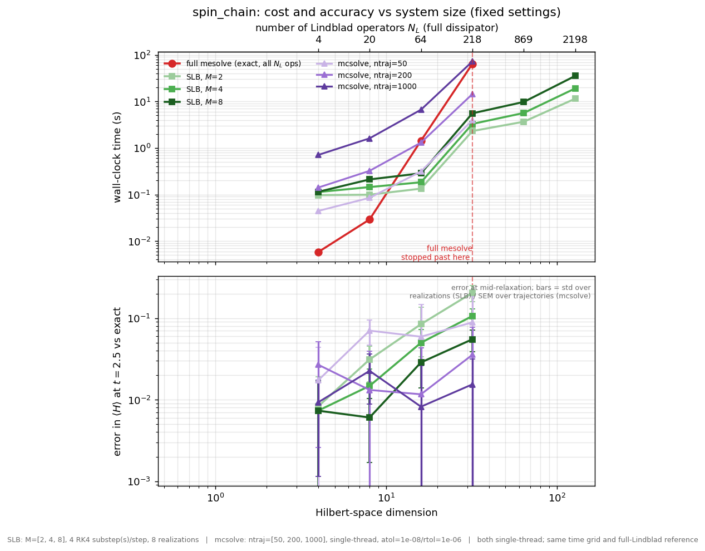

# qutip-bundling

Stochastic bundling of Lindblad operators for [QuTiP](https://qutip.org).

Implements the **stochastically bundled dissipator** of

> S. Adhikari and R. Baer, *Stochastically Bundled Dissipators for the Quantum
> Master Equation*, J. Chem. Theory Comput. **2025**, 21, 4142–4150.
> https://doi.org/10.1021/acs.jctc.5c00145

It is an independent package that builds on QuTiP — install alongside QuTiP
and use with the solvers you already know.

## What it does

A Lindblad master equation with a large number `N_L` of collapse operators is
expensive: the dissipator costs one matrix product per operator, and `N_L`
typically grows as the square of the Hilbert-space dimension.

The dissipator is *quadratic* in the operators, so it can be reproduced **in
expectation** by a much smaller set of `M` randomly *bundled* operators:
$$
R_m = \frac{1}{\sqrt{M}} \sum_\alpha r_{m,\alpha}\, c_\alpha
$$

```
R_m = (1 / sqrt(M)) * sum_alpha  r_{m,alpha} * c_alpha
```

where the `r_{m,alpha}` are independent random numbers with zero mean and unit
second moment. The bundled dissipator is an **unbiased estimator** of the full
one for any `M`, and the bundled operators still have Lindblad form, so the
dynamics stay completely positive and trace preserving.

Pair that with the deterministic Davies Lamb-shift Hamiltonian (built from
the *bare* `L_alpha`, never bundled), and a single bundled `mesolve` call
reproduces full master-equation dynamics with `M` independent of the
Hilbert-space dimension — per-step cost drops from `O(N^5)` to `O(N^3)`.

## Benchmarks

On a dissipative spin chain, full `mesolve` (paying for all `N_L` Lindblad
operators) becomes infeasible as the system grows, while bundling — using only
`M` of them — keeps going at a fraction of the cost:



Below the crossover the full solve is the better choice; above it, bundling is
what lets the calculation finish. Against QuTiP's trajectory solver `mcsolve`,
bundling reaches the same accuracy for less compute on both test systems. See
[`benchmarks/BENCHMARKS.md`](benchmarks/BENCHMARKS.md) for the full study —
both systems defined, accuracy-versus-`M` convergence, and the
accuracy-versus-cost frontier — all reproducible with the scripts in that
folder. The benchmark scripts also accept optional Davies-construction
thresholds, e.g. `COUPLING_THRESHOLD=1e-6`, so you can separate build-time
operator pruning from the bundling parameter `M`.

## Install

```bash
pip install qutip-bundling           
# or, from a checkout:
pip install -e ".[examples,test]"
```

## API: three operator transforms plus optional solver helpers

The easiest entry point is :func:`davies_operators`, which builds the
collapse operators directly from a Hamiltonian ``H`` and a system-bath
coupling operator ``X``, with the correct sign convention baked in (see
CONVENTIONS.md -- getting the sign wrong silently runs the dynamics
backwards):

```python
from qutip_bundling import davies_operators, bundle, rk4_mesolve

c_ops = davies_operators(H, X, gamma)          # gamma(omega) callable
R = bundle(c_ops, M=8, rng=0)                  # M bundled operators
res = rk4_mesolve(H, rho0, tlist, c_ops=R, e_ops=e_ops)
```

Under the hood the method is three pure operator transforms that return
operators, not solver results:

| Function | Purpose |
|---|---|
| `davies_operators(H, X, gamma)` | **recommended for Davies/Bohr setups** -- build collapse operators from `H` and coupling op `X`, correct sign baked in |
| `build_collapse_ops(L_ops, omegas, gamma)` | bare `L_alpha` and the spectral function → standard collapse operators `sqrt(gamma) * L_alpha` |
| `bundle(c_ops, M, ...)` | **the method** -- any collapse-operator list → `M` randomly bundled operators |
| `lamb_shift_hamiltonian(L_ops, omegas, imag_gamma)` | bare `L_alpha` and `Im Gamma` → Lamb-shift Hamiltonian `H_LS = sum_alpha imag_gamma * L^dag L` (built once) |

Spectral inputs (`gamma`, `imag_gamma`) may be either a callable
`f(omega) -> float` or an array aligned with `omegas`.

### Bringing your own operators (bundling is not tied to Davies)

`bundle` is the actual method, and it takes **any** list of collapse
operators — it does not care how they were built. The bundling is a purely
algebraic operation: it replaces `N_L` operators `{c_alpha}` with `M` random
linear combinations

```
R_m = (1 / sqrt(M)) * sum_alpha r_{m,alpha} * c_alpha,
```

so that the bundled dissipator `sum_m D[R_m]` equals the full dissipator
`sum_alpha D[c_alpha]` in expectation. Nothing in that statement assumes the
Davies construction, an ohmic bath, or even a master equation derived from a
microscopic model.

So if your collapse operators come from somewhere else — a Redfield equation
mapped to Lindblad form, a phenomenological model, quantum-optics jump
operators, local Lindbladians on a lattice, or operators that already include
their rates — you skip `davies_operators` and `build_collapse_ops` entirely
and bundle them directly:

```python
from qutip_bundling import bundle, mesolve_ensemble

my_c_ops = [...]                       # any collapse operators you like
R = bundle(my_c_ops, M=8, rng=0)
res = qutip.mesolve(H, rho0, tlist, c_ops=R, e_ops=e_ops)

# or with averaging + error bars:
ens = mesolve_ensemble(H, rho0, tlist, my_c_ops, M=8,
                       e_ops=e_ops, n_realizations=32)
```

`davies_operators` is provided because the Davies/Bohr construction is the
common case and the sign convention is easy to get wrong — but it is one
optional way to *produce* an operator list, not a requirement of the method.

### Any bath spectral function

When you do use `davies_operators` or `build_collapse_ops`, the spectral
function `gamma(omega)` is arbitrary — the library never assumes a particular
form (the ohmic example in the demos and tests is just an example). Pass any
callable or array. For physically sensible relaxation to the Gibbs state it
should be non-negative and satisfy detailed balance
`gamma(-omega)/gamma(omega) = exp(-omega/kT)` (see CONVENTIONS.md). For
instance a Drude–Lorentz bath:

```python
def gamma_drude(omega, lam=0.5, gamma_c=2.0, kT=1.0):
    # spectral density J(omega) = 2*lam*gamma_c*omega / (omega**2 + gamma_c**2)
    if abs(omega) < 1e-12:
        return 2.0 * lam * kT / gamma_c          # classical/zero-frequency limit
    J = 2.0 * lam * gamma_c * omega / (omega**2 + gamma_c**2)
    return J / (1.0 - math.exp(-omega / kT))     # detailed-balance weighting

c_ops = davies_operators(H, X, gamma_drude)
```

A microscopically-derived construction may not even factor into
`operators x gamma(omega)` — some methods hand you collapse operators with the
rates already included and no separate spectral function. Those just go
straight into `bundle`.

A convenience composes the three for the common case:

```python
from qutip_bundling import prepare_bundled_dynamics
import qutip

bundled = prepare_bundled_dynamics(
    L_ops, omegas, gamma=gamma, imag_gamma=imag_gamma, M=8, rng=0,
)
result = qutip.mesolve(
    H_sys + bundled.H_lamb_shift, rho0, tlist,
    c_ops=bundled.c_ops, e_ops=e_ops,
)
```

For ensemble averaging with error bars:

```python
from qutip_bundling import mesolve_ensemble

ens = mesolve_ensemble(H_total, rho0, tlist, c_ops_full,
                       M=8, e_ops=e_ops, n_realizations=32)

mean      = ens.expect[0]    # mean of observable 0 over realizations
error_bar = ens.sem[0]       # standard error of the mean (shrinks as 1/sqrt(n))
spread    = ens.std[0]       # standard deviation across trajectories (single-run noise)
raw       = ens.samples      # shape (n_realizations, n_e_ops, n_times)

# Everything else can be recomputed from raw -- your own fluctuation
# definition, percentiles, histograms -- since no information is discarded.
```

### Advanced: bias reduction with the jackknife

A finite bundle size `M` introduces an `O(1/M)` *bias* (eq. 14 of the paper).
You can usually control it just by increasing `M` or inspecting `ens.samples`
directly. When you specifically want to cancel the leading bias term at fixed
`M`, the package provides the jackknife-2 estimator (eqs. 15–16):

```python
from qutip_bundling import mesolve_jackknife

jack = mesolve_jackknife(H_total, rho0, tlist, c_ops_full,
                         M=8, e_ops=e_ops, n_realizations=32)
# jack.expect[0] is bias-corrected; jack.extra["direct"] is the uncorrected mean
```

This is an optimization, not a required step — the core method is
bundle → solve → average.

## How the pieces fit together

Bundling is a Monte Carlo trick for the **dissipator only**. The Davies
Lamb-shift Hamiltonian `H_LS` is a deterministic part of the renormalized
Hamiltonian (eq. 4 of the paper) — it's built once from the bare `L_alpha`,
added to the system Hamiltonian, and never enters the bundling step. If
`imag_gamma` is identically zero (the paper's test cases), `H_LS = 0` and
the package reduces to the dissipator-only case.

Because the API returns operators rather than wrapping a solver, the same
building blocks work with `qutip.mesolve`, `mcsolve`, `smesolve`, or any
custom propagator.

## Tutorial

A step-by-step Jupyter notebook is in `examples/tutorial.ipynb`. It builds a
system, bundles its operators, shows convergence to the deterministic answer
as `M` grows, shows the standard deviation vs standard error, and uses the
`native` backend. Every cell is executed and its output checked.

## Validation

`examples/oscillator_demo.py` builds an open system with many Davies/Bohr
Lindblad operators and a non-zero Lamb shift, and verifies all three
guarantees:

1. The bundled dissipator is an unbiased estimator of the full one (error
   decays as `1/sqrt(samples)`).
2. The Lamb shift is deterministic, Hermitian, and unchanged by any bundling
   call.
3. A bundled `mesolve` with `M = 8` plus `H_LS` reproduces the dynamics of
   the full operator set within the dynamic range of the observables.

## Acknowledgments

Developed in the group of Prof. Roi Baer at the Fritz Haber Center for
Molecular Dynamics, Institute of Chemistry, The Hebrew University of
Jerusalem.

## License

BSD-3-Clause.
