# Benchmarks

This page documents the performance of `qutip-bundling` against the standard
QuTiP solvers. All numbers below were produced by the two scripts in this
folder:

- `benchmark_scaling.py` — cost versus system size, and accuracy versus the
  bundle size *M*.
- `benchmark_vs_mcsolve.py` — accuracy-versus-cost frontier against QuTiP's
  Monte-Carlo trajectory solver `mcsolve`.

Both scripts are self-contained: `pip install qutip-bundling matplotlib`, then
`python benchmark_scaling.py`. Re-running them regenerates every figure here.

## What is being measured

A Lindblad master equation with a large number $N_L$ of collapse operators is
expensive: the dissipator costs one matrix product per operator, and $N_L$
typically grows as $N^2$ in the Hilbert-space dimension $N$, so propagating the
full equation scales as roughly $O(N^5)$ per step. Stochastic Lindblad
bundling (SLB) replaces the $N_L$ operators with $M$ random *bundled*
combinations whose dissipator equals the full one in expectation. With $M$
held fixed as the system grows, the per-step cost drops to $O(N^3)$.

The benchmarks therefore ask two distinct questions, and it is worth keeping
them separate:

1. **Does it scale?** As the system grows, does the wall-clock cost of SLB
   really grow more slowly than the full master equation — and where is the
   crossover below which the full solve is simply the better choice?
2. **Is it accurate, and at what price?** SLB is a stochastic
   approximation with a tunable knob `M`. More bundles means less error but more
   work. The honest way to judge a stochastic method is not raw speed but the
   error it achieves for a given amount of compute, compared against the other
   stochastic option a user already has — `mcsolve`.

## The two test systems

The benchmarks use two systems chosen to bracket the kinds of problems users
bring to a Lindblad solver. Both relax toward thermal equilibrium under the
same detailed-balance ohmic bath spectral function $$\gamma(\omega)$$, and in both
cases the collapse operators are built with `davies_operators(H, X, `$$\gamma$$`)`,
which diagonalizes `H`, forms one Bohr-frequency operator per pair of energy
levels, and weights each by the bath response at that frequency.

### Spin chain

A dissipative transverse-field Ising chain of `n` spins:

$$
H = -J \sum_i \sigma^z_i \sigma^z_{i+1} - h \sum_i \sigma^x_i
$$

with `J = 1.0`, `h = 0.6`. The bath couples to the total transverse
magnetization $X = \sum_i \sigma^x_i$, and the chain starts fully polarized. The
system size is set by the number of spins, so the Hilbert dimension is $2^n$.
Because the energy eigenbasis mixes all the sites, essentially every pair of
levels contributes a Davies operator, and $N_L$ climbs steeply with size — 64
operators at dimension 16 (4 spins), over 2000 at dimension 128 (7 spins). This
is a recognizable model across condensed-matter and quantum-computing work, and
it is SLB's natural home: a large operator count that grows quickly with system
size.

### Oscillator + bath

An anharmonic oscillator coupled to a two-level spin, with the oscillator
position coupling to the bath:

$$
H = \omega_0\left(n + \tfrac{1}{2}\right) + \chi n^2 + \frac{\Delta}{2}\sigma_z + g(x \otimes \sigma_x)
$$

with $\omega_0 = 1.0$ (`omega0`), $\chi = 0.1$ (`anh`), $\Delta = 1.0$
(`spin_gap`), and $g = 0.3$ (`coupling`). The bath couples through the
oscillator position $X = x$, and the system size is set by the Fock-space
truncation. The four terms are, in order: the bare oscillator (number operator $n$),
its anharmonicity ($\chi n^2$), the two-level spin's energy splitting
($\tfrac{\Delta}{2}\sigma_z$), and the oscillator–spin coupling through the
oscillator position ($g\,x\otimes\sigma_x$). This system is close to the molecular/vibronic
physics the method was originally developed for, so it shows how SLB
behaves on a realistic problem rather than only on an idealized chain.

## Result 1 — cost and accuracy versus system size

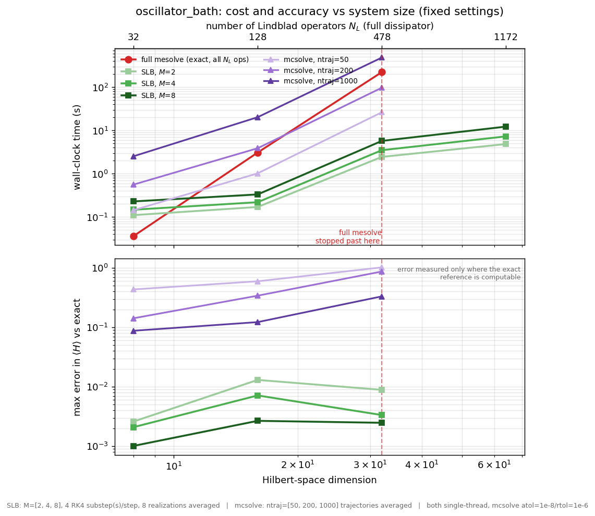

Each figure has two panels sharing the size axis: wall-clock cost on top and the
max-over-time error in $\langle H(t)\rangle$ (vs the exact reference) below.
Every method is run at **fixed settings** — full `mesolve` (exact), SLB at a
few bundle sizes, and `mcsolve` at a few trajectory counts (the exact values
are in the figure caption) — and we simply report what each one costs and how
accurate it turned out to be. There is no accuracy
matching; you read cost in the top panel and the accuracy that buys in the
bottom panel. The top axis shows $N_L$, the number of Lindblad operators in the
full dissipator, aligned with the Hilbert dimension.

**Cost (top).** Full `mesolve` is cheapest on the smallest systems, then rises
steeply and reaches the dashed line, past which a single solve exceeds the
time/memory budget. SLB (greens, cost rising gently with `M`) stays cheap and
continues well past that wall — it only ever propagates `M` operators,
independent of $N_L$. `mcsolve` (purples) costs more, rising with `ntraj`.
Beyond the wall there is no exact reference to measure error against, so
`mcsolve` is not run there (it is both unmeasurable and, at large `ntraj` on big
systems, prohibitively slow); only SLB's cost continues.

**Accuracy (bottom).** This is what keeps the cost panel honest: SLB is not
exact, and the bottom panel shows exactly how much error each `M` carries. The
SLB curves sit at the bottom (most accurate) — SLB at `M = 8` is consistently
more accurate than `mcsolve` at any of the trajectory counts shown, while also
costing less. Read together, the two panels say SLB is both cheaper and more
accurate than `mcsolve` here, and that full `mesolve` is exact but becomes
infeasible at dimension 32–64.

Two practical notes. The speedups are real but quoted alongside their accuracy,
not in isolation: on the spin chain the full solve at dimension 32 (218
operators) takes around a minute versus a few seconds for SLB, and at dimension
128 (≈2200 operators) the full solve is out of reach while SLB still completes.
And SLB's stochastic integrator needs at least two RK4 substeps per step to stay
stable on the stiffer oscillator at the larger sizes — a single substep diverges
there — so these runs use a small fixed number of substeps (stated in each
figure caption); the result is already converged by two.

## Result 2 — accuracy versus the bundle size M

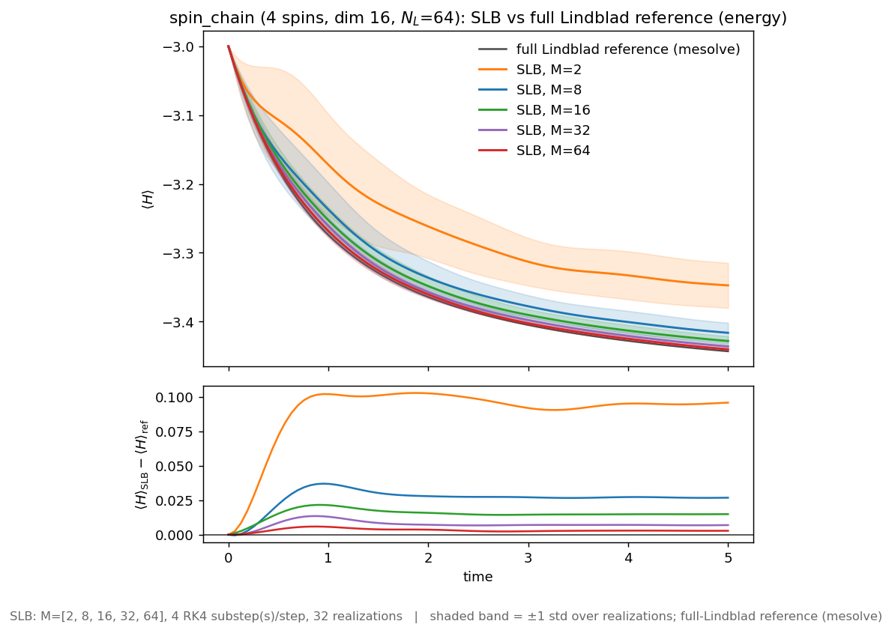

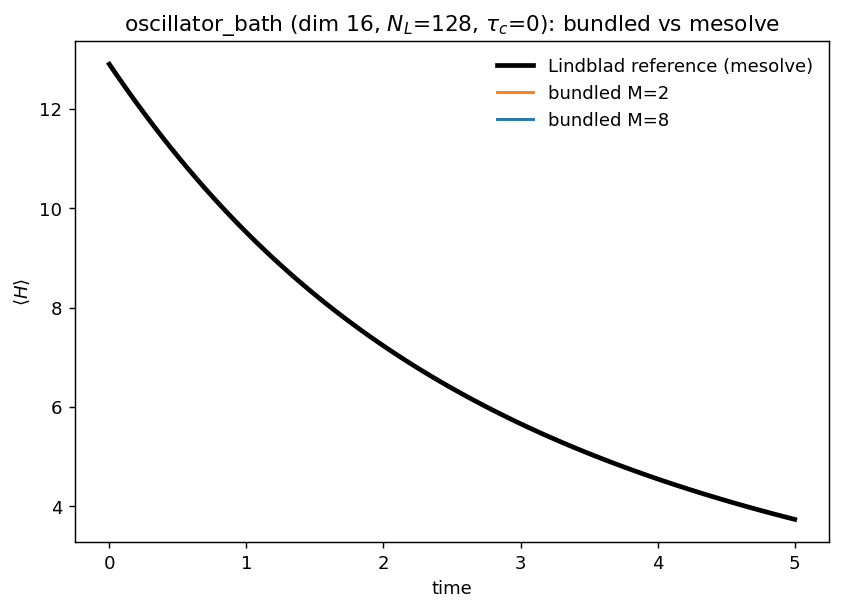

These plot the energy expectation $\langle H(t)\rangle$ against the full Lindblad
reference (black) as the system relaxes. The shaded band is one standard
deviation over stochastic realizations. As `M` grows the bundled mean tightens
onto the reference and the band narrows — the approximation is not a fixed
compromise but a dial the user controls.

The two systems also differ in how cleanly the bundled mean tracks the
reference at small `M`. On the spin chain the bias and spread at `M = 2` are
clearly visible and shrink steadily as `M` grows. On the oscillator the bundled
mean already sits essentially on the reference at `M = 2` — the residual error
there is roughly an order of magnitude smaller at the same `M` (see the frontier
numbers below). How quickly SLB converges in `M` is therefore
system-dependent: it is set by the spread of the individual operator
contributions to the dissipator, not by the Hilbert-space dimension alone, so it
is worth checking the convergence on your own system rather than assuming a
fixed `M` is enough.

## How the two stochastic methods differ

SLB and `mcsolve` are both Monte Carlo methods for the same master equation, but
they randomize different things, which is why the comparison below is not
obvious in advance.

`mcsolve` **unravels** the master equation into random pure-state *trajectories*.
A single trajectory is a wavefunction $|\psi(t)\rangle$ that drifts under a
non-Hermitian effective Hamiltonian $H_{\rm eff} = H - \tfrac{i}{2}\sum_a
L_a^\dagger L_a$, punctuated by random *quantum jumps*: at random times one of
the original $N_L$ collapse operators $L_a$ fires (chosen with probability
$\propto \langle\psi|L_a^\dagger L_a|\psi\rangle$) and the state is reset to
$L_a|\psi\rangle$. No single trajectory is the answer; the density matrix is
recovered by averaging over `ntraj` independent trajectories. Its randomness is
in the *state path*, and it keeps all $N_L$ operators exact.

SLB does the opposite. It keeps the **full density matrix** and randomizes the
*operators*: each realization is an ordinary (deterministic) Lindblad evolution
of $\rho$ in which the $N_L$ collapse operators are replaced by $M$ random
bundles. No jumps, no wavefunctions — just a density-matrix ODE with fewer
operators, recovered by averaging $\rho(t)$ over a handful of realizations. Its
randomness is in the *operators*, and it keeps the full state.

So the two attack the cost from opposite directions. `mcsolve` propagates cheap
$N$-vectors but touches all $N_L$ operators and needs many trajectories to
suppress its noise; SLB propagates the more expensive $N\times N$ density matrix
but with only $M \ll N_L$ operators and few realizations. Which wins depends on
$N$, $N_L$, $M$, and `ntraj` together — hence the empirical comparison.

**Why wall-clock time is the comparison axis.** A single time step is not the
same amount of work for the two methods — a density-matrix step with $M$
operators for SLB versus a wavefunction step with $N_L$ operators for `mcsolve`
— so counting time steps or samples would not be a fair common measure.
Wall-clock time is, because it folds cost-per-step, step count, and sample count
into one number. The methods also use different integrators: SLB uses fixed-step
RK4 (its resolution set explicitly by the substep count in each figure), while
`mcsolve` uses QuTiP's adaptive integrator at stated tolerances
(`atol=1e-8`, `rtol=1e-6`). SLB is therefore not winning by integrating more
loosely — if anything `mcsolve` integrates each trajectory more precisely; SLB
wins by needing far fewer operators and far fewer samples to reach the same
accuracy.

## Result 3 — accuracy-versus-cost against mcsolve

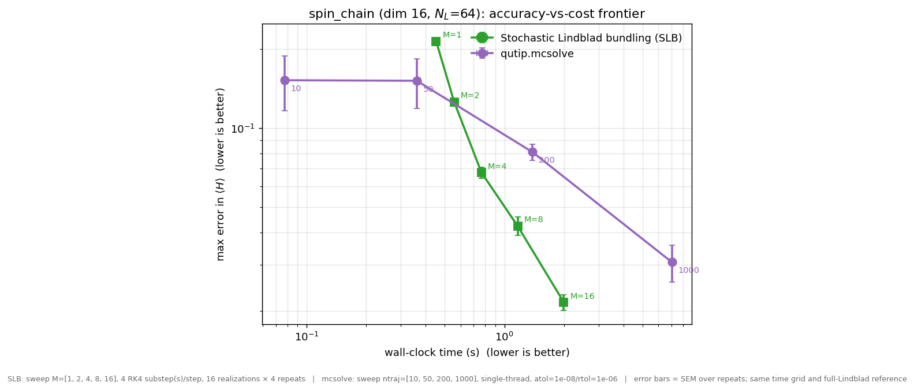

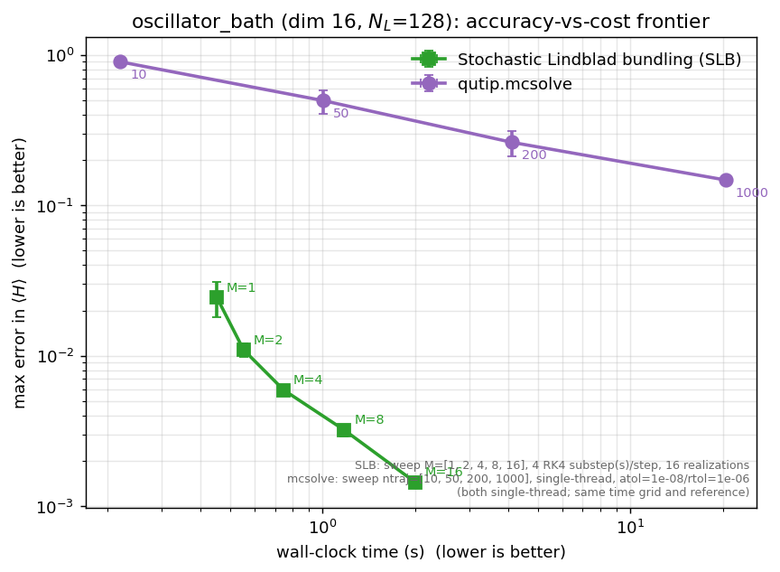

This is the comparison against the other stochastic option, QuTiP's
quantum-trajectory solver `mcsolve`. Both methods have an accuracy knob —
bundle size `M` for SLB, trajectory count `ntraj` for `mcsolve` — so
neither raw speed nor raw accuracy alone is a fair summary. Each curve sweeps
its own knob; the axes are wall-clock time and max-over-time error in
$\langle H(t)\rangle$ against the full reference (lower is better on both), so
the method sitting toward the **lower-left wins at matched accuracy**. Error
bars are the standard error over independent repeats.

For the comparison to be fair, both methods are run at a stated integration
resolution: SLB sweeps `M` at a fixed number of RK4 substeps per time step
(noted in the figure caption), and `mcsolve` sweeps `ntraj` at the stated ODE
tolerances (`atol=1e-8`, `rtol=1e-6`). Both share the same time grid and the
same full-Lindblad reference, so a point's horizontal position reflects real
work, not a coarser integration hidden in one method.

On the spin chain, SLB sits below `mcsolve` across most of the range: to reach
an error near 0.02 it needs a few seconds (at `M = 16`), where `mcsolve` needs
roughly three times as long in trajectories to match — a few times cheaper at
matched accuracy. (At the very loosest accuracy a handful of trajectories is
the single cheapest point, so for a quick rough look `mcsolve` is fine.) On the
oscillator the gap is far larger: SLB reaches errors around $10^{-3}$ in a few
seconds, while `mcsolve` after a thousand trajectories and roughly half a minute
is still near $10^{-1}$ — about two orders of magnitude less accurate at higher
cost. This is the regime SLB is built for, and it is where the method most
clearly earns its place.

## Result 4 — validation and robustness

The three results above establish the headline claims. This section collects the
checks that answer the obvious follow-up doubts: that the comparison is fair,
that SLB reproduces more than one easy observable, that it converges at the rate
the theory predicts, and that none of it hinges on a lucky random seed. Each
check has its own script and figure.

**Beyond energy: a coherence observable.** Energy is a forgiving target — it is
essentially diagonal in the energy eigenbasis, so matching $\langle H(t)\rangle$
says little about the off-diagonal part of the state. As a harder test we also
track the energy-eigenstate coherence the dynamics most strongly populates
($|a\rangle\langle b| + \text{h.c.}$, with the pair $(a,b)$ chosen by the
largest $|\langle a|\rho(t)|b\rangle|$ in the exact solution).

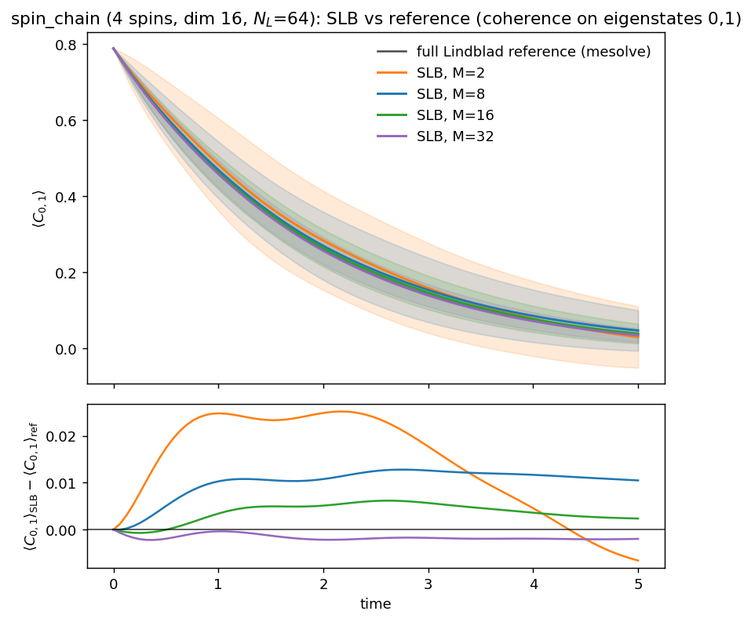

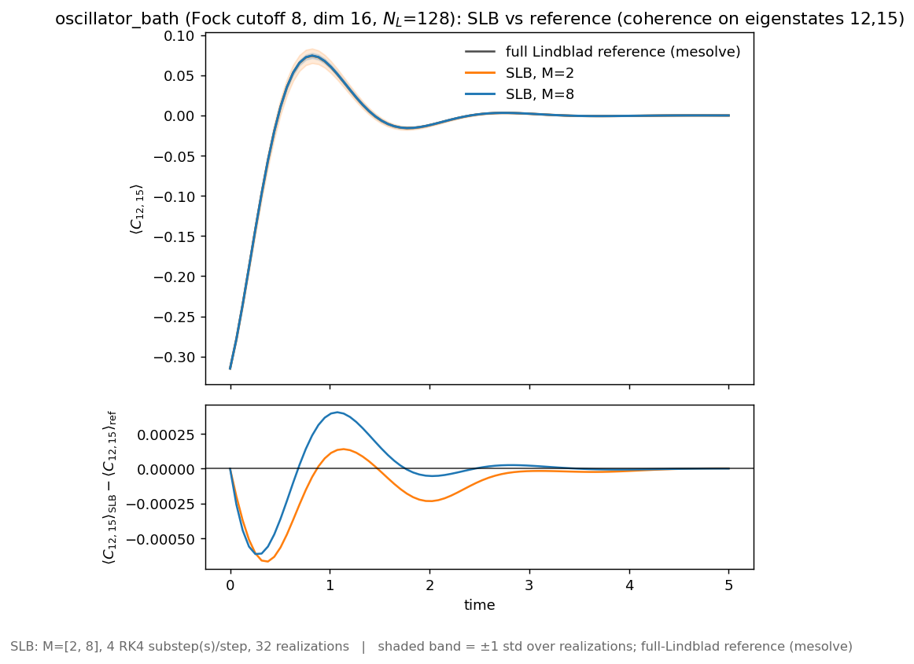

These are genuine off-diagonal signals — the spin-chain coherence decays from
about 0.4, the oscillator coherence swings through zero and oscillates — and SLB
tracks them with the same convergence in `M` it shows for energy. Reproducing a
coherence, not just a population, is direct evidence SLB captures the state
rather than one easy projection of it.

**Convergence at the predicted rate.** SLB is a Monte Carlo estimator, so two
quantities should fall with `M` at two different, theory-fixed rates: the
statistical spread as $M^{-1/2}$, and the finite-`M` bias faster, as $$M^{-1}$$.

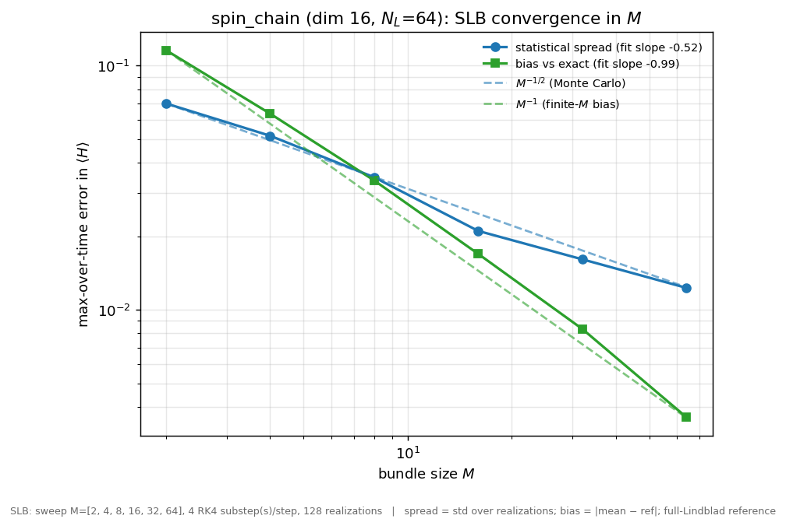

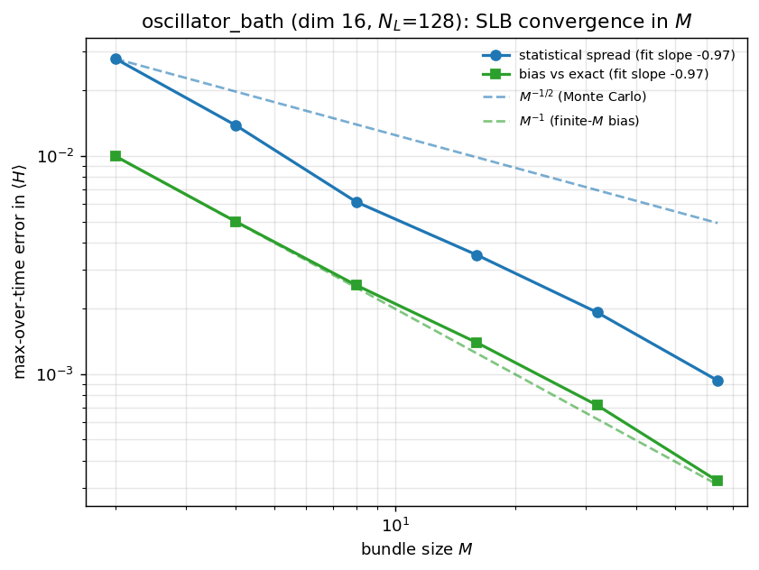

Fitting the measured slopes recovers the predicted finite- `M` bias rate of
$$M^{-1}$$ on both systems ($$M^{-0.99}$$ for the spin chain, $$M^{-0.97}$$ for the
oscillator) — and since the finite-`M` bias is what sets SLB's accuracy, this
is the central check. The statistical spread follows the Monte-Carlo
$$M^{-1/2}$$ rate on the spin chain (fitted $$M^{-0.52}$$); on the oscillator it
falls faster still, close to $$M^{-1}$$, so its run-to-run noise is suppressed
more quickly than the worst-case Monte-Carlo bound rather than landing on the
$$M^{-1/2}$$ guide. Matching the predicted bias exponent on both systems — not
merely "getting smaller" — is hard to fake by tuning and is the strongest
single check that the estimator behaves as derived.

**Bias versus system size, with jackknife correction.** At fixed `M` the
finite-`M` bias grows with system size — visible as the SLB error climbing in
Result 1. The jackknife study quantifies this and shows the built-in jackknife
correction suppresses it.

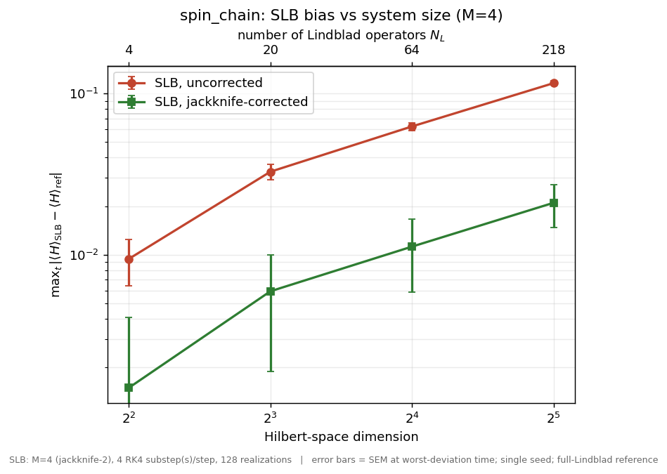

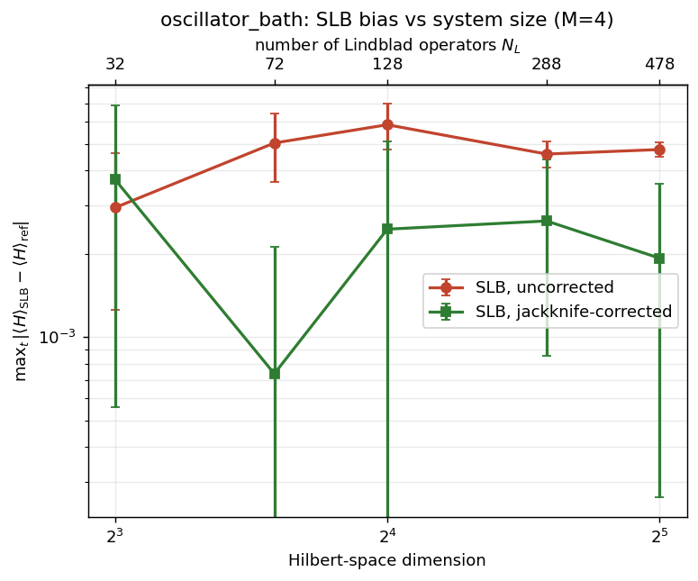

The uncorrected bias rises steeply with dimension while the jackknife-corrected
bias stays comparatively flat — so the error growth at fixed `M` is a known,
correctable effect, not a breakdown of the method. On the oscillator the
correction is strong enough that the residual bias sits at the noise floor: the
corrected points are consistent with zero, so their wide error bars on the log
axis reflect a small absolute uncertainty around a near-zero value, not
instability.

**Seed robustness.** Both SLB and mcsolve are stochastic; the other figures fix
one seed for reproducibility. Recomputing the frontier across several
independent master seeds shows the conclusion does not depend on the seed.

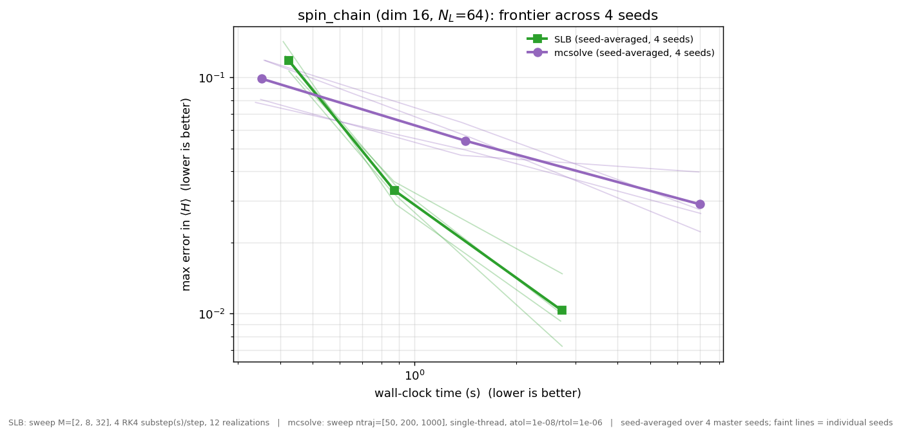

The per-seed frontiers (faint) cluster tightly around the seed-average (bold),
and the SLB points stay below the mcsolve points for every seed.

**mcsolve fairness.** So the cost comparison cannot be dismissed as an artifact
of hidden settings, `mcsolve` in Result 3 is run single-threaded (matching SLB's
single-threaded realization loop) with its ODE tolerances stated explicitly
(`atol=1e-8`, `rtol=1e-6`), both shown in the figure caption. Removing
mcsolve's multi-core advantage this way does not change the conclusion — SLB
still reaches a given accuracy at lower cost.

## Reproducing and reading these numbers

The absolute times depend on the machine, the CPU core count, and the BLAS
build, so treat them as relative comparisons rather than fixed constants. A few
notes for anyone re-running:

- `mcsolve` parallelizes its trajectories across CPU cores, so its wall-clock
  cost depends on the core count. The Result 3 frontier pins it single-threaded
  to match SLB's single-threaded loop; if you allow it multiple cores its points
  shift left, so state the core count when reporting.
- The first solve of any method pays one-time import and compilation costs; for
  careful timing, discard a warm-up run.
- The system size, time grid, and tolerances are identical across all methods
  in a given figure, so the comparison within each plot is apples-to-apples.
