# Performance Benchmarks: Stochastically Bundled Dissipators

This page benchmarks `qutip-bundling` (stochastic Lindblad bundling, **SLB**)
against the two standard QuTiP solvers it competes with: the exact Lindblad
master equation `mesolve`, and the Monte-Carlo trajectory solver `mcsolve`.

Everything below is produced by self-contained scripts in this folder:

> **New here?** Start with [`README.md`](README.md) to replot a committed result
> in seconds without launching the expensive numerical benchmarks.

- `run_accuracy_vs_M.py` + `plot_accuracy_vs_M.py` — accuracy versus bundle size
  (Result 1). The run script saves the raw per-realization dynamics of both
  observables for every `M` into
  `data/accuracy_vs_M_<system>_dim<D>.json`, timing the Davies-operator
  construction separately from the propagation; the plot script derives the
  mean curves, the bands, and the peak-error decomposition from it.
- `run_cost_scaling.py` + `plot_cost_scaling.py` — cost scaling versus the exact
  solver (Result 2). The exact reference is QuTiP's `mesolve` up to the memory
  wall (~dim 32), and beyond it — where `mesolve` can no longer build its
  superoperator — the native full-dissipator RK4 solver (`rk4_mesolve`), which
  propagates all `N_L` operators directly and is cross-validated against
  `mesolve` wherever both run. The run script does the compute and writes
  `data/cost_scaling_<system>.json` (stamped with package versions, seeds, the
  bundle-size sweep, and the substeps used for each reference); the plot script
  derives the figure from that file in seconds.
- `run_method_comparison.py` + `plot_method_comparison.py` — accuracy versus
  cost against `mcsolve` (Result 3). One Slurm allocation runs all four solvers
  at each dimension so the wall-clocks are comparable, and
  `data/method_comparison_<system>_dim<D>.json` keeps the per-realization samples
  for every `M` alongside `mcsolve`'s trajectory statistics; each run records
  whether its fixed-step integrator stayed stable at the chosen substep count,
  so an under-resolved reference is flagged rather than trusted.
- `run_extreme_dimension.py` + `plot_extreme_dimension.py` — the regime with no
  exact reference (Result 5), where the operator list no longer fits in memory
  and the run is scored on convergence, trace preservation, and the thermal
  limit instead of against an exact answer.

`run_frontier.py` + `plot_frontier.py` produced an earlier version of Result 3
and are kept so the superseded figures stay reproducible; new work should use
`run_method_comparison.py`.
- `run_isocost_vs_dim.py` + `plot_isocost_vs_dim.py` — iso-accuracy cost versus
  dimension (Result 4), split the same way: the run script writes
  `data/isocost_vs_dim_<system>.json` with the raw run samples and the mcsolve
  $S^2$ fit; the plot script derives $M^\ast$, $\texttt{ntraj}^\ast$, and the
  speedups from it.

To regenerate every figure, install the package (`pip install -e ".[examples,test]"`
from a checkout, or `pip install qutip-bundling matplotlib`) and run each script
from this folder. Start with the `plot_*.py` scripts: they redraw from the saved
`data/*.json` in seconds without recomputing. The `run_*.py` scripts do the
expensive simulations: they require an explicit `--system` or `--all`, support
`--dry-run`, and refuse to replace tracked JSON unless `--overwrite` is given.
The supporting checks (`benchmark_convergence.py`,
`benchmark_jackknife.py`, `benchmark_seed_robustness.py`,
`benchmark_substep_convergence.py`) produce the validation figures (§6).

---

## Contents

**Setup**
- [1. The core idea, and when it applies](#1-the-core-idea-and-when-it-applies)
  - [Will bundling help *your* system?](#will-bundling-help-your-system)
- [2. The three test systems (fully specified)](#2-the-three-test-systems-fully-specified)
  - [2.0 The physical picture, before any equations](#20-the-physical-picture-before-any-equations)
  - [2.1 The bath (shared by all three systems)](#21-the-bath-shared-by-all-three-systems)
  - [2.2 Is this weak coupling? Yes — in both senses.](#22-is-this-weak-coupling-yes--in-both-senses)
  - [2.3 Systems A & B — transverse-field and mixed-field Ising chains](#23-system-a--b--transverse-field-g0-and-mixed-field-g04-ising-chains)
  - [2.4 System C — anharmonic oscillator coupled to a spin](#24-system-c--anharmonic-oscillator-coupled-to-a-spin)
  - [2.5 What each system is for](#25-what-each-system-is-for)
  - [2.6 Worked example: where these numbers actually come from](#26-worked-example-where-these-numbers-actually-come-from)
- [3. What we measure, and how the error is reported](#3-what-we-measure-and-how-the-error-is-reported)
  - [3.1 Which observables, and why not just the energy](#31-which-observables-and-why-not-just-the-energy)
  - [3.2 Error: a time-resolved band, and the single numbers from it](#32-error-a-time-resolved-band-and-the-single-numbers-from-it)
  - [3.3 How much sampling each method does](#33-how-much-sampling-each-method-does)
  - [3.4 Integrators: matched where it is possible, disclosed where it is not](#34-integrators-matched-where-it-is-possible-disclosed-where-it-is-not)
- [4. How `mcsolve`'s error works, versus SLB's](#4-how-mcsolves-error-works-versus-slbs)

**Results**
- [5. Results](#5-results)
  - [Reference state and spectrum profiles](#reference-state-and-spectrum-profiles)
  - [5.1 Reading the cost–accuracy plots](#51-reading-the-costaccuracy-plots)
  - [5.2 Memory and stiffness walls](#52-memory-and-stiffness-walls)
  - [5.3 Provenance](#53-provenance)
  - [Result 1 — accuracy versus the bundle size M](#result-1--accuracy-versus-the-bundle-size-m)
  - [Result 2 — cost scaling versus the exact solver](#result-2--cost-scaling-versus-the-exact-solver)
  - [Result 3 — accuracy versus cost: SLB against mcsolve](#result-3--accuracy-versus-cost-slb-against-mcsolve)
  - [Result 4 — iso-accuracy cost versus dimension](#result-4--iso-accuracy-cost-versus-dimension)
  - [Result 5 — past the reference wall](#result-5--past-the-reference-wall)

**Reference**
- [6. Validation and robustness](#6-validation-and-robustness)
- [7. Reproducing and reading these numbers](#7-reproducing-and-reading-these-numbers)

---

## 1. The core idea, and when it applies

A Lindblad master equation with many collapse operators is expensive: the
dissipator costs one matrix product per operator, so a full solve scales as
roughly $O(N_L N^3)$ per step in the Hilbert-space dimension $N$. **SLB**
replaces the $N_L$ operators with $M$ random *bundled* combinations whose
dissipator equals the full one in expectation, dropping the per-step cost to
$O(M N^3)$.

**What is a collapse operator? (Physical intuition)**
In an isolated quantum system, the state evolves unitarily under the Schrödinger
equation ($i\hbar \dot{\rho} = [H, \rho]$), keeping energy and quantum information
strictly conserved. When the system is open to an external thermal bath or environment,
energy and coherence leak out. The **collapse operators** (also called *jump
operators* or *Lindblad operators*, denoted $c_\alpha$) represent the **microscopic
channels of interaction** between the system and the environment:
- **Spontaneous decay / emission:** Moving an excitation from the system to the
  bath (e.g. lowering operator $a$ or $|g\rangle\langle e|$).
- **Thermal excitation / absorption:** Gaining energy from thermal fluctuations in
  the bath (e.g. raising operator $a^\dagger$).
- **Pure dephasing:** Scrambling quantum phases without exchanging energy
  (e.g. $\sigma^z$).

In a microscopic thermal bath (the Davies/secular description used here), each
collapse operator $c_\alpha = \sqrt{\gamma(\omega)} \, |e'\rangle\langle e|$
represents a transition between energy eigenstates $|e\rangle \to |e'\rangle$ at
Bohr transition frequency $\omega = E_{e'} - E_e$, weighted by the bath's response
rate $\gamma(\omega)$. The total rate of change of the density matrix $\rho(t)$
is governed by the **Lindblad dissipator**, which sums over all $N_L$ interaction
channels:
$$\mathcal{D}[\rho] = \sum_{\alpha=1}^{N_L} \left( c_\alpha \rho c_\alpha^\dagger - \frac{1}{2} \{ c_\alpha^\dagger c_\alpha, \rho \} \right)$$
Because every single transition channel $c_\alpha$ must be applied as a matrix
multiplication at every integration time step, a system with thousands of possible
transitions ($N_L \sim 10^3\text{--}10^4$) becomes computationally intractable.
**SLB replaces this massive sum of $N_L$ individual channels with $M \ll N_L$
random bundled combinations.**

That statement contains the two conditions that decide whether bundling is effective:

1. **Cost.** Bundling can only pay when $M \ll N_L$. The operator count
   $N_L$ — **not** the Hilbert-space dimension — governs the speedup.
2. **Accuracy.** At a given $M$, accuracy depends on how *local* the collapse
   operators are in the energy eigenbasis: operators connecting neighbouring
   levels give far smaller errors than operators connecting distant ones.
   Measured locality at dimension 64 is 27%, 26% and 3.1% for the three systems
   below — see §2.5 for the definition and the caveats. This is an empirical
   correlation across three systems, not a derived law.

The three systems benchmarked here isolate these two conditions. In the
locality row, the percentage is the average energy-level separation a collapse
operator connects, as a fraction of the whole spectrum: **3% means an operator
essentially only couples neighbouring levels, 27% means it couples levels a
quarter of the spectrum apart.** The definition is in §2.5.

| Metric / Property | System A — Spin Chain (`g=0`, §2.3) | System B — Mixed Chain (`g=0.4`, §2.3) | System C — Oscillator (§2.4) |
|---|---|---|---|
| Model | Transverse-field Ising (`J=1, h=0.6`) | Mixed-field Ising (`g=0.4`) | Anharmonic oscillator + spin |
| Coupling `X` | Σᵢ σˣᵢ (collective) | Σᵢ σˣᵢ (collective) | x ⊗ I (position) |
| `N_L` at dim 64 | 31 (collapses due to integrability) | 2,017 (~N²/2) | 890 (~N¹·⁴) |
| How far operators reach, d̄ (dim 64) | 27% of the spectrum | 26% | **3.1% — neighbours only** |
| Cost vs the exact solve, one SLB run at `M=16` | **1.6x** — and none at a usable accuracy | **96x cheaper** | **54x cheaper** |
| Span-normalized energy error, one run at `M=16` | 7.9×10⁻² | 5.4×10⁻² | **6.0×10⁻⁶** |
| Role here | **Control 1** — too few operators to bundle | **Control 2** — many operators, but each reaches far | **Demonstration** — many operators, each local |

**System A** is a special case. Its bath couples to every spin in the same way,
and the model itself is exactly solvable, which makes its energy gaps repeat
over and over. The Davies construction merges every transition that shares a
gap into a single operator, so even a 512-dimensional chain ends up with just
73 of them. Bundling works by shrinking a long list of operators; with a list
this short there is nothing to shrink, and solving exactly is the better choice
at every size measured.

**System B** is the same chain with one extra field term, which destroys that
special structure. The gaps stop repeating, almost nothing merges, and the
count climbs to 8,193 at dimension 128 — enough to make one bundled run **96x
cheaper** than solving exactly at dimension 64, and the margin widens with size.
But its operators connect energy levels far apart rather than neighbouring ones,
and a single run at $M=16$ lands at percent-level error.

**System C** has both properties at once: many operators (890 at dimension 64)
*and* operators that only connect neighbouring rungs of its ladder. It is the
only system here that is cheap **and** accurate at small $M$.

**Note which chain is the less accurate one.** System A, not System B — 7.9×10⁻²
against 5.4×10⁻² at the same $M=16$ and dimension (and 8.0×10⁻² vs 5.5×10⁻² at $M=8$), and by the same ordering under
absolute error, error over span, and error over $|\langle H\rangle|$. Having
few operators does not make them easy to bundle; System A's are as far-reaching
as System B's and there are too few of them for a bundle to average over. Result
1's height table and Result 3's tables agree on this ordering. §2.6's
cross-term ratio does **not** — it is smaller for A than for B and so predicts
the opposite — which that section states plainly as one of the three ways the
ratio fails as a predictor.

### Will bundling help *your* system?

Two checks, both cheap, both before you run anything expensive.

**1. Count the collapse operators.**

```python
from qutip_bundling import davies_operators
n_l = len(davies_operators(H, X, gamma))
```

Bundling replaces $N_L$ operators with $M$, so the best speedup available is
about $N_L/M$. If $N_L$ is a few dozen, there is nothing to win — the exact
solve is cheaper and exact. If it is in the hundreds or thousands, the saving
is real. This part is arithmetic, not a claim: it holds by construction.

Be aware that $N_L$ is **not** predictable from the Hilbert dimension. Symmetry
and integrability can collapse it by orders of magnitude, as they do in System
A. Count it; do not estimate it.

**2. Ask how far each operator reaches.** Diagonalise $H$, write the collapse
operators in that basis, and look at how far from the diagonal their weight
sits ($\bar d$, §2.5). Operators confined near the diagonal — a ladder, a
cascade, anything where the bath moves the system one level at a time —
accompany the smallest errors here by four orders of magnitude. Operators
spread across the spectrum accompany percent-level error at the same $M$.

This second check is an **empirical correlation across three systems, not a
derived law**, and §2.5 says exactly where it fails. Treat it as a guide to
what to measure, not a guarantee.

**What to do with the answer.**

| `N_L` | operator reach | what to expect |
|---|---|---|
| small (tens) | either | use the exact solver; bundling has nothing to compress |
| large | local | the best case — large speedup at small `M` (System C) |
| large | far-reaching | still a large speedup, but you will need a larger `M` for a given accuracy (System B) |

And if you cannot even build the operator list — thousands of dense operators
at large dimension — that is the regime bundling exists for, though you will
then have no exact reference to check against.

Both checks run on all three systems with one command, and the script is short
enough to copy and point at your own $(H, X)$:

```bash
python benchmarks/explain_structure.py
```

§2.6 walks through its output and explains where each number comes from.

There are also two stochastic methods on the table, and the single most
important thing to understand up front is that **they randomize different
things.** This is why their costs and errors behave so differently, and why the
comparison has to be empirical.

**`mcsolve` randomizes the state.** It *unravels* the master equation into
random pure-state trajectories. One trajectory is a wavefunction
$|\psi(t)\rangle$ that drifts under the non-Hermitian effective Hamiltonian
$H_{\rm eff} = H - \tfrac{i}{2}\sum_a L_a^\dagger L_a$, interrupted by random
*quantum jumps*: at random times one of the original $N_L$ collapse operators
$L_a$ fires (chosen with probability
$\propto\langle\psi|L_a^\dagger L_a|\psi\rangle$) and the state resets to
$L_a|\psi\rangle$. A single trajectory
looks nothing like the smooth answer — no two are alike, differing even in how
many jumps occur — and you recover the density matrix by averaging `ntraj` of
them. **The randomness is in the state path, and all $N_L$ operators are kept
exact.**

**SLB randomizes the operators.** It keeps the full density matrix and runs an
ordinary deterministic Lindblad evolution — but with the $N_L$ collapse
operators replaced by $M$ random bundles. No jumps, no wavefunctions, just a
density-matrix ODE with fewer operators, averaged over a handful of
realizations. **The randomness is in the operators, and the full state is
kept.**

So the two attack the cost from opposite directions. `mcsolve` propagates cheap
$N$-vectors but touches all $N_L$ operators and needs many trajectories to
suppress its noise. SLB propagates the more expensive $N\times N$ density matrix
but with only $M\ll N_L$ operators and few realizations. Which wins depends on
$N$, $N_L$, $M$, and `ntraj` together — hence the empirical comparison in the
rest of this page.

A consequence worth stating now: the two methods have different **error knobs**,
and they are *not* symmetric (see §4). `mcsolve` has one knob (`ntraj`) that
controls pure statistical noise. SLB has two knobs (`M` and the number of
realizations) controlling two different error sources (a bias and a
fluctuation). Keeping that asymmetry in mind makes every results section below
easier to read.

---

## 2. The three test systems (fully specified)

### 2.0 The physical picture, before any equations

Every system here is the same kind of object: a **small quantum system** in
contact with a **large environment**, held at a fixed temperature.

**The system** is what we simulate — a row of spins, or a vibrating mode with a
spin attached. It is small enough to write down completely.

**The bath** is everything else: the phonons of a surrounding crystal, the
photons of a cavity, the solvent a molecule sits in. It is far too large to
simulate, and we never do. Instead it is *summed over* and replaced by its
effect on the system — draining energy away and destroying quantum coherence.
Its entire influence is captured by one function, $\gamma(\omega)$, giving how
readily the bath absorbs or emits an energy quantum $\omega$ (§2.1).

**The coupling operator $X$** is the part that decides *what the environment can
see*. A bath does not touch a system everywhere at once; it couples to one
physical property. For a molecule jostled by a solvent, that property is
position. For a spin in a fluctuating magnetic field, it is a spin component.
Choosing $X$ is choosing which handle the environment has.

**What "weak coupling" buys.** When the system–bath coupling is weak, the
environment can be eliminated exactly to leading order, leaving a closed
equation for the system alone — the Lindblad master equation. The price is a
set of **collapse operators**: each one is a channel through which the bath can
move the system between its energy levels.

#### How the collapse operators are built (the "construction")

Throughout this page, *construction* means the recipe that turns a Hamiltonian
and a coupling operator into that list of collapse operators. All three systems
use the same one, `davies_operators(H, X, gamma)`:

1. **Find the energy levels.** Diagonalise $H$.
2. **Look at every pair of levels.** A pair separated by energy $\omega$ is a
   possible transition, and $X$ says how strongly the bath drives it.
3. **Group transitions that share a gap.** This is the important step. The bath
   responds to a *frequency*, not to a pair of labels — if two different pairs
   of levels happen to be separated by the same $\omega$, the environment
   cannot tell them apart, so they are one channel, not two. All blocks with
   the same $\omega$ are summed into a single operator $A(\omega)$.
4. **Weight by the bath.** Multiply by $\sqrt{\gamma(\omega)}$: how fast the
   bath actually drives that frequency.

The number of collapse operators, $N_L$, is therefore **the number of distinct
energy gaps that the coupling operator can drive** — not the number of levels,
and not the dimension. That is why it varies so wildly between the systems
below, and it is the single quantity that decides whether bundling helps.

#### Two terms used below

**Exact symmetry.** An operation that leaves the Hamiltonian completely
unchanged. System A, for instance, is unchanged if you flip *every* spin about
the $x$ axis at once ($\mathbb{Z}_2$ symmetry). Symmetries have two
consequences here: they force some transitions to vanish and make others share
a gap, shrinking $N_L$; and they can split the state space into sectors the
dynamics never mixes, so the system remembers which sector it started in. That
is why detailed balance makes the thermal (Gibbs) state stationary, but does
not always make it the *unique* late-time state.

**Integrability, and "free fermions".** A model is integrable when it can be
transformed into something non-interacting. System A can: a standard change of
variables turns the interacting spin chain into a gas of independent
particles. Because the particles do not interact, the total energies are simply
*sums of n independent single-particle energies* — and sums built from the
same small pool of numbers produce the same differences over and over. Its gaps
repeat massively, step 3 above merges them, and $N_L$ collapses. Adding one
extra field term (System B) breaks the transformation, the gaps stop repeating,
and $N_L$ grows by orders of magnitude. Nothing else about the chain changes.

Both terms are demonstrated on the actual spectra in **§2.6** — including an
explicit check that System A's 16 energies are the subset sums of 4 numbers, to
machine precision, and System B's are not.

---

All three systems are weakly coupled to the **same** thermal bath, use the
**same** construction, and are scored on the **same** observables. They differ
only in $(H_{\rm sys}, X)$ — which makes them a controlled comparison rather
than three unrelated demonstrations. §2.5 states what each one is for.

### 2.1 The bath (shared by all three systems)

The bath is specified entirely by one spectral function — the rate at which the
bath exchanges energy quantum $\omega$ with the system:

$$
\gamma(\omega) =
\frac{\alpha\,\omega\,e^{-|\omega|/\omega_c}}{1-e^{-\omega/(k_BT)}},
\qquad \alpha = 0.3,\; k_BT = 0.5,\; \omega_c = 8 .
$$

Reading the three factors:

- $\alpha\,\omega$ — an **ohmic** spectral density (linear in $\omega$ at low
  frequency). $\alpha=0.3$ sets the overall system–bath coupling strength.
- $e^{-|\omega|/\omega_c}$ — an exponential high-frequency cutoff at
  $\omega_c=8$, representing the fact that a real environment cannot respond
  arbitrarily fast. **It is comparable to the transition frequencies here, not
  far above them, so it does shape the coupling.** Weighting each transition by
  $|\langle i|X|j\rangle|^2$, the median transition sits at $\omega=3.1$ (System
  A), $2.8$ (B) and $5.3$ (C), with 90th percentiles of $5.3$, $5.2$ and $6.9$ —
  of order a few, not of order one. Across that range the cutoff removes 31% of
  the rate at $\omega=3$ and 58% at $\omega=7$, so a high-frequency transition
  is damped about $1.6\times$ harder than a typical one. The suppression is
  smooth and never switches a transition off, but the bath is **not** broadband
  over the transitions that matter, and rates should not be read as though the
  cutoff were absent.
- $1/(1-e^{-\omega/k_BT})$ — the thermal occupation factor at temperature
  $k_BT=0.5$. It enforces **detailed balance** (the KMS condition
  $\gamma(-\omega)/\gamma(\omega)=e^{-\omega/k_BT}$), which makes the Gibbs
  state stationary; uniqueness additionally requires the coupling to connect all
  symmetry sectors. At $\omega\to0$
  this factor gives the finite limit $\gamma(0)=\alpha\,k_BT$.

So in one line: **an ohmic bath with an exponential cutoff, at temperature
$k_BT=0.5$, satisfying detailed balance.**

**Building the Lindblad operators.** All three systems turn
$(H_{\rm sys}, X, \gamma)$ into collapse operators by the same strict Davies
(secular) recipe. First resolve the Hamiltonian into projectors onto its
distinct, possibly degenerate, energy eigenspaces,

$$H_{\rm sys}=\sum_\epsilon \epsilon\,\Pi_\epsilon.$$

Then group every transition block with the same Bohr frequency:

$$
\omega=\epsilon'-\epsilon,\qquad
A(\omega)=\sum_{\epsilon'-\epsilon=\omega}
\Pi_\epsilon X\Pi_{\epsilon'},\qquad
c(\omega)=\sqrt{\gamma(\omega)}\,A(\omega).
$$

There is one collapse operator per **distinct populated frequency sector**, not
one per eigenvector pair. Keeping the sum inside $A(\omega)$ retains the cross
terms required when energies or gaps are degenerate and makes the generator
independent of the arbitrary eigenbasis chosen inside a degenerate eigenspace.
The code groups numerical equalities within
`DAVIES_DEGENERACY_TOL = 1e-10`. It also removes projector blocks at or below
the scale-covariant backward-error floor
$512\,\epsilon_{\rm mach}N\lVert X\rVert_F$, so exact symmetry zeros do not
become machine-dependent operators.

**Why that value, and how to choose your own.** The tolerance is a genuine
physical knob — it decides which Bohr frequencies count as one bath channel, so
it sets $N_L$ — and it should be chosen so that the answer does not depend on
it. Sweeping it across nine decades on the benchmark systems gives a wide
plateau:

| tolerance | 10⁻¹⁴ | 10⁻¹² | 10⁻¹⁰ | 10⁻⁸ | 10⁻⁶ | 10⁻⁵ | 10⁻⁴ | 10⁻³ |
|---|---|---|---|---|---|---|---|---|
| System B, dim 64 | 2,017 | 2,017 | **2,017** | 2,017 | 2,017 | 2,015 | 1,991 | 1,813 |
| System C, dim 64 | 890 | 890 | **890** | 890 | 890 | 890 | 890 | 884 |

Everything from $10^{-14}$ to $10^{-6}$ gives an identical count; erosion starts
at $10^{-5}$ and becomes severe past $10^{-4}$. $10^{-10}$ sits at the middle of
that shelf, four orders below the smallest separation between two genuinely
distinct driven frequencies ($2.5\times10^{-6}$ for System B at dimension 64).

Two things follow for anyone applying this elsewhere. **A tolerance that changes
your count is too loose** — find the plateau first. And **the plateau existing
at all is the evidence that eigenvalue roundoff is not inflating $N_L$**: if it
were, tightening below $10^{-10}$ would split operators, and it does not.
`tests/test_degeneracy_tolerance.py` pins both properties.

The sign $\omega=\epsilon'-\epsilon$ makes a downward transition positive.
With the detailed-balance convention above, the Gibbs state is stationary.
It is the unique late-time state only when $(H_{\rm sys},X)$ is ergodic; an
exact symmetry shared by both can preserve multiple stationary sectors.

The three systems feed *different* $(H_{\rm sys}, X)$ into this one recipe:

- **System A** (§2.3): Integrable Ising chain ($g=0$), $X = \sum_i \sigma^x_i$. Its free-fermion integrability and $\mathbb{Z}_2$ symmetry collapse the Bohr spectrum. At 6 spins (dim 64), $N_L = 31$ ($N_L = n^2-n+1$).
- **System B** (§2.3): Mixed-field Ising chain ($g=0.4$), $X = \sum_i \sigma^x_i$. The longitudinal field breaks integrability, preventing frequency collapse and raising $N_L$ to 2,017 at dim 64 and 8,193 at dim 128. Its transition matrices in the energy eigenbasis are dense: the strength-weighted mean transition distance is $\bar d = 16.9$ levels at dim 64, i.e. **26% of the spectrum** under the §2.5 definition, which divides by $N$. Its operators reach about as far as System A's (27%) and roughly eight times further than System C's (3.1%).
- **System C** (§2.4): Anharmonic oscillator + spin, $X = x \otimes I$. Its collapse operators act through position $x \propto (a + a^\dagger)$, which is strictly tridiagonal in Fock space. $N_L = 890$ at dim 64, and its transition bandwidth is narrow (~3.1% – 4.4% of the spectrum).

In code these are built via dedicated functions in `common.py`:

```python
H, X, psi0 = build_spin_chain(6, g=0.0)      # System A  (dim 64, N_L=31)
H, X, psi0 = build_spin_chain(6, g=0.4)      # System B  (dim 64, N_L=2017)
H, X, psi0 = build_oscillator_bath(32)       # System C  (dim 64, N_L=890)
                                             # the argument is the FOCK cutoff;
                                             # dim = 2 x n_fock, so 32 -> 64
c_ops = davies_operators(H, X, gamma)        # the collapse operators, length N_L
```

### 2.2 Is this weak coupling? Yes — in both senses.

1. **By construction.** `davies_operators` builds a Davies/secular master
   equation, which is *derived* in the weak system–bath coupling (Born–Markov)
   limit. Using the Davies operators places the model in the weak-coupling
   Lindblad regime by assumption — that is the theory's domain of validity.
2. **By the numbers.** The bath coupling scale $\alpha=0.3$ is smaller than each
   system's coherent energy scales ($J=1$ for the chains, $\omega_0=1$ for the
   oscillator), so dissipation is slower than the internal coherent dynamics —
   the weak-coupling ordering. It is "moderate" weak coupling: strong enough to
   produce real relaxation over $t\in[0,5]$, not so strong that the perturbative
   description breaks.

### 2.3 System A & B — transverse-field ($g=0$) and mixed-field ($g=0.4$) Ising chains

**Physically:** a row of $n$ tiny magnets. Neighbours prefer to point the same
way (the $ZZ$ term), while a magnetic field along $x$ tries to tip them all
sideways (the $X$ term). System B adds a second field along $z$.

The bath couples through $X=\sum_i\sigma^x_i$ — the environment pushes on
*every* spin identically, along $x$. It cannot address one spin: picture the
whole chain sitting in a single fluctuating field, rather than each magnet
having its own noise source. The chain starts fully polarised and relaxes
towards thermal equilibrium.

The **system Hamiltonian** for $n$ spins is

$$
H_{\rm sys} = -J\sum_{i=1}^{n-1}\sigma^z_i\sigma^z_{i+1}
              - h\sum_{i=1}^{n}\sigma^x_i
              - g\sum_{i=1}^{n}\sigma^z_i,
\qquad J = 1.0,\; h = 0.6 .
$$

- **System A ($g=0.0$):** The transverse-field Ising model is **integrable**. It maps to free fermions, so its energy levels are sums of $n$ independent single-particle mode energies. Enormous numbers of transitions share identical Bohr frequencies, collapsing $N_L$ under Davies grouping to $n^2-n+1$ (31 at dim 64, 43 at dim 128).
- **System B ($g=0.4$):** Adding the longitudinal field $g=0.4$ **breaks integrability**. Bohr frequencies no longer coincide, grouping merges almost nothing, and $N_L$ scales as $\sim N^2 / 2$ (2,017 at dim 64, 8,193 at dim 128).

In both chains, the bath couples through $X = \sum_i \sigma^x_i$, and the chain starts fully polarized, $|\psi_0\rangle = |{\uparrow\uparrow\cdots\uparrow}\rangle$. Expressed in the energy eigenbasis, $X$ produces **dense** transitions: it
connects levels far apart in energy rather than only neighbouring ones. Under
the mean-transition-distance definition of §1 this is ~26-32% of the spectrum
for both chains, essentially independent of $g$ — breaking integrability
multiplies the operator *count* without making the individual operators any
more local.

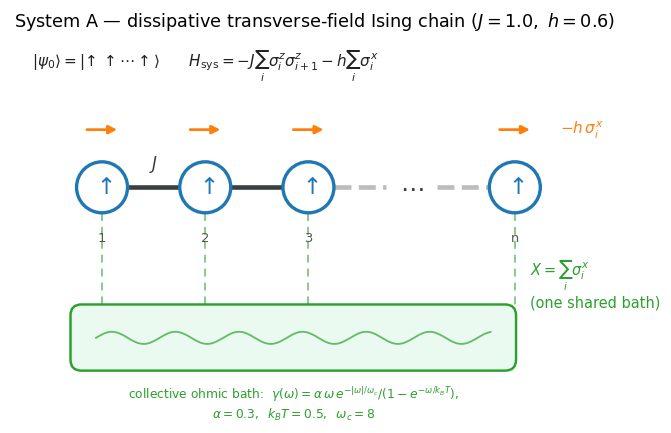

System A / B: an Ising chain ($J = 1.0$, $h = 0.6$, $g=0$ or $g=0.4$), fully
polarized at $t = 0$, coupled through the global operator
$X = \sum_i \sigma^x_i$ to a single collective ohmic bath.

### 2.4 System C — anharmonic oscillator coupled to a spin

**Physically:** a single vibrating mode — think of one bond in a molecule —
with a two-level system attached. The vibration's energy ladder is
*anharmonic*: its rungs are not evenly spaced but widen going up, much as a
real bond stiffens as it stretches.

The bath couples through the oscillator's **position**, $X = x\otimes I$: a
surrounding solvent or lattice jostles the bond and damps its motion. Two
consequences matter for everything below. First, position only connects
*adjacent* rungs of the ladder ($n\to n\pm1$), so the environment can only walk
the oscillator down one step at a time — this is the "local" transition
structure of §1. Second, the bath never touches the spin at all; the spin feels
dissipation only second-hand, through its coherent coupling to the oscillator.

The oscillator starts at the top of its ladder and cascades down.

The **system Hamiltonian** is

$$
H_{\rm sys} = \omega_0\left(n+\tfrac12\right) + \chi n^2
              + \tfrac{\Delta}{2}\sigma_z + g_{\rm int}(x\otimes\sigma_x)
$$

with $\omega_0=1.0$, anharmonicity $\chi=0.1$, spin gap $\Delta=1.0$, and an
internal oscillator–spin coupling $g_{\rm int}=0.3$ (`coupling` in the code;
written $g_{\rm int}$ here because $g$ already denotes the chains'
longitudinal field in §2.3 — they are unrelated). Here $n=a^\dagger a$ is the number
operator and $x=(a+a^\dagger)/\sqrt2$ the position. The four terms are: the bare
oscillator, its anharmonicity, the spin's energy splitting, and a coherent
oscillator–spin coupling.

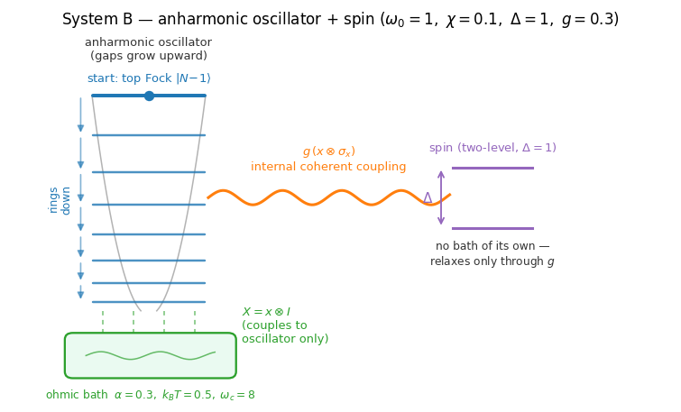

<!-- filename is historical: this is System C's schematic. -->

System C: an anharmonic oscillator whose energy gaps widen up the ladder,
coupled to a two-level spin by an internal coherent coupling $g_{\rm int}$. A single
ohmic bath couples to the oscillator position $X = x\otimes I$ only, so the
spin relaxes solely indirectly through $g$. The oscillator starts in its top
Fock level.

There is **one** bath, not two: $X = x\otimes I$ acts only on the oscillator, so
the spin has no reservoir of its own. The evolved object is the Lindblad equation
built from $(H_{\rm sys}, X, \gamma)$ exactly as in §2.1 ($N_L = 128$ at dim 16),
started with the spin up and the oscillator in its top Fock state.

Watch the two "couplings", which are unrelated physics that happen to share a
value: $g_{\rm int}=0.3$ is the **internal coherent** coupling inside
$H_{\rm sys}$, while $\alpha=0.3$ is the **system–bath** strength carried by
$\gamma$ through $X$. Dimension is set by the Fock truncation. This system is the
closest here to the molecular and vibronic problems the method was built for.

### 2.5 What each system is for

The three are not three demonstrations. They vary two properties independently,
so the benchmark can say which one matters:

| | operator count `N_L` | how far each operator reaches | outcome |
|---|---|---|---|
| **A** — TFIM chain (`g=0`) | small (31 at dim 64) | reaches far (d̄ ≈ 27%) | no usable speedup, error 8.6×10⁻² |
| **B** — mixed chain (`g=0.4`) | large (2,017 at dim 64) | reaches far (d̄ ≈ 26%) | 96x cheaper, error 6.2×10⁻² |
| **C** — oscillator | large (890 at dim 64) | local (d̄ ≈ 3%) | 54x cheaper, error 6.6×10⁻⁶ |

**A versus B** isolates the operator count. Same lattice, same coupling
operator, same initial state; the only change is a longitudinal field that
breaks integrability. `N_L` rises 65-fold and a speedup appears where there was
none — so the *cost* benefit is governed by `N_L`, as §1 claims.

**B versus C** isolates the operator structure. Both have thousands of
operators, so both are cheap. But B's transitions are dense in energy and C's
are tridiagonal, and their accuracies differ by four orders of magnitude — so
the *accuracy* is not governed by `N_L`. Without B, that would be invisible,
and the natural reading of A-versus-C would be that a large `N_L` buys both
benefits at once. It does not.

**System B is therefore not a failure.** A 96x speedup at ~6% error is a
useful operating point — for parameter sweeps, screening, or qualitative
dynamics — and it is a *different point on the cost-accuracy curve*, not a
broken result. What it rules out is the simpler claim we would otherwise have
made.

**Measuring locality.** Order the eigenvectors $|i\rangle$ of $H$ by energy and
take the mean transition distance, in units of the dimension:

$$
\bar{d} = \frac{1}{N} \frac{\sum_{\alpha}\sum_{ij} |i-j| \, |\langle i|c_\alpha|j\rangle|^2}{\sum_{\alpha}\sum_{ij} |\langle i|c_\alpha|j\rangle|^2}
$$

At dimension 64 this gives 27% (A), 26% (B) and 3.1% (C) — raw distances of
17.4, 16.9 and 2.0 levels. `probe_oq4_accuracy.py` normalises differently and
reports different percentages for the same systems; the ranking is robust, the
absolute scale is not.

**Treat it as a guide, not a law.** It separates the two *families* cleanly, and
within System C halving $\bar{d}$ divides the error by about five. But it does
not explain everything: within the chains $\bar{d}$ falls with dimension while
the error rises, and System C's fitted power law under-predicts the chains'
error by a factor of 40. It also sets a prefactor rather than a floor — System B
still reaches $2.4\times10^{-3}$, it just needs $M=128$ to get there.

A reader with their own model can place it on this table by computing two
numbers before running anything: `len(davies_operators(H, X, gamma))` and the
mean transition distance defined in §1. `explain_structure.py` computes both,
and §2.6 walks through what they mean on these three systems.

### 2.6 Worked example: Why do some systems compress so well?

In the tables above, you might notice that **System A** (the simple spin chain) ends up with a remarkably small number of Lindblad operators ($N_L = 13$ at dimension 16), while **System B** (the mixed chain) and **System C** (the oscillator) do not. 

Why does the Davies method compress System A so effectively, but leave the others mostly alone? The script `explain_structure.py` breaks this down. There are two physical reasons:

#### 1. The Energy Gaps "Collide" (Degeneracy)
The Davies method groups transitions together if they share the *exact same energy gap* (the difference in energy between the starting state and the ending state). 

Imagine a system where the energy levels are completely messy. If you calculate the gap between any two levels, you'll get a unique number every time. No two gaps will be identical, so no grouping can happen. This is exactly what happens in System B and System C.

System A is special. It is a "free" model, meaning its excitations (like flipping a spin) don't interfere with each other. If flipping one spin costs 2 units of energy, and flipping another costs 3 units, then flipping *both* costs exactly 5 units. Because the energies add together perfectly, the energy gaps between different levels start to repeat over and over again. 

For a 4-spin chain (16 energy levels), there are 256 possible transitions. But because the energies add up perfectly, they produce only 81 distinct gaps rather than 256. The gaps "collide," letting the Davies method pack many transitions into one operator. The second rule below cuts the count much further: once transitions forbidden by symmetry are removed, 62 survive and they carry just **13** distinct gaps.

#### 2. The "Parity" Rule (Symmetry)
System A has a perfect symmetry: if you flip all the spins at once, the system's physics remain exactly the same. Because of this, every quantum state in the system is stamped with a built-in "parity" (think of it as being either "Even" or "Odd").

The coupling operator that connects the system to the bath ($X$) obeys this symmetry too. The rules of quantum mechanics dictate that $X$ is completely forbidden from causing a jump between an "Even" state and an "Odd" state. 

This simple rule instantly crosses out 76% of all the possible transitions on the board, before we even start grouping them by energy.

#### The Final Breakdown (Dimension 16)

Here is how those two rules play out in practice:

| | Allowed Transitions | Unique Energy Gaps (`N_L`) | Transitions packed into one operator |
|---|---|---|---|
| **System A** (Perfect symmetry, perfect adding) | 62 of 256 (24%) | **13** | 4.8 |
| **System B** (One symmetry left, messy adding) | 136 of 256 (53%) | **121** | 1.1 |
| **System C** (No symmetry, messy adding) | 128 of 256 (50%) | **128** | 1.0 |

As you can see, System A gets a massive discount because of its symmetrical and "free" nature. Systems B and C do not have these clean physical properties, so their transitions don't group together.

**System B is not symmetry-free either, and its row shows it.** The longitudinal
field breaks the spin-flip parity above, but the chain is still unchanged when
read back to front, and so is $X$. That surviving left–right reflection is what
forbids the other 47%: its two sectors hold 10 and 6 of the 16 levels, and
$10^2 + 6^2 = 136$ — exactly the allowed count in the table. What System B loses
is not symmetry but *degeneracy*: its gaps stop colliding, so grouping packs
only 1.1 transitions per operator against System A's 4.8. Result 5 returns to
these sectors, where they decide which state the dynamics relaxes to. 

This proves a key point: **Extreme operator compression is a lucky feature of specific, clean physical models (like System A), not a guarantee for all systems.**

#### What the collapse operators look like

To see *why* System C compresses so well and System B resists bundling, we can plot the total transition weight (how strongly the bath moves population between energy levels) as a heatmap over the 16x16 energy basis:

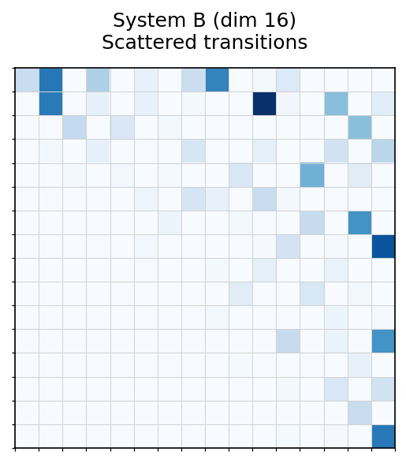
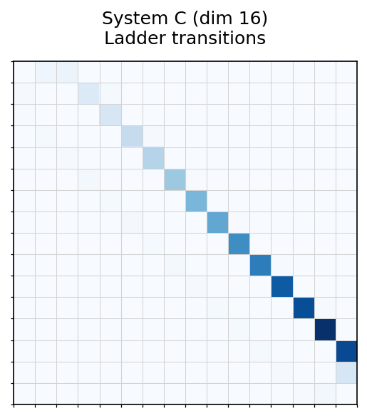

**System C is a staircase.** The bath couples through position
$x \propto a + a^\dagger$, which by construction has matrix elements only
between adjacent Fock states, $n \to n\pm1$. Anharmonicity mixes the states a
little, but the ladder survives: the weight sits on a narrow band hugging the
diagonal, and the bath drains the oscillator **one rung at a time**. The band
sits two indices out rather than one only because each oscillator level carries
the spin's two states with it — the physical step is still one rung.

**System B is scattered.** $X = \sum_i \sigma^x_i$ is local *on the lattice*,
but the energy eigenstates of a non-integrable chain are superpositions spread
over the whole chain, so in the energy basis a single spin flip connects levels
far apart in energy. One bath event can take the system from near the bottom of
the spectrum to near the middle. There is no ladder to walk.

$\bar d$ puts one number on that difference: the strength-weighted mean of
$|a-b|$. **These are dimension-16 numbers in levels**, not the dimension-64
percentages of §2.5 — divide by $N=16$ to compare. C sits at 1.97 out of a
possible 15; B at 5.13, close to the 5.3 you
would get by scattering weight uniformly at random.

Note what this does **not** separate. System A's $\bar d$ is 4.98 — statistically
the same as B's. Locality does not distinguish A from B; $N_L$ does (13 against
121). And $N_L$ does not distinguish B from C (121 against 128); locality does.
That is precisely why three systems are needed and two would not do.

#### Where the error actually comes from

It is tempting to think locality works because sampling noise "cancels out." It doesn't. 

Write out the bundles $R_m = M^{-1/2}\sum_\alpha r_{m\alpha} c_\alpha$, where the
$r_{m\alpha}$ are unit-modulus **complex phases** $e^{i\theta}$ by default —
$\pm1$ signs are a separate option in `random_phases` and are not what these
runs use. Summing the jump term over all $M$ bundles, and using
$\sum_m r_{m\alpha} r_{m\beta}^\ast = M\,\delta_{\alpha\beta}$ in expectation:

$$
\sum_m R_m \rho R_m^\dagger = \sum_{\alpha} c_\alpha \rho c_\alpha^\dagger + \frac{1}{M}\sum_{m}\sum_{\alpha\neq\beta} r_{m\alpha} r_{m\beta}^\ast \, c_\alpha \rho c_\beta^\dagger
$$

The first sum is the exact jump term; it is recovered only after summing all $M$
bundles, not from any single one. The second is what finite $M$ leaves behind:
its expectation is zero, and it survives as a fluctuation of relative size
$1/\sqrt{M}$ per draw.

**That is not the whole error.** Each $c_\alpha$ also enters the anticommutator,
so the generator's full discrepancy carries the matching cross terms there too:

$$
\frac{1}{M}\sum_{m}\sum_{\alpha\neq\beta} r_{m\alpha} r_{m\beta}^\ast \left( c_\alpha \rho c_\beta^\dagger - \frac{1}{2} \{ c_\beta^\dagger c_\alpha, \rho \} \right)
$$

Both halves vanish for the same reason and are governed by the same object —
which pairs $(\alpha,\beta)$ have $c_\alpha \rho c_\beta^\dagger \ne 0$ — so
counting the jump-term pairs is a **proxy** for the error, and the right one to
count. It is not a complete evaluation of it. 

The question isn't "how local are the operators," but **how many cross-terms survive to create noise?**

| | non-vanishing cross terms | total cross weight ÷ true dissipator |
|---|---|---|
| **A** | 100% | 1.9x |
| **B** | 56% | **4.2x** |
| **C** | 11% | **0.6x** |

**Locality is simply *why* C's cross terms vanish.** Because C is a ladder, taking a step down ($c_\alpha$) and a step back up ($c_\beta^\dagger$) rarely lines up, so 89% of the products evaluate to exactly zero. System B is scattered, so almost every path survives.

**Is this ratio a better predictor than $\bar d$?**
Yes, but it is still not a universal law. 
- **It fixes the direction:** Within each system, a higher ratio correctly predicts higher error (which $\bar d$ failed to do).
- **It fails across systems:** It massively under-predicts the gap between the oscillator and the chains.
- **It gets A vs B backwards:** At dimension 64, System A has a much smaller ratio than B, but larger error. 

The cross-term ratio names where the error comes from, but it counts only the jump-term pairs — not the anticommutator cross terms that accompany them — and it still cannot quantitatively predict error across different systems. **Open Question 4 stays open.** 

**A note on the rate.** The sweeps consistently confirm that the empirical error falls as $1/M$, not $1/\sqrt{M}$: doubling $M$ halves it, measured at 1.87x-2.04x per doubling across every system and dimension.


---

## 3. What we measure, and how the error is reported

### 3.1 Which observables, and why not just the energy

An **observable** is anything you can measure from the state. Pick an operator
$A$; at each time it gives one number, $\langle A\rangle(t)=\mathrm{Tr}(A\rho(t))$,
and over the run that traces a curve. Every accuracy figure on this page is a
comparison of two such curves — one from the method being tested, one from the
exact reference.

Which quantities you pick is not a side detail. **It decides what "accurate"
means.**

#### Why the energy alone is not enough

The state $\rho$ is a matrix, and its two halves mean different things:

- the **diagonal**, $\rho_{aa}$ — how much of the state sits in energy level
  $a$. These are the *populations*.
- the **off-diagonal**, $\rho_{ab}$ — how strongly levels $a$ and $b$ are still
  in step with each other. These are the *coherences*. They have no classical
  counterpart, and they are the first thing an environment destroys.

$\langle H\rangle$ is built almost entirely from the diagonal. So a method can
get the populations right, get the coherences badly wrong, and the energy curve
will still look fine.

That is not a small effect here. On identical runs, SLB beats `mcsolve` by
**914x on the energy** but only **33.2x on the dominant coherence** (the
eigenstate pair $(a,b)$ that develops the strongest quantum superposition $|\rho_{ab}(t)|$ during the dynamics; detailed below). Both are
from Result 3's oscillator table at dimension 64. Quote the energy alone and you
overstate the advantage roughly **twenty-sevenfold**.

**Read every accuracy claim on this page as being about one specific
observable.**

#### How the observables were chosen

The Hamiltonian is a sum of terms, $H=\sum_k \lambda_k O_k$. Each term $O_k$ is
measured on its own. Two things come for free:

1. **They have to add back up to the energy.** The identity
   $\langle H\rangle=\sum_k\lambda_k\langle O_k\rangle$ is checked on every run and holds to machine precision —
   residual $<10^{-15}$ on the chains, $\le 1.4\times10^{-13}$ on the
   oscillator (consistent with standard double-precision accumulation over $N$ levels). That is a correctness test on the whole pipeline, at no extra
   cost.
2. **Each one already has a name.** $O_k$ is the susceptibility
   $\partial\langle H\rangle/\partial\lambda_k$, so these are quantities people
   already quote for these models, not probes invented for this benchmark.

| | chains (A, B) | oscillator (C) |
|---|---|---|
| the bulk number | ⟨H⟩ | ⟨H⟩ |
| the quantum part | dominant coherence | dominant coherence |
| what the bath drives | Σᵢ⟨σᶻᵢσᶻᵢ₊₁⟩ — neighbour alignment | ⟨n⟩ — how far up the ladder |
| the hard one | Σᵢ⟨σˣᵢ⟩ — this *is* the bath coupling operator | ⟨σᶻ⟩ — the bath never touches the spin |
| remaining `H` terms | Σᵢ⟨σᶻᵢ⟩ (System B only) | ⟨ n²⟩, ⟨ x⊗σˣ⟩ |
| per-site version | Σ⟨σᶻσᶻ⟩/(n-1) | — |

#### What each observable tells you

**$\langle H\rangle$ — total energy.** The weighted sum of every other observable.
It is dominated by the diagonal of $\rho$ (the populations), so a method can get
the off-diagonal structure badly wrong and the energy curve will still look
fine. It is necessary but not sufficient.

**Dominant coherence — quantum interference between the two most-coupled energy
eigenstates.** The density matrix $\rho$ is rotated into the eigenbasis of $H$,
so its off-diagonal entries $\rho_{ab}$ measure how much quantum superposition
exists between energy levels $a$ and $b$. Most pairs are effectively dead (at
dim 16, 76 out of 120 never reach 1 % of the largest). The code
(`common.populated_coherence_op`) scans the exact reference trajectory and picks
the single pair $(a,b)$ whose $|\rho_{ab}|$ is largest at any time. The
observable is $|a\rangle\langle b|+|b\rangle\langle a|$, so it traces a
real-valued curve. This directly tests whether the method preserves quantum
interference, not just level populations.

**$\sum_i\langle\sigma^z_i\sigma^z_{i+1}\rangle$ — nearest-neighbour Ising
correlation (chains).** This is the coupling between adjacent spins in the
$z$-direction. It tells you whether the chain is ordering ferromagnetically
(spins aligning) or remaining disordered under the bath. Since the bath drives
transitions through this term, getting it right means the dissipation is being
approximated correctly.

**$\langle n\rangle$ — oscillator excitation number (System C).** The average
rung on the harmonic-oscillator ladder. If the bath is thermalizing the
oscillator, $\langle n\rangle$ should relax toward the Bose–Einstein value set
by the bath temperature. This directly tests whether the bath is doing its job.

**$\sum_i\langle\sigma^x_i\rangle$ — bath coupling operator (chains).** The bath
drives transitions *through* $\sigma^x$, so this expectation value is the most
sensitive to how accurately you approximate the dissipation. Any error in the
bundled collapse operators shows up here first, before it bleeds into the other
observables. That is why it is labelled "the hard one."

**$\langle\sigma^z\rangle$ — the spin the bath never touches (System C).** The
bath couples only through $X=x\otimes I$, so it never acts on the spin at all.
The spin moves *solely* because it is coupled to the oscillator internally. On
top of that it carries under 4 % of the total energy, so it can be badly wrong
while $\langle H\rangle$ barely flinches. That blind spot is exactly why it is
included.

**$\sum_i\langle\sigma^z_i\rangle$ — longitudinal magnetization (System B
only).** The mixed-field Ising chain adds a $\sigma^z$ field on top of the
transverse $\sigma^x$ field. This observable tracks the response to that extra
field and is absent in the pure transverse-field chain (System A).

**$\langle n^2\rangle$ — oscillator excitation variance (System C).** The second
moment of the oscillator number. Together with $\langle n\rangle$ it pins down
the width of the excitation distribution — a check that energy alone cannot
provide, since two very different distributions can share the same
$\langle n\rangle$.

**$\langle x\otimes\sigma^x\rangle$ — oscillator–spin correlation (System C).**
This is the internal coupling term between the oscillator and the spin. It
measures how strongly the two subsystems are entangled or correlated. A method
that treats the two subsystems too independently will get this wrong even if it
nails the marginals $\langle n\rangle$ and $\langle\sigma^z\rangle$ separately.

**$\sum\langle\sigma^z\sigma^z\rangle/(n{-}1)$ — per-bond correlation
(chains).** The same nearest-neighbour correlation divided by the number of
bonds. It rescales the chain observable so that different chain lengths can be
compared on the same plot.

#### The coherence is chosen from evidence, not by hand

At dimension 16 there are 120 possible level pairs $(a,b)$, and only one of them
becomes the coherence observable. The choice matters enormously, because **most
pairs are dead**. Running the exact dynamics and recording the largest
$|\rho_{ab}|$ each pair ever reaches:

| pair | largest |ρ_ab| over the whole run |
|---|---|
| (0,1) | 3.9×10⁻¹ |
| (1,3) | 2.2×10⁻¹ |
| (0,3) | 2.0×10⁻¹ |
| … | |
| (10,14) | 2.9×10⁻¹⁸ |

Top to bottom spans **17 orders of magnitude**, and **76 of the 120 pairs never
reach even 1%** of the largest. The dynamics simply never creates coherence
between those levels.

Pick one of those by hand and the exact answer is zero, SLB returns zero,
`mcsolve` returns zero, and a broken method returns zero too. Every method
passes and nothing has been measured.

So `common.populated_coherence_op` picks by evidence instead: it scans the
reference trajectory, rotates $\rho$ into the energy eigenbasis, blanks the
diagonal, and takes the pair whose $|\rho_{ab}|$ is largest at any time. The
observable is $|a\rangle\langle b|+\mathrm{h.c.}$

**The pair is fixed once, from the reference, and handed to every method.** If
each method found its own largest pair, SLB would report its error on one pair
and `mcsolve` on another — two numbers about two different quantities, which
cannot be put side by side in a table.

#### One limit worth knowing if you extend this

Trajectory methods rebuild $\rho$ as an *average over samples*, so they can only
report quantities that are **linear in $\rho$**. Purity $\mathrm{Tr}(\rho^2)$
and the von Neumann and entanglement entropies are not: averaging
$\mathrm{Tr}(\rho_k^2)$ over trajectories does not give $\mathrm{Tr}(\bar\rho^2)$.
Density-matrix methods, bundling included, carry no such restriction, and that
is a genuine advantage of that route.

Two smaller rules. Observables must be Hermitian, or the solvers quietly discard
an imaginary part. And they must be declared *before* the run, because `mcsolve`
cannot store full states at these sizes and has to be told up front what to
record.

### 3.2 Error: a time-resolved band, and the single numbers from it

The quantity of interest is how well the bundled $\langle H(t)\rangle$ (and, in
Result 1, a coherence) tracks the exact reference. The accuracy and coherence
figures show this **resolved over the whole trajectory**: for each $M$, the SLB
mean curve is drawn against the reference with a shaded **$\pm1$
standard-deviation band** (the spread over stochastic realizations). The
separate error-decomposition figure in Result 1 then resolves the bias and
fluctuation at the hardest instant.

This keeps the **two error components** separate:

- the **bias** is the offset of the bundled mean from the exact answer;
- the **statistical fluctuation** is the width of the shaded band — how much a
  single bundled run scatters around that mean.

The distinction matters because one combined number hides which dominates, and
at small $M$ or small systems the fluctuation can be *larger* than the bias.

When the error must instead live on an axis — the **error-vs-X figures** — it is
collapsed to one scalar per point, and the right scalar depends on the figure's
job:

- **Characterizing one method's own scaling** — convergence vs $M$ and the
  jackknife vs dimension (both §6) — uses the **max-over-time** error, the
  worst deviation over the trajectory. For "how fast does this method's error
  shrink," the conservative worst case is the robust diagnostic and needs no
  chosen time.
- **Comparing methods head-to-head** — the four-method comparison
  (Result 3) — uses the **time-averaged RMSE**: at each time it combines the
  systematic bias $|\langle H\rangle_{\rm SLB}-\langle H\rangle_{\rm ref}|$
  with the statistical error $S/\sqrt{N_r}$ as $\sqrt{\text{bias}^2+\text{SEM}^2}$,
  then averages over the trajectory. This is the fair choice for a head-to-head:
  it counts *both* error components — a bias-only or single-time number would
  ignore `mcsolve`'s large trajectory variance, and could be gamed by trading
  bias for variance or the reverse — and time-averaging avoids both a
  lucky single instant and the upward bias of a max-over-time number. The substep
  integrator check (§6) still reports a single **mid-relaxation time
  $t=2.5$**, where one representative instant suffices.

(The dynamics run to $t=5$ in natural units — $J=1$ for the chain,
$\omega_0=1$ for the oscillator. Result 2 and the validation checks use 40
output points, as does Result 3; Results 1 and 4 use 80. In either grid,
$t=2.5$ is the mid-relaxation sample, where the energy has substantially
decayed but not yet saturated.)

### 3.3 How much sampling each method does

The two methods' "sample counts" are not the same kind of thing, so here they
are explicitly.

**SLB has two levels of sampling:**

- *Within one solve:* $M$ random bundled operators. Each solve is already a
  Monte-Carlo average over $M$ random draws (that is the unbiased-estimator
  property).
- *Across solves:* the reported mean and its std come from averaging
  `n_realizations` independent bundled solves, each with a fresh random draw.
  This is the closer analogue of `ntraj`.

So a single reported SLB point is built from `n_realizations` full
density-matrix solves of $M$ operators each — a total of $M\times$
`n_realizations` random draws. The values used here:

| figure | `M` | `n_realizations` | error bars |
|---|---|---|---|
| accuracy (Result 1) | system-dependent (2–64) | 200 | ±1 std band |
| cost scaling (Result 2) | 8 (iso-accuracy sweeps `M`) | 1 (cost) / 16 (RMSE) | — |
| four-method comparison (Result 3) | 1–32 (swept) | 16 | S/√N_r (SEM) |
| iso-cost vs dim (Result 4) | swept to target (≤ 128) | spin (A): 4; mixed (B) & oscillator (C): 16 | mcsolve via S/√ntraj fit |
| extreme dim (Result 5) | 8, 16, 32 | 16 | S/√N_r (SEM) |

**`mcsolve` has one level of sampling:** a single reported point is `ntraj`
independent trajectories (fixed at 500 trajectories in the four-method
comparison (Result 3), and sampled at `[100, 200, 400]` to fit the cost
projection in Result 4), run single-threaded so its wall-clock
time is the full sequential cost of all trajectories — matching SLB's
single-threaded realization loop. Its error bar is its own trajectory
spread $S/\sqrt{\texttt{ntraj}}$ — the same quantity SLB's bar measures over its
runs ($S/\sqrt{N_r}$), so the two methods are treated identically, one estimate per point (no
extra repeats of one method but not the other).

### 3.4 Integrators: matched where it is possible, disclosed where it is not

The full `mesolve` reference and `mcsolve` both use QuTiP's **adaptive**
integrator at stated tolerances (`atol=1e-8`, `rtol=1e-6`): they choose their
own step sizes to hit an error target, so there is no single step size to quote.
SLB's native backend uses **fixed-step RK4** with a fixed number of substeps per
output step. That number is 4 on both chains everywhere, and on the oscillator
it is whatever stability requires, which grows with the Fock cutoff:

| section | chains | oscillator |
|---|---|---|
| Result 1 | 4 | 4 to dim 32, 16 at dim 64, 32 at dim 128 |
| Result 2 | 4 | **32 uniformly**, so the cost slopes stay comparable |
| Result 3 | 4 | 16 to dim 64, 32 at dim 128 |
| Result 4 | 4 | 4 to dim 32, 16 at dim 64, 32 at dim 128 |

Every file records its own count in `meta.substeps`. On the chains 4 is already
converged by 2; on the oscillator the counts above are the stable ones, and §6's
substep-convergence check shows the integration error sitting orders of
magnitude below the bundling error at those settings.

This is a deliberate, disclosed asymmetry, not a hidden advantage:

- All methods share the **same output time grid** and the **same exact
  reference**, so they are compared at identical points.
- You *can* match the full `mesolve` reference to SLB by running the full
  (unbundled) operators through the same fixed-step RK4. Doing so isolates the
  integration error, which falls far below the bundling error — orders of
  magnitude below for these systems (the substep-convergence check in
  **§6** makes this explicit) — so it does not contaminate the comparison.
- You *cannot* match `mcsolve` this way: its accuracy knob is `ntraj`, not a step
  size, so a shared accurate reference is the only sensible common ground. SLB is
  therefore not winning by integrating more loosely — if anything `mcsolve`
  integrates each trajectory more tightly; SLB wins by needing far fewer
  operators and samples.

---

## 4. How `mcsolve`'s error works, versus SLB's

This is the asymmetry promised in §1, made precise.

**`mcsolve`: essentially no bias; error is pure fluctuation.** Because the
observable is linear in $\rho$ and the unraveling is exact in expectation
($\mathbb{E}[|\psi\rangle\langle\psi|]=\rho$), the trajectory average is an
**unbiased** estimator of the true expectation for *any* `ntraj`. Increasing
`ntraj` does not move the mean — it only shrinks the statistical scatter, as

$$
\text{StdErr} = \frac{\sigma_{\rm traj}}{\sqrt{\text{ntraj}}} .
$$

The fluctuation depends on **`ntraj`** (the explicit knob, $1/\sqrt{\text{ntraj}}$)
and on **$\sigma_{\rm traj}$**, the intrinsic per-trajectory spread — large for
strongly dissipative systems, many jump channels, long times, and observables
sensitive to *which* jumps occurred (coherences especially). The only
non-statistical error floor is ODE integration error, set by the tolerances —
not by `ntraj`. **To reduce `mcsolve` error: raise `ntraj`** (and the floor is
governed by the tolerances).

**SLB: a bias *and* a fluctuation — two knobs.** The randomness sits in the
dissipator, and $\rho$ is a *nonlinear* function of the generator, so even
though the bundled dissipator is unbiased, pushing its noise through the
nonlinear evolution leaves a **finite $M$ bias** of order $1/M$ in the state.
On top of that sits a run-to-run **fluctuation** that averages down over
realizations. So:

- **Bias** $\sim M^{-1}$ — reduced by raising `M` (or removed to leading order by
  the built-in jackknife correction). This is what grows with system size at
  fixed `M` (more operators compressed into the same bundles — see Result 2).
- **Fluctuation** — reduced by raising `n_realizations` (and also falls with
  `M`).

The practical upshot: `mcsolve` users turn one knob (`ntraj`) against noise; SLB
users turn `M` against bias and `n_realizations` against fluctuation. The
four-method comparison (Result 3) sweeps the bias knob `M` for SLB alongside
the fixed 500-trajectory budget for `mcsolve` and the exact solvers.

---

## 5. Results

> **Read in order, the benchmark results build one argument:**
> 1. **Memory and Stiffness Walls (§5.2):** `mesolve` hits a hard 32 GB memory wall at dim 128 for the chain and dim 64 for the oscillator; the oscillator's fixed-step RK4 needs ever more substeps as it grows — 128 of
>    them at dim 256, where 32 diverges — so dim 256 leaves the *uniform-substep*
>    axis of Result 2 rather than defeating the method.
> 2. **Results 1 and 2:** accuracy versus bundle size, and cost scaling with dimension, regenerated under 0.6.4 for all three systems. On the mixed chain, now complete to dim 128, SLB at matched accuracy fits $N^{2.7}$ against $N^{4.6}$ for the certified native exact solver (and $N^{6.0}$ for superoperator `mesolve` up to dim 32). Measured directly: the exact solve costs $353\times$ one SLB solve at dim 64 and $1{,}013\times$ at dim 128. Those wall-clocks were re-measured on exclusive nodes in August 2026; §5.3 records what the earlier numbers were and why they were wrong.
> 3. **Result 3 — the four-method comparison:** across three systems and six observables, SLB, `mcsolve`, and the exact solvers are compared head-to-head at dim 64. The advantage swings from 914x (oscillator energy at dim 64) to 8.3x *worse* than `mcsolve` (mixed chain coherence at $M=16$, same dimension). The weak case is a setting rather than a property: at dim 128, raising $M$ to 256 brings that same observable to 1.6x worse while the energy goes 13.5x better. No single number captures the method; the section presents the full range.
> 4. **Result 4 — iso-accuracy cost versus dimension:** at each size, what does
>    each method cost to reach the *same* accuracy? The advantage compounds:
>    468x on the mixed chain and 1,739x on the oscillator at the largest dimension (dim 128),
>    while System A never reaches the target at all.
> 5. **Result 5 — past the reference wall:** System B at dimension 256, where
>    the operator list alone would be 31.9 GB and no exact solve exists. Scored
>    on convergence rate, trace preservation, and the thermal limit rather than
>    against an exact answer.

### Reference state and spectrum profiles

To understand where each simulation starts and where it relaxes, the table below defines the exact physical parameters, initial state projections, operator counts, and asymptotic thermal equilibrium targets across the three benchmark systems at dimension 64:

| property | System A (TFIM chain) | System B (mixed chain) | System C (oscillator + spin) |
|---|---|---|---|
| **Hilbert space dimension (N)** | 64 (n=6 spins) | 64 (n=6 spins) | 64 (N_Fock = 32 x 2) |
| **Collapse operators (N_L)** | **31** (free-fermion grouped) | **2,017** (chaotic spectrum) | **890** (near-tridiagonal) |
| **Initial pure state \|ψ₀⟩** | \|↑↑↑↑↑↑⟩ (\|000000⟩) | \|↑↑↑↑↑↑⟩ (\|000000⟩) | \|31⟩ ⊗ \|↑⟩ (highest Fock level) |
| **Density matrix ρ(0)** | \|ψ₀⟩⟨ψ₀\| (pure, rank 1, Tr=1) | \|ψ₀⟩⟨ψ₀\| (pure, rank 1, Tr=1) | \|ψ₀⟩⟨ψ₀\| (pure, rank 1, Tr=1) |
| **Eigenstate projection of \|ψ₀⟩** | 38.4% \|E₁⟩, 34.8% \|E₀⟩, 7.8% \|E₃⟩ | 85.5% \|E₀⟩, 8.1% \|E₁⟩, 1.5% \|E₇⟩ | 97.9% \|E₆₃⟩ (top of spectrum), 2.0% \|E₆₀⟩ |
| **Ground state energy E₀** | -5.7709 | -7.9575 | -0.0216 |
| **First excited energies (E₁, E₂, E₃)** | -5.7107, -4.5287, -4.4685 | -5.2567, -5.2541, -4.4212 | 0.8177, 1.2427, 1.9173 |
| **Initial energy ⟨H⟩(0)** | -5.0000 | -7.4000 | +128.1000 |
| **Initial components at t=0** | ⟨ZZ⟩ = 5.0, ⟨X⟩ = 0.0, ⟨Z⟩ = 6.0 | ⟨ZZ⟩ = 5.0, ⟨X⟩ = 0.0, ⟨Z⟩ = 6.0 | ⟨n⟩ = 31.0, ⟨n²⟩ = 961.0, ⟨σᶻ⟩ = 1.0, ⟨xσˣ⟩ = 0.0 |
| **Global Gibbs energy ⟨H⟩_th (kT=0.5)** | -5.5687 | -7.9238 | **+0.2249** |
| **Actual t→∞ limit** (Gibbs within the sector ρ₀ occupies) | **-5.6490** (7 sectors) | **-7.9397** (2 sectors) | **+0.2249** (1 sector) |
| **Thermal components (t→∞)** | ⟨ZZ⟩ = 4.05, ⟨X⟩ = 2.54, ⟨Z⟩ = 0.00 | ⟨ZZ⟩ = 4.55, ⟨X⟩ = 1.86, ⟨Z⟩ = 5.64 | ⟨n⟩ = 0.14, ⟨n²⟩ = 0.16, ⟨σᶻ⟩ = -0.74 |

**Physical interpretation:**
- **System A & B initial states:** Both chains start in the computational state $|\uparrow\dots\uparrow\rangle$ ($\langle H\rangle(0) = -5.0$ for A and $-7.4$ for B). Because of the transverse field $h=0.6$, this is *not* the Hamiltonian ground state ($E_0 = -5.77$ for A, $-7.96$ for B). Over time the bath transfers energy, tilts the spins towards the $x$-axis, and cools the chain — but **not to the global Gibbs state**. Both chains have a coupling operator that cannot connect every pair of levels, so each relaxes to the Gibbs state *within the sector its initial state occupies*: $-5.6490$ for A across 7 sectors, $-7.9397$ for B across 2. The global values in the row above are what a naive calculation gives and are **not** the limit; Result 5 is where this is established and measured. System C has a single sector, so for it the two coincide.
- **System C initial state:** The oscillator starts pumped to its maximum inverted state $|31,\uparrow\rangle$ with energy $\langle H\rangle(0) = 128.10$, projecting almost entirely (97.9%) on the highest eigenstate $|E_{63}\rangle$. During the dynamics it cascades down the ladder, draining 31 quanta into the bath until settling at the thermal average $\langle n\rangle_{\rm th} = 0.14$ ($\langle H\rangle_{\rm th} = 0.22$).

### 5.1 Reading the cost–accuracy plots

**Which speedup is which.** Several different comparisons live in this
document, and each answers a different question. They are all real; quoting one
where another is meant is the mistake to avoid.

| number | what it compares | where |
|---|---|---|
| **1.6x, 96x, 54x** | one SLB realization at `M=16` against one exact solve, dim 64 | §1's table, from Result 3 |
| **0.1x, 6.0x, 3.4x** | the whole 16-realization ensemble against one exact solve | Result 3's tables |
| **353x, 1013x** | one SLB solve at `M=8` against the *certified* reference, which runs at 2x SLB's substeps | Result 2 |
| **468x, 1,739x** | SLB at `M*` against `mcsolve`'s *projected* trajectory count for the same accuracy at dim 128 | Result 4 |
| **620x, 19.3x** | SLB's error against `mcsolve`'s at a fixed budget, not a cost ratio at all | Result 3 |

Three rules follow. **Say how many realizations** — the ensemble is 16x the work
of one run, which is the whole difference between 3.4x and 54x. **Say which
baseline** — Result 2's exact curve carries a deliberate 2x substep margin and
its ratios are inflated by roughly that, while Result 3's native runs at SLB's
own substeps and carries none. **Say measured or projected** — Result 4's
`mcsolve` cost is a fit, not a run, and its caveats say where that fit is thin.

**What one point on the cost axis means.** Every wall-clock here is the *total*
for that method's whole ensemble on a single core: all 500 `mcsolve`
trajectories, all 16 SLB realizations, one deterministic solve. Both stochastic
methods parallelize trivially over their samples, so the figures carry a second
panel giving wall-clock divided by sample count — the limit of one core per
sample. The exact solvers have one sample and do not move between panels.

**The two stochastic methods need very different sample counts, and this is the
whole comparison.** `mcsolve`'s error is Monte-Carlo fluctuation, falling as
$1/\sqrt{N_{\rm traj}}$: at the oscillator, dimension 64, one trajectory gives
$6.7\times10^{-2}$ against $2.9\times10^{-3}$ for all 500 — a factor of 23,
against $\sqrt{500}=22$. It genuinely needs every trajectory. SLB's error at
fixed $M$ is dominated instead by the $O(1/M)$ *bias*, which averaging cannot
remove, so one realization lands within 1.3x of sixteen
($6.0\times10^{-6}$ against $4.7\times10^{-6}$). One realization is already the
answer.

| oscillator, dim 64 | samples it needs | cost of that | span-normalized energy error |
|---|---|---|---|
| SLB, `M=16` | **1** realization | 2.3 s | 6.0×10⁻⁶ |
| `mcsolve` | **500** trajectories | 7,118 s serial (14.2 s / 500 traj) | 2.9×10⁻³ |

So parallelism does not close the gap. In the ideal parallel limit of one core per trajectory, `mcsolve` finishes in 14.2 s at $2.9\times10^{-3}$ span-normalized energy error ($3.44\times10^{-1}$ absolute RMSE), while SLB finishes in 2.3 s at $6.0\times10^{-6}$ ($5.56\times10^{-4}$ absolute RMSE) — still 6x faster and 490x more accurate on the energy. You cannot parallelize away a $1/\sqrt{N_{\rm traj}}$ sampling variance; you can only pay for it.

**On the choice of exact baseline.** The speedups below are quoted against the
package's own native RK4 with the full dissipator, not against `mesolve`. That
matters: the two exact solvers disagree by up to two orders of magnitude on the
same problem — 219.6 s against 0.99 s on the TFIM chain at dimension 64, 179.3 s
against 23.2 s on the oscillator at dimension 32 — because `mesolve` builds the
full $N^2\times N^2$ Liouvillian. Quoting a speedup against `mesolve` would
partly measure that construction rather than bundling. Native RK4 shares SLB's
integrator and code path, so the only difference between them is $N_L \to M$,
which is the quantity under test.

### 5.2 Memory and Stiffness Walls

The solvers encounter two distinct, physical walls:

1. **The `mesolve` Memory Wall (32 GB):**
   - **Operator Count Wall — both systems, and it is not the matrix size.** A
     dense $N^2\times N^2$ complex128 Liouvillian is only 268 MB at dim 64 and
     4.3 GB at dim 128; neither exhausts 32 GB on its own. What does is
     *building* it: `mesolve` sums one superoperator per collapse operator, and
     the peak footprint is that summation, not the result. It bites the
     oscillator at dim 64 (890 operators) and the chain at dim 128 (8,193).
   - **So the wall tracks $N_L$, not dimension**, which is the same quantity
     that decides whether bundling helps at all.
2. **The Oscillator Stiffness Ceiling:**
   - The anharmonicity $\chi n^2$ grows with the Fock cutoff, and the substeps needed for
     stability roughly double per dimension doubling. Quote these against the
     right object, because SLB and its certified reference do not run at the
     same resolution: Result 2 propagates **SLB** at 32 substeps uniformly and
     that is stable through dim 128, while the **reference** at that size is
     certified on a 32/64 pair, and dim 256 needs 128 for SLB. Result 1, a
     separate sweep, runs the oscillator at 4 substeps to dim 32, 16 at dim 64
     and 32 at dim 128.
   - **The dim-256 half of that rule has now been measured, and it holds.** It was a
     projection from two octaves; job 19592849 tested the third. Given 128 substeps SLB
     runs at dimension 256 -- one $M=8$ solve in 806.6 s, $N_L = 2{,}986$, Davies
     construction 19.4 s -- with no divergence. So the `slb_unstable_at_substeps: 32`
     recorded against that dimension in Result 2 means exactly what it says, *unstable at
     32*, and not that the method stops there.
   - **That point is deliberately absent from Result 2's curve**, for two independent
     reasons: it is integrated at $4\times$ that panel's substeps, and it ran on landau44
     while the panel ran on landau42. Either one alone disqualifies its wall-clock from
     that axis. Putting it on properly would mean re-running the whole oscillator sweep at
     128 substeps -- roughly 15 h, and it would multiply every published SLB cost there by
     four, turning the $327\times$ advantage at dim 128 into $\sim82\times$. Paying that
     to gain one dot is a bad trade. **It establishes reach, not cost scaling**, and is
     quoted here rather than plotted for that reason.
   - **What stops the study at dim 128 is certification, not propagation.** A dim-256
     reference at 128 substeps does run -- it completed in ~2.4 days (job 19559986). But
     certifying it requires agreement with a second run at a different resolution, and the
     cheap downward comparison at 64 substeps is itself unstable there. Checking upward
     instead costs ~2x the primary, putting a *certified* dim-256 oscillator reference at
     roughly a week. The propagation is affordable; the proof that it has converged is not.
   - `certified_reference` now escalates the check upward rather than discarding a good
     reference when the halved comparison diverges.

---


### 5.3 Provenance

**Results 1 through 5 run on data regenerated under 0.6.4**, so every operator count
matches the shipped code, and every file records `degeneracy_tol = 1e-10`, the
shipped default (Section 6 validation preserves the original pre-0.6.4 convergence sweep to document the $M^{-1.78}$ rate steepening, as noted in §6). Job IDs, read from the committed files rather than from
memory:

| Result | Slurm jobs | dates |
|---|---|---|
| **1** accuracy vs `M` | 19585257, 19592647, 19597390, 19598577, 19598578 | Aug 7 – 26 |
| **2** cost scaling | 19599550, 19599671, 19599672 | Aug 29 – 30 |
| **3** method comparison | 19559720, 19559854, 19559945, 19594145 | Aug 1 – 19 |
| **4** iso-accuracy cost | 19597387, 19597388, 19598579 | Aug 22 – 25 |
| **5** past the reference wall | 19592848 | Aug 18 |
| **Certified References** | 19559570 | Aug 1 – 2 |

Result 4's three systems *did* share a single allocation (19597387) when the
figure stopped at dimension 64, which is what made its absolute wall-clocks
comparable across panels. Extending the mixed chain and the oscillator to
dimension 128 needed jobs of their own, so that no longer holds; the caveat
below and the one in Result 4 itself both say so, and the speedup *ratios*
within each panel are unaffected because SLB and `mcsolve` still ran together.
Every Result now spans several jobs, which is safe because their claims are
about *slopes* and *ratios* rather than absolute seconds — none of them require
one machine.

Results 1 and 3 each carry points from an older job alongside newer ones, which
is safe for the same reason: Result 1 compares the exponent of $M$ at each
dimension separately, and Result 3's wall-clock comparisons are checked by
`plot_method_comparison.py`, which refuses to draw a cost axis across
allocations unless forced.

**Result 2's wall-clocks were re-measured, and the first set was wrong.** An
outside reviewer noticed that the mixed chain's dimension-128 exact solve
appears as 88,443 s in Result 2 and 2,413 s in Result 3 — the same quantity, 37×
apart, in one document. That was worth taking seriously and it turned out to be
real.

The first hypothesis was thread pinning: all three original `cost_scaling` runs
had `OMP_NUM_THREADS` unset while every `method_comparison` run pinned it to 4.
Job 19599549 tested it directly, running both configurations back to back in one
allocation on one node, and **disproved it** — 204.9 s pinned against 206.2 s
unpinned. The cause was node sharing, not threading.

Re-run on `--exclusive` nodes with three timing samples per point (jobs
19599550, 19599671 and 19599672, superseding the timings from the original
19591128, 19592644 and 19592645), the inflation tracks the size of the operator
list almost perfectly:

| `N_L` | inflation of the exact reference |
|---|---|
| 3 – 513 | 1.1 – 2.4× |
| 890 – 1,686 | 1.4 – 2.0× |
| 2,017 | 5.6× |
| **8,193** | **27.2×** |

The heaviest solve in the document was hit hardest, and it is the one carrying
the headline. The mixed chain's widest gap falls from $2{,}263\times$ to
$1{,}013\times$, and dim 64 from $577\times$ to $353\times$. The oscillator's
ratios barely move and two of them *rise* (dim 128, $303\times$ to $327\times$),
because both sides of its ratio were inflated about equally.

**What did not change is the reason to believe any of it.** Every RMSE in every
sweep reproduced to the last printed digit — the accuracy results are
deterministic at fixed seed and were never in question. `merge_retimed.py`
checks exactly that before allowing a merge: same settings, same dimensions,
same operator counts, same RMSE at every bundle size. All three files passed.

Three samples per point now agree to **1.00–1.31×**, and to 1.03× or better at
every point carrying a quoted headline. So these wall-clocks are
reproducible to a few percent on a node the job does not share — the original
numbers were not noisy, they were inflated, and by a diagnosable amount.

**The code that produced the data.** Every file records the package version it
ran under, but that number is written by the running process about itself — it
cannot show that the cluster checkout matched what this repository publishes.
Checked directly instead, by diffing the cluster's working copies against
`main`: `run_accuracy_vs_M.py` and `run_isocost_vs_dim.py` are **byte-identical**,
so every Result 1 and Result 4 number came from the published runner.
`run_extreme_dimension.py` sits one commit behind, at the revision immediately
preceding the sector-resolved correction — and that correction is applied when
the figure is drawn, by `sector_resolved_energy()` in
`plot_extreme_dimension.py`, not when the data is generated, so Result 5's files
are unaffected by the gap. The one *run-time* fix that could have mattered — the
thermal grid that keeps its step size — is verifiable in the data rather than
taken on trust: the committed grid runs from $0$ to $60.128205$ on a uniform
step of $0.128205$ across 470 points, matching `TLIST`'s step exactly, which is
what the corrected code produces.

**Why the regeneration mattered, stated plainly because it cuts against the
method.** The 0.6.4 floor removed operators contributing $10^{-24}$ relative or
less, so the dissipator is unchanged to double precision and every *accuracy*
conclusion from the older data survived. The *cost* comparisons did not:

> **Removing the spurious operators made `mcsolve` faster.** Its cost scales
> with `N_L`, since every jump evaluates all `N_L` jump probabilities. On the
> chain at dim 64 that is 0.174 s per trajectory at the old `N_L=113` against
> 0.056 s at the corrected 31 — a 3.1x speed-up, tracking the 3.6x drop in
> operator count. Bundling also lost headroom, since `M` can never exceed
> `N_L`: the old data allowed `M` up to 113, the corrected construction caps it
> at 31.

The pre-0.6.4 inputs are kept under `data/legacy/` rather than deleted, so the
older figures remain reproducible and the difference is auditable.

**Wall-clock comparability.** Times are comparable *within* a figure, where all
methods ran in one Slurm allocation on one node, and in general **not between**
figures. Result 4's three panels now come from separate Slurm jobs (spin chain:
19597387/landau44, oscillator: 19597388/landau44, mixed chain:
19598579/landau43), so their absolute seconds are comparable only *within* each
panel, not across panels. The speedup *ratios* within each panel — SLB vs
`mcsolve` at the same dimension — remain valid because both methods ran in
the same allocation. Every data file records its hostname, job ID and thread
settings for exactly this check — `plot_method_comparison.py` refuses to draw a
cost axis across files that disagree unless forced.

### Result 1 — convergence dynamics versus the bundle size $M$

To see exactly *how* SLB converges to the exact solution as the bundle size $M$ grows, we can plot the time-evolution of several observables for each system. The dashed black line is the exact reference dynamics, and the colored lines are SLB at $M \in \{1, 2, 4, 8, 16, 32\}$, darkening as $M$ increases.

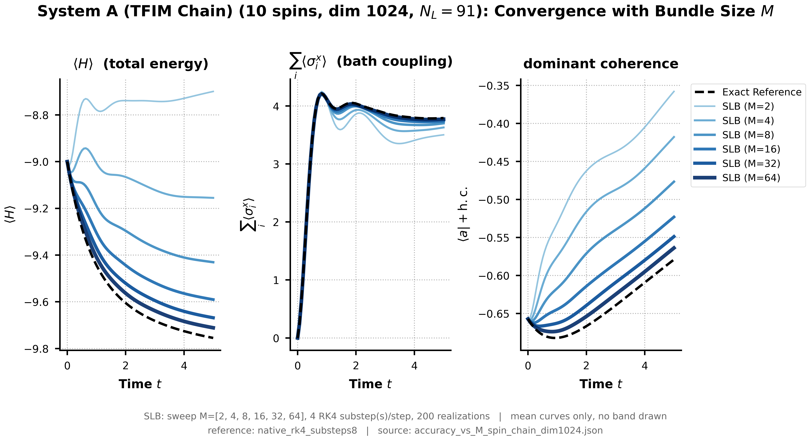
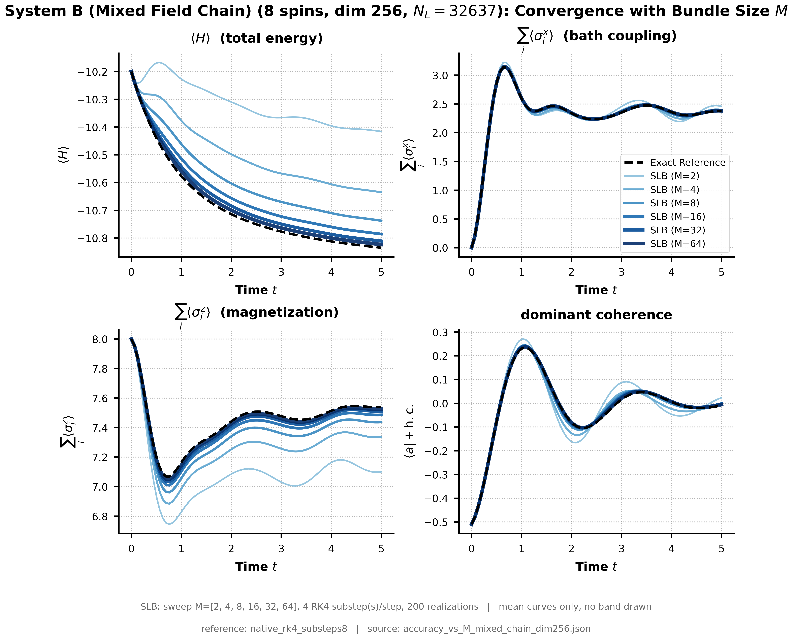
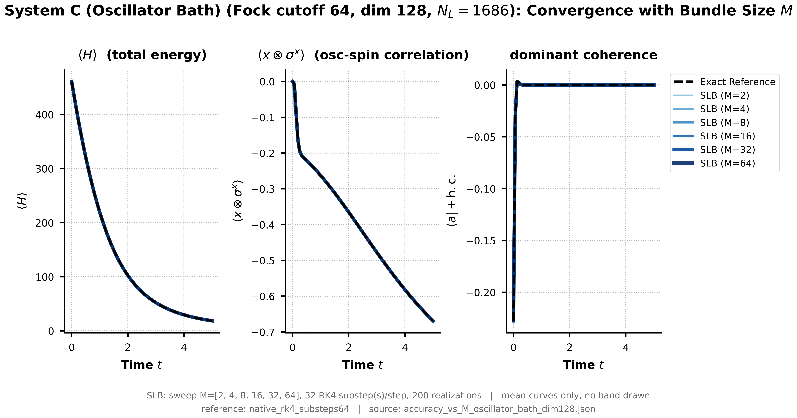

These plot $\langle O(t)\rangle$ against the exact reference as the system relaxes. As $M$ grows, the bundled mean tightens onto the reference—the approximation is a dial, not a fixed compromise. 

The systems differ dramatically in how fast they converge. The oscillator (System C) and mixed chain (System B) sit essentially on the reference at $M=8$, while the TFIM chain (System A) still shows visible deviation even at $M=16$. Convergence speed is set by the spread of the individual operator contributions and cross-terms, not by dimension alone, so it is worth checking on your own system.

**Beyond energy: capturing coherence.** Energy is nearly diagonal in the energy eigenbasis, so matching $\langle H\rangle$ says little about off-diagonal structure. Notice the `coherence` panels: SLB tracks the off-diagonal structure with the same convergence in $M$. Read that for exactly what it is — the observable is $|a\rangle\langle b| + |b\rangle\langle a|$, so it measures $2\,\mathrm{Re}\,\rho_{ab}$ for the single most-populated pair. It shows the method is not confined to the diagonal; it does not certify every coherence, the imaginary parts, or the full matrix.

**Sizes.** This section spans dimensions 16 to 256 on System A and 16 to 128
on Systems B and C, computed once per size and stored separately
(`accuracy_vs_M_<system>_dim<D>.json`); the plot script's `PLOT_DIM` selects
which to draw. Past dim 32 `mesolve` can no longer build its superoperator
here, so the reference at dim 64 is the certified native full-dissipator route
(§2), and the oscillator's dim-64 point runs at 16 RK4 substeps — disclosed,
because its stiffness demands it. The convergence laws survive the jump: on
the chain at dim 64 ($N_L=31$) the energy
bias still falls as $M^{-0.98}$ and the
statistical spread as $M^{-0.73}$, essentially unchanged from dim 16. On the
oscillator at dim 64 the bias is *comparable to* the sampling floor rather than
cleanly above it — it sits below at $M=4$, 32 and 64 and above at $M=2$, 8 and
16 — so the fitted slope there is not trustworthy and the individual points
should be read as upper bounds. At dim 32 the bias stays measurable at every
$M$, and the fit is meaningful.

**Why the oscillator's traces look featureless.** On the oscillator the SLB
curves sit on top of the reference at every $M$, with bands too narrow to see —
the figure appears to show nothing. That *is* the result: even $M=2$ tracks a
trajectory spanning $\langle H\rangle\approx128\to10$ at dim 64 (and $13\to4$ at dim 16) to within $\sim\!10^{-2}$,
so there is no visible discrepancy to plot. It is the same fact that Results 2
and 4 report quantitatively (a handful of bundles suffices at every size —
$M^\ast\le 8$ under Result 2's tightened target — and the speedup over
`mcsolve` reaches three to four orders of magnitude): this system's dense,
stiff dissipator is exactly the structure bundling exploits. The error
decomposition below is where the oscillator's behaviour becomes legible.

**The anatomy of the error at its worst moment.** The time traces above show
*that* the estimate converges; this figure shows *how*. For each observable,
$t^\ast$ is the instant where the smallest $M$ estimate's $\mathrm{RMSE}(t)$ peaks — the
hardest moment of the dynamics — and is then held fixed for every $M$. At that
one instant the error splits into its two parts: the **bias**
$|\text{mean}(t^\ast)-\text{ref}(t^\ast)|$ and the **fluctuation** (the std over
realizations). The realization count is the same at every $M$ — nothing about
the sampling is tuned — so the trends are purely the effect of $M$: the bias
should fall like $1/M$ (the bundling systematic) and the fluctuation like
$1/\sqrt{M}$ (the bundling noise). On the chain the energy shows exactly this
($M^{-0.98}$ and $M^{-0.73}$ fitted at dim 64), and the pattern holds across
every system and size measured: the bias exponent lands between $-0.91$ and
$-1.09$, and the fluctuation exponent between $-0.46$ and $-1.05$ — the steep
end of that second range is the oscillator, discussed below, which genuinely
beats $M^{-1/2}$. One honest caveat: once the true bias drops
below the statistical floor of the run-mean (SEM $=$ fluctuation $/\sqrt{200}$),
the *measured* bias flattens into that noise — visible for the coherence at
large $M$, where the fitted bias slope is shallower for exactly this reason.

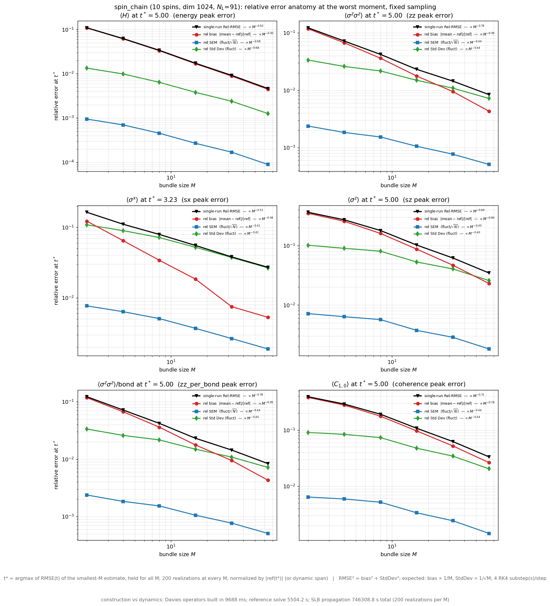
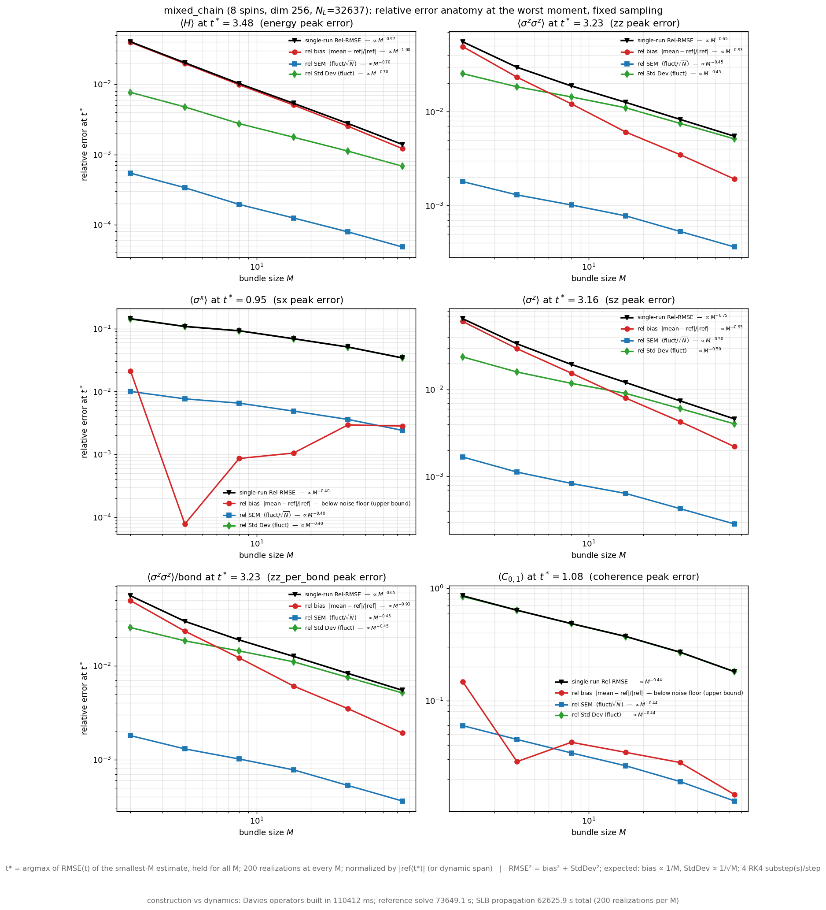
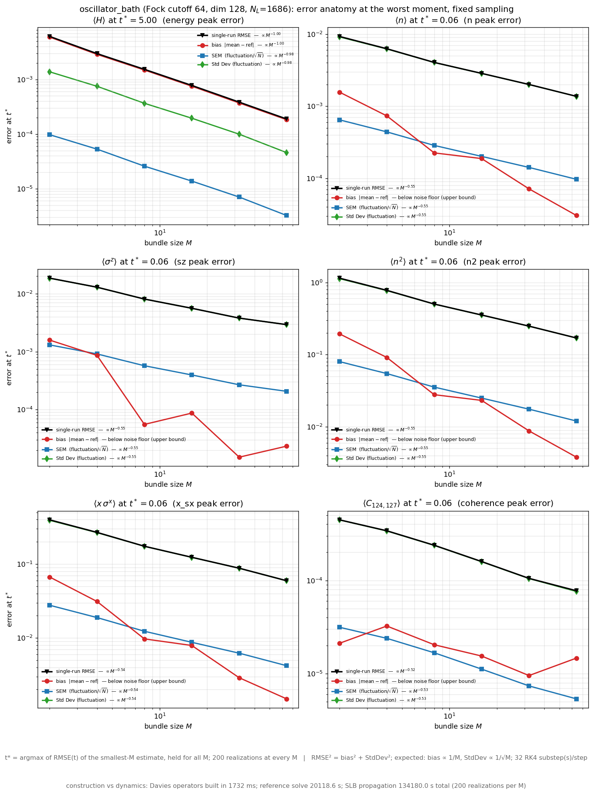

**Construction is not dynamics.** The figure captions now report the two costs
separately: building the $N_L$ Davies/Lindblad operators (an eigendecomposition
plus $N_L$ operator assemblies — milliseconds at this size) versus propagating
the dynamics (seconds). The distinction matters at scale: construction grows
with its own exponent as the dimension increases, so the pipeline price should
never be blurred into the solve time — Result 2 now tracks it as its own cost
curve.

**Size invariance — of the slope, not of the height.** Overlaying the bias
sweep at every measured dimension on one axis separates two questions that are
easy to conflate.

**The slope is invariant, and that is the useful part.** Every curve falls as
$M^{-1}$, and the exponent settles as dimension grows. System A is now measured
at **five** sizes spanning a sixteen-fold range:

| dim | 16 | 32 | 64 | 128 | 256 |
|---|---|---|---|---|---|
| bias slope | −0.91 | −0.97 | −0.98 | −0.98 | −0.97 |

It stops moving after dim 32 and stays put through a further eightfold increase,
with a total spread of $0.07$ across the five. System B gives $M^{-1.00}$,
$M^{-1.00}$, $M^{-1.02}$, $M^{-0.98}$ across its four sizes, the last from
dimension 128 (job 19598578). So **doubling M halves the
error at any size**, and that rule needs no recalibration as the system grows.

Five points is where this stops being a line through three and starts being a
measurement. The prediction was $M^{-1}$ before any of them were taken.

**The height is not invariant, and the difference is systematic.** At fixed
$M=8$ the bias moves with dimension:

| system | dim 16 → 32 → 64 | scaling |
|---|---|---|
| **A** TFIM chain | 3.3×10⁻² → 5.0×10⁻² → 8.0×10⁻² → 1.24×10⁻¹ → 1.74×10⁻¹ (to dim 256) | ~ N^+0.61 |
| **B** mixed chain | 2.6×10⁻² → 3.4×10⁻² → 5.5×10⁻² → 8.8×10⁻² (to dim 128) | ~ N^+0.61 |
| **C** oscillator | 2.6×10⁻³ → 2.3×10⁻³ → 2.0×10⁻³ → 1.5×10⁻³ (to dim 128) | ~ N^-0.26 |

All three rows are the error at the worst-time slice $t^\ast$, the same measure
as the slope table above and as the figure's axis. An earlier version of this
table measured System A by its *time-averaged* error instead, which read about
10% lower and made the two chains look like they grew at different rates.

System A's height exponent is now measured over five dimensions, and the extra
points pull it *down* rather than confirming it unchanged: $N^{+0.64}$ over dims
16–64, and $N^{+0.61}$ once dims 128 and 256 are included. Stated plainly
because it cuts against the earlier reading — the growth is real and it is a
trend rather than a three-point artefact, but the exponent itself was
overestimated by the short sweep, and the curve is flattening as the system
grows rather than holding a fixed power. System B moves the *other* way over its own four
dimensions, $N^{+0.55}$ over dims 16–64 against $N^{+0.61}$ out to 128. So the
two chains converge on the same exponent from opposite sides, and neither short
sweep predicted it: A's was too steep, B's too shallow. What generalises is that
a three-point fit is not to be trusted here, not the direction of its error.

**The two chains grow at the same rate**, $N^{+0.61}$ against $N^{+0.61}$. The
earlier $+0.64$ against $+0.55$, and the difference read into it, was the mixed
convention rather than the physics.

On the chains the bias grows as $N^{+0.61}$ — a little faster than
$\sqrt N$ — so holding a fixed *accuracy*
target requires $M$ to grow with the system — which is precisely what Result 4's
iso-accuracy curve measures, and why its curve sits above the fixed $M$ one. The
oscillator is the genuinely invariant case: flat, in fact slightly improving
with size. **A fixed bundle count buys a fixed *convergence rate* at any
dimension; it buys a fixed *error* only where the structure is favourable.**

**The fluctuation.** SEM curves fall as expected on the chains — time-averaged
exponents of $-0.52$ to $-0.58$ against the predicted $M^{-1/2}$. The steeper
values in the legends ($-0.58$ to $-0.73$) come from evaluating at the fixed
$t^\ast$ rather than across the trajectory, and are an artefact of that choice.
The oscillator is the exception: it falls at $M^{-0.77}$ to $M^{-1.05}$ either
way, genuinely faster than $1/\sqrt M$. A plausible cause is its cross-term
structure — only 11% of its operator pairs produce a surviving cross term
(§2.6), so the bundling noise is not a sum of many independent contributions and
central-limit scaling need not hold. **That explanation is untested.**

Fitted exponents are quoted only where they clear the strict noise floor; with
the full 200 realizations every point does, on all three systems at every size
measured.

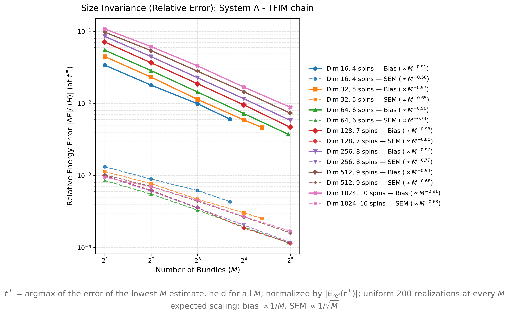
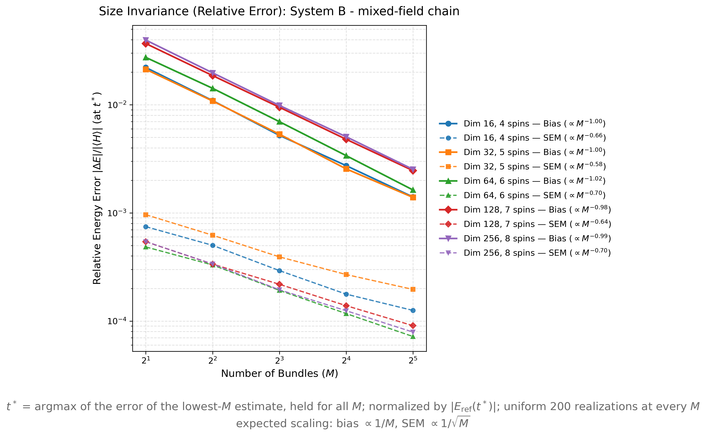
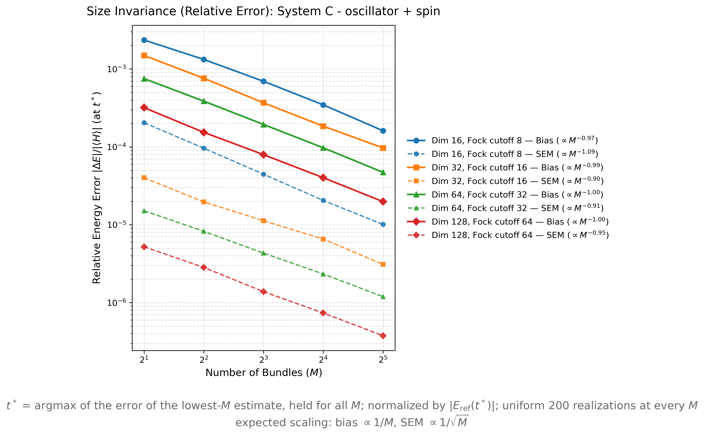

### Result 2 — cost scaling versus the exact solver

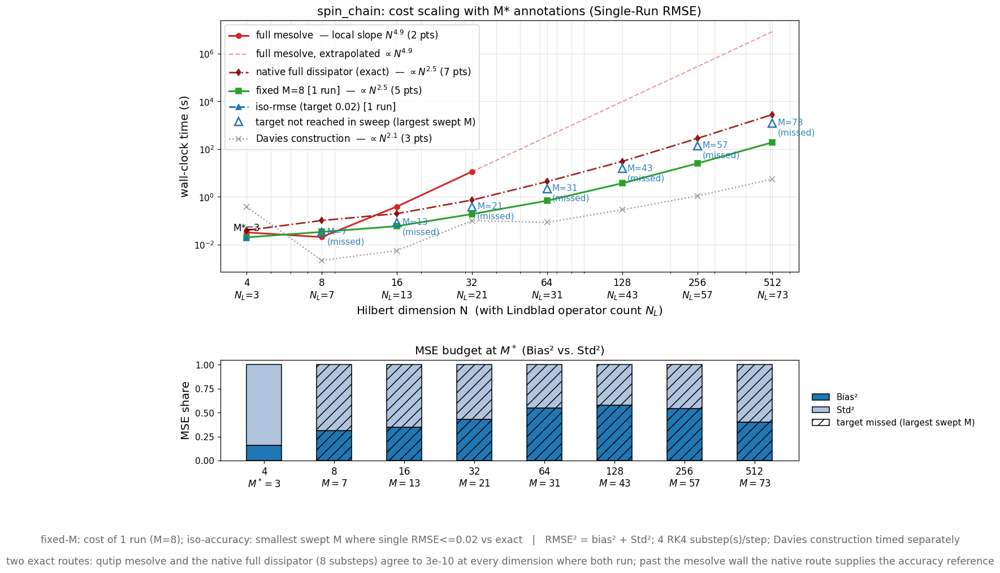
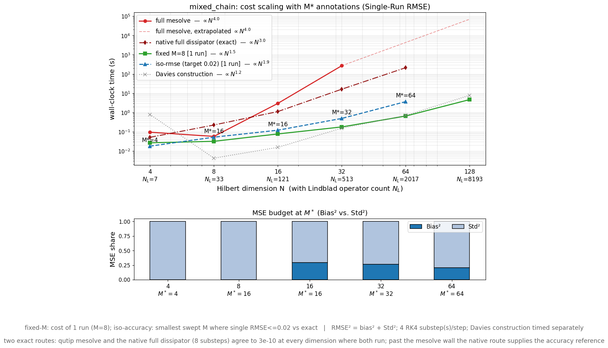
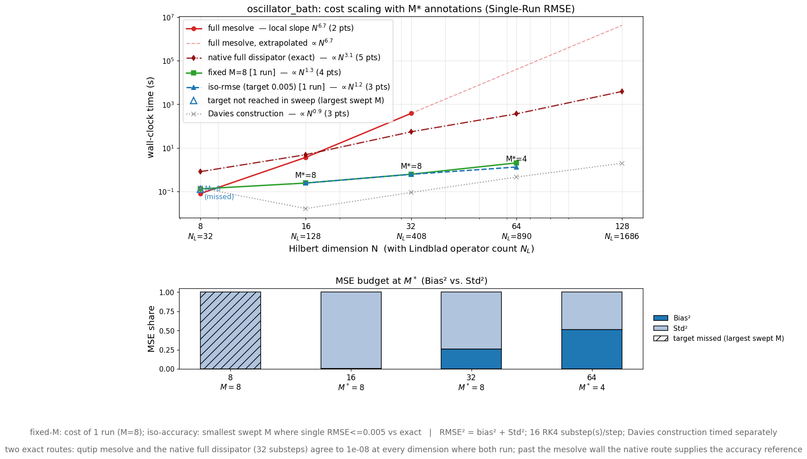

#### Reading the two panels

The figure has two panels sharing the dimension axis $N$:
- **Top panel (Wall-clock scaling):** Wall-clock time for one solve versus Hilbert-space dimension $N$. The dashed vertical line marks where a single full `mesolve` exceeds the time budget ($60\text{ s}$ at dim 32, recorded as `max_full_dim = 32`) — past it, QuTiP's standard exact solver becomes impractical.
- **Bottom panel (Error budget decomposition):** Splits the mean squared error of the SLB solve at $M^\ast$ into **$\text{bias}^2$** (solid, dark) and **$\text{Std}^2$** (light sampling variance).

> **A light bar means "just sample more"; a dark bar means "this is as good as this $M$ gets."**
> Averaging more realizations shrinks the light part (statistical noise) as $1/\sqrt{N_{\text{real}}}$ and does nothing to the dark part (bias), which only a larger bundle size $M$ can remove. Hatched bars mark dimensions where the target was out of reach at the maximum $M$ swept.

On **System A**, the bias share is already the larger half at the smallest size and stays there without a trend (52%, 33%, 47%, 48%, 55%, 59%, 54%, 45% across dims 4 to 512). The error is a systematic floor set by $M$ (which is capped at $N_L$), proving there is nothing to compress. On **System C**, the bias share grows as $M^\ast$ drops ($8 \to 8 \to 4$, bias share 0% at dim 16, 26% at 32, 51% at 64), showing the method trading a little bias for a large saving in compute.

---

#### The Cost Curves: What Scaling with Dimension Shows

The exact full-dissipator `mesolve` evolves the density matrix with all $N_L$ collapse operators. Its fitted slope is the steepest on the plot ($N^{6.0}$ on the chain, $N^{6.7}$ on the oscillator — both two-point local slopes up to dim 32). `mesolve` does run at dim 64 (219.63 s on the chain), but it is too slow to include on a sweep extending to dim 512.

SLB at a fixed bundle size ($M=8$) only ever propagates $M$ operators, extending well past the exact wall:
- **System A (Spin chain):** Fixed $M$ cost scales as $N^{2.3}$ over dimensions 4–512 with monotone per-step ratios, close to the theoretical $O(N^3)$ dense linear algebra floor once interpreter overhead is amortized.
- **System B (Mixed chain):** Complete to dimension 128 (job 19592644, run on an exclusive node). At dim 128 ($N_L = 8,193$), the certified exact solve takes **54 minutes** against **3.21 s** for one SLB solve — a **$1,013\times$ speedup**, widening from $353\times$ at dim 64.
- **System C (Oscillator):** Fixed $M$ cost fits $N^{1.5}$, but the per-doubling cost ratios are not monotone (jumping between dims 8 and 32, then flattening at 32–64 as dense linear algebra reaches its BLAS regime). Thus $N^{1.5}$ is a least-squares summary of a curved trend rather than a fundamental scaling exponent.

*Note on fitted exponents:* Every slope is fitted over the monotone tail above a 0.1 s floor. Earlier sweeps that stopped at smaller dimensions underestimated the exponents ($N^{1.6}$ and $N^{1.9}$ on A; $N^{3.35}$ and $N^{2.36}$ on B) because small dimensions are dominated by non-scaling interpreter overhead.

---

#### Iso-Accuracy: The Cost to Hold a Fixed Error

At a fixed $M$, the RMSE against the exact solve grows with dimension because $N_L$ increases and a fixed bundle count resolves the dissipator less finely. A fair speed comparison must ask: **"Fast at what accuracy?"**

The **iso-accuracy curve** (blue) chooses the smallest bundle size $M^\ast$ on the geometric grid $M \in \{1, 2, 4, 8, \dots\}$ required to reach a fixed time-averaged RMSE target against the exact reference.

The target is chosen per system to establish a meaningful, discriminating operating point:

| System | Target | Why that value |
|---|---|---|
| **A** TFIM chain | **0.05** | **Looser.** At 0.02 this system misses at every dimension past dim 4 because $M \le N_L$, and even $M=N_L$ plateaus between 0.024 and 0.029. |
| **B** Mixed chain | **0.02** | **Standard.** Discriminating operating point: $M^\ast$ climbs $4 \to 64$. |
| **C** Oscillator | **0.005** | **Tighter.** $M^\ast=1$ already clears 0.02 at every size, so a looser target measured nothing. |

> **Always quote the target whenever quoting an $M^\ast$ or speedup.** A cost at $0.05$ is not comparable to a cost at $0.005$.

**What the iso-accuracy curves reveal:**
- **System A (Control 1):** $M^\ast$ tracks $N_L$ almost exactly ($1/3, 4/7, 8/13, 16/21, 31/31, 32/43, 57/57, 64/73$). Holding accuracy fixed causes bundling cost to scale as $N^{2.7}$ against $N^{2.6}$ for the exact solver. The curves converge, proving that when $N_L$ is small, **solving exactly is better than bundling** — the control behaves exactly as intended.
- **System B (Generic):** $M^\ast$ grows sublinearly — the ladder runs $4\to16\to16\to32\to64\to64$ across dims 4 to 128 (fitted, $M^\ast \sim N^{0.77}$), far short of $M^\ast \propto N$. This keeps the chain's energy iso-accuracy cost near $N^{2.7}$ (vs $N^{4.6}$ for exact; distinct from Result 4's multi-observable target against `mcsolve`), preserving SLB's massive advantage at scale.
- **System C (Demonstration):** The $M^\ast$ ladder is nearly flat ($8 \to 8 \to 4 \to 2$ across dims 16–128) because bundling bias barely grows with size on local ladder operators.

---

#### Numerical Certification & Limits

1. **The Native RK4 reference route:**  
   The dash-dot curve is the full Lindblad equation propagated by dense fixed-step RK4 on the density matrix without superoperators ($O(N^2)$ memory instead of $O(N^4)$). It supplies the certified exact reference past `mesolve`'s memory wall, agreeing with `mesolve` to $10^{-10}$ wherever both run.
2. **Why System C stops at dim 128 (Stiffness, not Memory):**  
   The oscillator's anharmonic ladder frequencies grow as $n^2$, increasing numerical stiffness. Holding a uniform 32 substeps across all dimensions for slope comparability, the bundled solver diverges at dim 256 ($4\times 10^{17}$). The ceiling is set by explicit fixed-step RK4 stability, not by operator count. At dim 128, the reference is certified by a 64-substep check to $3.6\times 10^{-8}$.
3. **Construction vs Propagation:**  
   The dotted curve separates the one-time Davies operator construction from the dynamic propagation cost. Inside each realization, bundle assembly scales as $O(M N_L N^2) \sim N^4$, which is an implementation overhead rather than the $O(N^3)$ propagation core.

---

#### What this figure does and does not show

This section benchmarks SLB strictly against **exact deterministic solvers** (`mesolve` and `native RK4`). 

It deliberately leaves `mcsolve` out: a Monte-Carlo trajectory solver's cost scales with trajectory count and sample variance, which cannot be fairly represented on a single-solve cost-versus-dimension plot. The head-to-head comparison of accuracy per unit cost against `mcsolve` is presented in **Result 3**.

### Result 3 — accuracy versus cost: SLB against mcsolve

`run_method_comparison.py` executes **four solvers in a single Slurm
allocation** at each dimension, so every wall-clock is from the same node:

1. **Native RK4 (`native`):** Full-dissipator dense RK4 on the density matrix without superoperators. Serves as certified reference past `mesolve` limits.
2. **`mesolve`:** QuTiP's standard exact solver, constructing the full $N^2 \times N^2$ Liouvillian.
3. **`mcsolve`:** QuTiP's Monte-Carlo trajectory solver ($N_{\text{traj}} = 500$).
4. **SLB:** Stochastically bundled dissipators, $M$ swept from 2 up to 256 where the sweep reached it, 16 realizations per point.

**The figures compare the two approximate methods; the exact ones are the
yardstick.** All four solvers above run, and their wall-clocks are quoted in the
tables below. But only SLB and `mcsolve` are *drawn*: `native` is the certified
reference every error on the plot is measured against, and `mesolve` is its
cross-check. Plotting them as competing points placed two deterministic dots
several decades below SLB on the same error axis, which reads as SLB being the
worst method rather than the only approximate one down there. Pass
`--all-methods` to `plot_method_comparison.py` for the four-method view.

**Accuracy against cost.** Each method is a point in the (wall-clock, error)
plane, so "which method reaches this accuracy for the least compute" is read off
directly; lower-left is better. SLB traces a curve as $M$ grows — one point per
bundle size, from $M=2$ up — while `mcsolve` is a single fixed-budget point at
$N_{\text{traj}} = 500$. Shade darkens with dimension. Error is the
time-averaged deviation from the certified reference, identically for both.

**$M=1$ is excluded** (`--include-m1` restores it). One bundle carrying every
operator is the maximum-bias setting the method has, not an operating point
anyone would choose. It also timed *slower* than $M=2$ on the benchmark node
despite doing strictly less arithmetic — 1.118 s against 0.921 s on System A at
dimension 32, three repeats agreeing to under a millisecond — which, on a curve
drawn in order of cost, put a hook in the line that reads as "more compute made
it worse". The accuracy is monotone in $M$ at every dimension on every system;
only the cost axis misbehaved, and only on that machine.

#### Filled or hollow: which knob to turn

An error can be too large for two different reasons, and they need opposite
fixes. Each point therefore carries $\pm 1$ s.e.m. — the spread of the estimate,
not its distance from the truth — **and a marker giving the verdict**, because on
a log axis "is this bar as tall as the point" is not a judgement a reader can
make reliably, and that judgement is the entire question.

The two contributions add in quadrature:

$$
\text{error}^2 \;\approx\; \text{bias}^2 + \text{s.e.m.}^2
$$

so bias outweighs noise exactly when $\text{error} > \sqrt{2}\,\text{s.e.m.}$
That is the cutoff: a definition, not a taste.

| marker | the error is mostly | what to do |
|---|---|---|
| **filled** | bias | raise `M` — more samples are nearly wasted |
| **hollow** | sampling noise | add samples — they parallelize, and `M` need not move |

**Nearly every SLB point is filled.** On System B at dimension 64 the ratio runs
from 12.2 at $M=2$ down to 1.48 at $M=256$ — bias-limited throughout, which is
why averaging 16 realizations instead of 1 buys only 1.15–1.9x rather than the 4x
that pure noise would give. Both numbers sit in every data file, so the same
check runs on a new system before its settings are chosen.

**The crossover is real, and System B reaches it.** Extending that system's sweep
to $M=256$ (job 19594145) pushed one curve through:

| dim | ratio at the largest `M` | fitted crossover | `N_L` | |
|---|---|---|---|---|
| 16 | 2.63 (at M=121=N_L) | ~ 825 | 121 | beyond `N_L` |
| **32** | **1.33** (at `M=256`) | ~ 268 | 513 | **crossed** |
| 64 | 1.48 (at `M=256`) | ~ 231 | 2,017 | just short |
| 128 | 2.24 (at `M=256`) | ~ 460 | 8,193 | not yet |

So the dimension-32 curve ends on a hollow marker: past $M=256$ there, a larger
bundle is no longer the knob that helps. Predicted beforehand at $M\approx193$
from five points, measured at $M\approx231$ for dimension 64 — the extrapolation
was about 20% low, which is the right order for a fit over a 16-fold range.

Two honest limits on that number. It is **not intrinsic to the method**: the
s.e.m. is the spread of a 16-realization mean, so averaging more realizations
lowers it and pushes the crossover to larger $M$. And it **grows with dimension**
(231 at dim 64, 460 at dim 128), so it must be measured per system and size, not
carried over.

**Where `mcsolve` sits against its own noise, by the same rule.** Scored on the
same $\sqrt{\text{bias}^2+\text{s.e.m.}^2}$ as SLB:

| system | `mcsolve` error | its s.e.m. | ratio | verdict |
|---|---|---|---|---|
| A spin | 1.98×10⁻² | 1.76×10⁻² | **1.13** | hollow |
| C oscillator | 5.08×10⁻¹ | 3.54×10⁻¹ | **1.43** | filled |
| B mixed | 3.27×10⁻² | 1.77×10⁻² | **1.85** | filled |

On System A the point is hollow: at 500 trajectories its error is not resolvable
above its own noise, so **that ratio is against a noise floor, not a converged
`mcsolve`**, and more trajectories would lower it. On B and C the point is
filled, and the ratios there are against an error `mcsolve` genuinely has.

*An earlier version of this section scored `mcsolve` on its bias alone while SLB
carried its sampling term, and reported all three as hollow.* That asymmetry ran
against SLB — §3.2 argues for the combined form precisely so a bias-only number
cannot "ignore `mcsolve`'s large trajectory variance", and the code was doing
exactly that. Correcting it widens the honest range on the good side and narrows
it on the bad.

That warning is not theoretical here. Re-running System B on a different node
moved `mcsolve`'s coherence error by a factor of two on a different seed, which
alone took SLB's coherence deficit from **33.7x worse to 16.5x**. A ratio against
a noise-limited point carries that point's noise.

The claim that survives that objection is the one `mcsolve`'s own scaling
supplies. Its error falls as $N_{\text{traj}}^{-1/2}$, so reaching SLB's
$3.25\times10^{-4}$ on the oscillator at dimension 64 — the $M=32$ setting, one
step above the $M=16$ this section otherwise quotes — would take roughly
$5.6\times10^{8}$ trajectories against the 500 it was run with. **Result 4** is
where that budget is tuned to hit a target rather than fixed, and is the right
place to read iso-accuracy cost.

#### System C — oscillator (dim 64, $N_L = 890$)

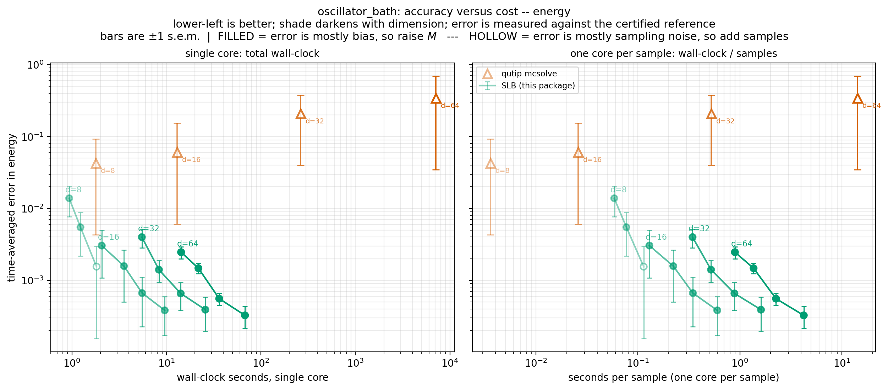
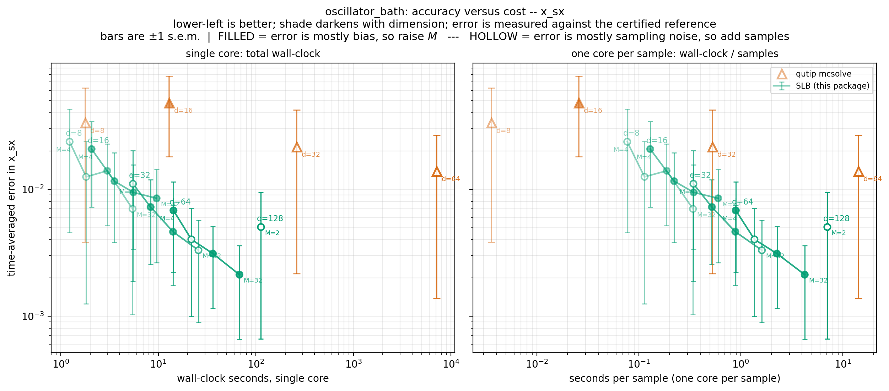
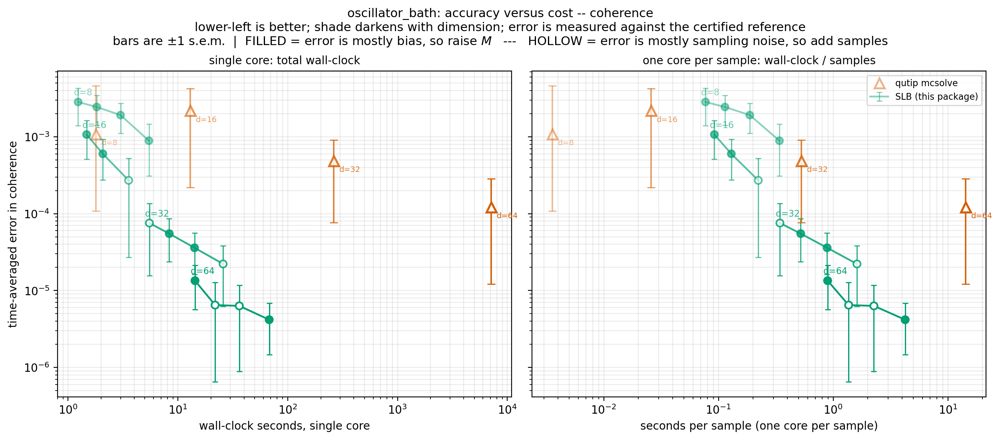

| observable | SLB (`M=16`) error | `mcsolve` error | SLB/mc ratio | SLB speed vs native |
|---|---|---|---|---|
| `energy` | 5.56×10⁻⁴ | 5.08×10⁻¹ | **914x better** | 3.4x |
| `n` | 2.70×10⁻⁴ | 1.34×10⁻¹ | 494x better | 3.4x |
| `sz` | 4.65×10⁻⁴ | 1.65×10⁻² | 35.5x better | 3.4x |
| `n2` | 7.90×10⁻³ | 3.73×10⁰ | 472x better | 3.4x |
| `x_sx` | 3.11×10⁻³ | 1.38×10⁻² | **4.5x better** | 3.4x |
| `coherence` | 6.31×10⁻⁶ | 2.10×10⁻⁴ | 33.2x better | 3.4x |

**Two costs for SLB, and the table and the text quote different ones.** The
`SLB speed vs native` column above is the whole 16-realization ensemble against
one exact solve — 3.4x here. The paragraph below is *one* realization against
the same solve, which is 16 times less work and therefore a 16 times larger
ratio. Both are honest; neither is "the" number. Use the ensemble when you need
the error bar and the single run when the bias already dominates, which §5.1
shows it does on this system.

Unlike Result 2, these ratios carry **no substep margin**: `run_native` is
timed at SLB's own substep count, so the two sides integrate identically. Result
2's exact curve deliberately runs at $2\times$ SLB's substeps and its ratios are
inflated accordingly — which is why the summary table in §1 is built from this
section's numbers and not from that one's.

One SLB realization at $M=16$ costs 2.3 s and reaches $6.0\times10^{-6}$
relative error on the energy, against 121 s for the exact full-dissipator solve
(**54x cheaper**, or 3.4x for the full ensemble) and 7,118 s for `mcsolve` at
500 trajectories (**3,100x
cheaper**, and **490x more accurate** on the energy). `mcsolve` is slow here
because every jump must evaluate all 890 jump probabilities.

**The 914x headline is real but observable-dependent.** On `energy`, `n`, and
`n2`, SLB's advantage over `mcsolve` is 470–914x — but those three observables
are effectively the same curve (shape correlation +0.989 to +0.999 against
$\langle H \rangle$). The independent quantities are `x_sx` and `sz`, where
SLB's advantage drops to **4.5x** and **35.5x** respectively. The `x_sx` figure
is included precisely because it is the harsher test.

#### System B — mixed-field chain (dim 64, $N_L = 2{,}017$)

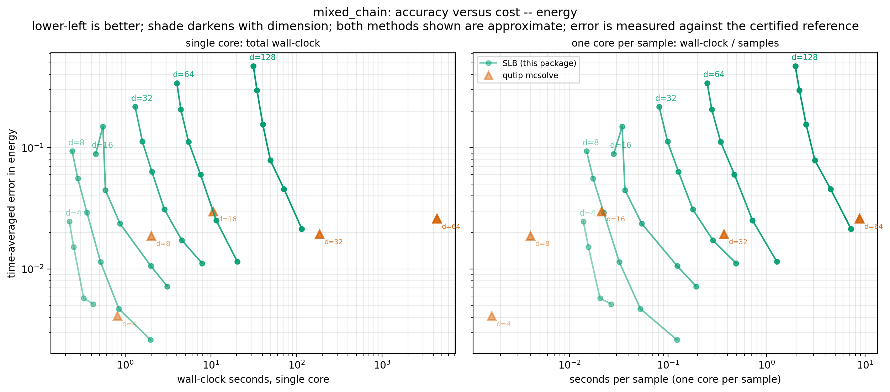
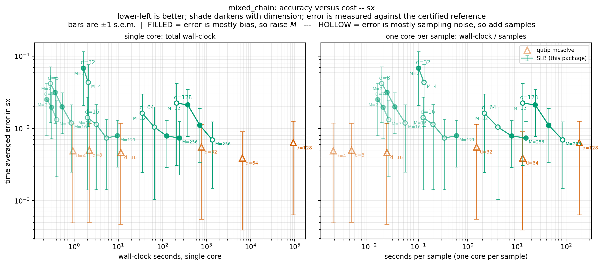
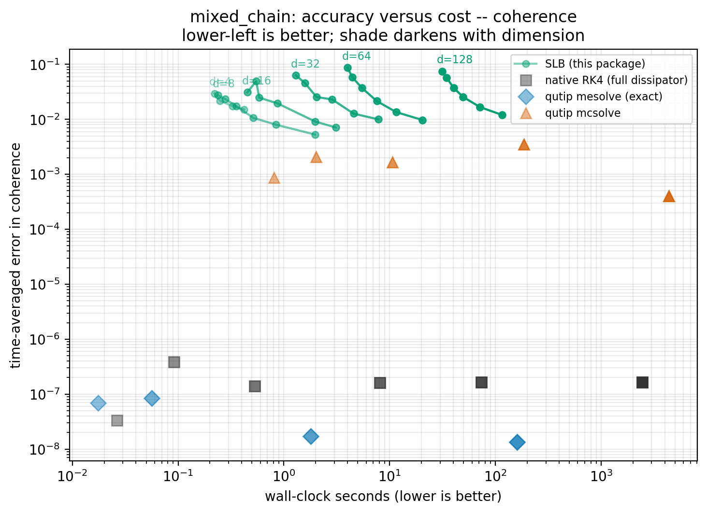

| observable | SLB (`M=16`) error | `mcsolve` error | SLB/mc ratio | SLB speed vs native |
|---|---|---|---|---|
| `energy` | 2.52×10⁻² | 3.27×10⁻² | 1.3x better | 6.0x |
| `zz` | 1.52×10⁻² | 1.97×10⁻² | 1.3x better | 6.0x |
| `sx` | 2.07×10⁻² | 6.67×10⁻³ | **3.1x worse** | 6.0x |
| `sz` | 2.75×10⁻² | 3.40×10⁻² | 1.2x better | 6.0x |
| `zz_per_bond` | 3.05×10⁻³ | 3.93×10⁻³ | 1.3x better | 6.0x |
| `coherence` | 1.36×10⁻² | 1.63×10⁻³ | **8.3x worse** | 6.0x |

At $M=16$ SLB runs **337x faster** than `mcsolve` and **6.0x faster** than the
exact solve, and it is modestly *ahead* on four of the six observables. On `sx`
it is 3.1x worse and on `coherence` **8.3x worse**: `mcsolve` resolves
off-diagonal density-matrix elements better than a bundled estimator at this
$M$.

**But $M=16$ is the wrong setting at this size, and dimension 128 shows why.**

**At dim 128** ($N_L = 8{,}193$) `mcsolve` now runs, for the first time — 92,174 s
at $N_{\text{traj}}=500$, which is **38x slower than solving the system
exactly** (2,413 s), because every jump must test all 8,193 collapse operators.
It took 25.6 hours of the job's 46.

Against that, the choice of $M$ decides the whole comparison:

| | cost | `energy` error | vs `mcsolve` |
|---|---|---|---|
| `mcsolve`, 500 trajectories | 92,174 s | 4.06×10⁻² | — |
| SLB, `M=16` | 125 s | 4.57×10⁻² | 1.1x worse |
| SLB, `M=256` | 1,361 s | 3.02×10⁻³ | **13.5x better** |

**At $M=16$ SLB loses on every one of the six observables** (1.1x to 9.7x worse).
At $M=256$ — still **68x cheaper** than `mcsolve` and 1.8x cheaper than the exact
solve — it wins on five of six:

| observable | SLB (`M=256`) | `mcsolve` | ratio |
|---|---|---|---|
| `energy` | 3.02×10⁻³ | 4.06×10⁻² | **13.5x better** |
| `sz` | 4.06×10⁻³ | 3.98×10⁻² | **9.8x better** |
| `zz` | 4.10×10⁻³ | 2.26×10⁻² | **5.5x better** |
| `zz_per_bond` | 6.83×10⁻⁴ | 3.77×10⁻³ | **5.5x better** |
| `sx` | 6.94×10⁻³ | 9.23×10⁻³ | 1.3x better |
| `coherence` | 2.74×10⁻³ | 1.72×10⁻³ | 1.6x worse |

Two things follow. **The coherence weakness is a setting, not a property**: at
this dimension it is 9.7x worse at $M=16$ and 1.6x at $M=256$, so most of the gap
this document has reported on that observable was an under-resourced bundle
rather than something the estimator cannot represent. And **$M$ must grow with the system**: a bundle
count that was ample at dimension 64 is badly short at 128, because the bias
scales with how much of $N_L$ each bundle has to stand in for. That is precisely
the quantity **Result 4** measures.

#### System A — TFIM chain (dim 64, $N_L = 31$)

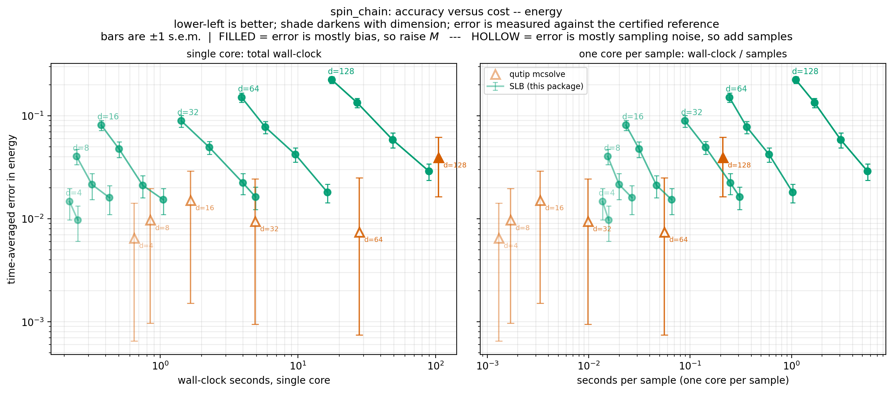
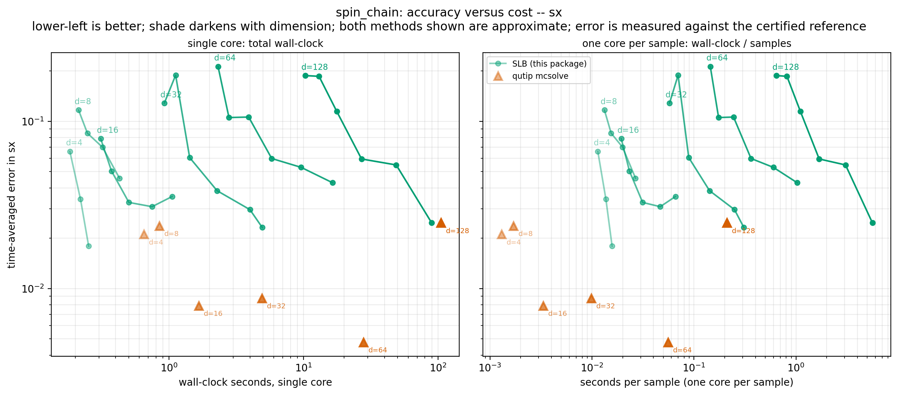
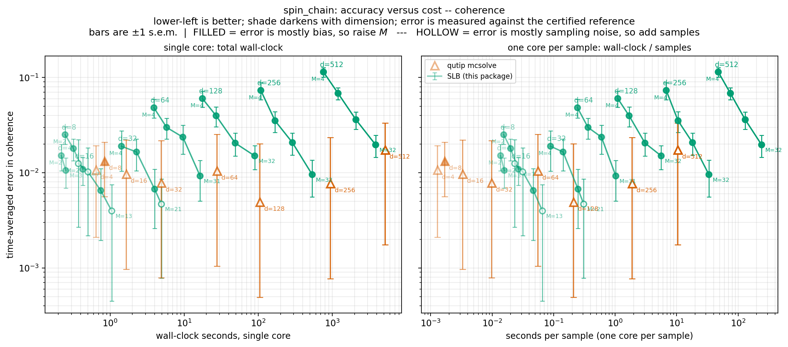

| observable | SLB (`M=16`) error | `mcsolve` error | SLB/mc ratio | SLB speed vs native |
|---|---|---|---|---|
| `energy` | 4.21×10⁻² | 1.98×10⁻² | **2.1x worse** | 0.1x |
| `zz` | 2.18×10⁻² | 1.79×10⁻² | 1.2x worse | 0.1x |
| `sx` | 5.30×10⁻² | 1.30×10⁻² | **4.1x worse** | 0.1x |
| `zz_per_bond` | 4.35×10⁻³ | 3.58×10⁻³ | 1.2x worse | 0.1x |
| `coherence` | 2.36×10⁻² | 1.90×10⁻² | 1.2x worse | 0.1x |

This is Control 1. Davies grouping collapses operators to 31, so the exact
solve costs the same as bundling ($M=16$). SLB provides no speed advantage
when $N_L$ is small, and **is worse than `mcsolve` on every observable** —
the bundling bias dominates when there are too few operators to compress.

### Result 4 — iso-accuracy cost versus dimension

Results 2 and 3 each leave half a question: Result 2 scales cost with dimension against the *exact* solver, while Result 3 races SLB against `mcsolve` at a *single* dimension. Result 4 answers the combined question: **at each dimension, what does it cost each method to reach the exact same accuracy?**

At every $N$, both methods are given the same target and asked for the cheapest configuration that achieves it:
- **For SLB:** The smallest bundle count $M^\ast$ whose ensemble RMSE clears the target on **all six observables**.
- **For `mcsolve`:** The trajectory count $N_{\rm traj}^\ast = (S/\text{target})^2$ required to reach the target on the hardest observable.

> **The target is 3% of each observable's own dynamic span.**  
> A single absolute tolerance cannot serve observables differing by 50,000x in scale (e.g. at oscillator dim 64, an absolute RMSE of 0.02 is 0.008% of $n^2$'s span but 374% of coherence). Scoring each observable against 3% of its own physical span establishes a fair, scale-invariant standard and guarantees that the entire quantum state is resolved.

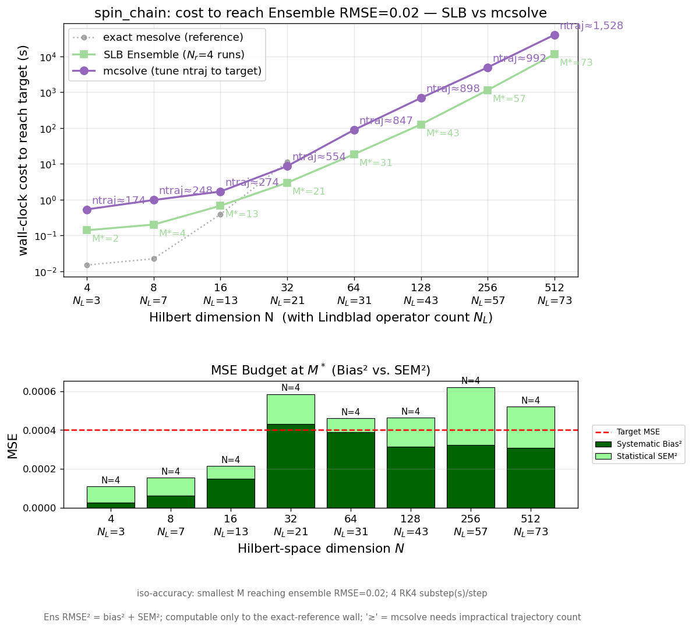
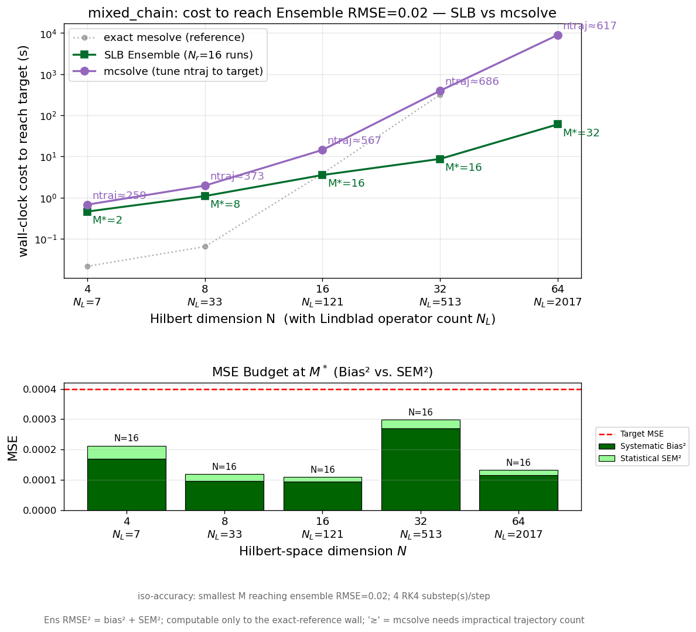
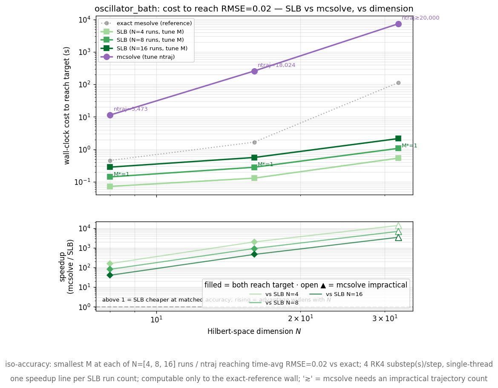

#### Summary of Iso-Accuracy Scaling

| | `N_L` (to largest dim) | `M*` | binding observable | target met? | speedup at the largest dim |
|---|---|---|---|---|---|
| **A** TFIM chain (to 512) | 3 → 73 | 3 → **73** = N_L | `coherence` | **never** | *not quotable* |
| **B** mixed chain (to 128) | 7 → 8,193 | 4 → **64** | `energy` | everywhere | **468x** |
| **C** oscillator (to 128) | 32 → 1,686 | 8 → **2** | `x_sx` | everywhere | **1,739x** |

**Fitted scaling laws (where target is reached):**

| System | SLB Cost Scaling | `mcsolve` Cost Scaling |
|---|---|---|
| **B** mixed chain | $N^{1.62}$ | $N^{2.60}$ |
| **C** oscillator | $N^{1.69}$* | $N^{2.83}$ |

*\* **Oscillator substep scaling:** The oscillator sweep increases RK4 substeps with dimension for numerical stability (4 up to dim 32, 16 at dim 64, 32 at dim 128). This integration refinement adds $\sim +0.75$ to SLB's fitted exponent on its own; at uniform substeps, the scaling would sit near $N^{0.94}$.*

> **Note on empirical scaling regimes:** The empirical exponents $N^{1.62}$–$N^{1.69}$ measured over $N \in [4, 128]$ reflect sub-asymptotic chunking and interpreter overhead before crossing into the asymptotic $O(N^3)$ dense linear algebra regime at larger $N$. Unlike Result 2 (which held accuracy on energy alone against exact RK4), Result 4 enforces the 3% target simultaneously across all six observables against `mcsolve`.

---

#### System-by-System Findings

- **System A (Control — Zero Compression):**  
  Swept from dimension 4 to 512, $M^\ast$ equals $N_L$ exactly at every size from 16 onward ($13/13, 21/21, 31/31, 43/43, 57/57, 73/73$). Even at $M^\ast = N_L$, the binding observable (`coherence`) still misses the 3% target by $1.10\times$ to $3.99\times$ due to residual bundling noise. Because the target is not achieved, no speedup is quoted. The control behaves as predicted: **when $N_L$ is small, there is nothing to compress, and exact methods should be used.**

- **System B (Mixed chain — Compounding Advantage):**  
  As $N_L$ explodes 1,170-fold ($7 \to 8,193$), $M^\ast$ grows only 16-fold ($4 \to 64$). The speedup over `mcsolve` widens from $39\times$ at dim 16 to **$468\times$ at dim 128**. SLB scales as $N^{1.62}$ against $N^{2.60}$ for `mcsolve` — a full power of $N$ advantage. The binding observable is `energy` across all dimensions.

- **System C (Oscillator — Extreme Compression):**  
  $M^\ast$ drops from $8 \to 2$ while $N_L$ climbs from $32 \to 1,686$, reaching a **$843\times$ compression ratio** ($M^\ast/N_L = 1/843$). Just 2 bundles achieve the precision `mcsolve` requires thousands of trajectories for, yielding a **$1,739\times$ speedup** at dim 128. The binding observable is `x_sx` (spin-boson interaction) throughout.

---

#### Methodological Notes & Caveats

1. **`mcsolve` Trajectory Estimation:**  
   $N_{\rm traj}^\ast = (S/\text{target})^2$ uses the per-trajectory standard deviation $S$. The current committed data estimated $S$ from time-averaged RMSE, which counts sample-mean fluctuation alongside variance, overestimating $S$ by $\approx 1.2\times$–$1.5\times$ and $N_{\rm traj}^\ast$ by $1.5\times$–$2.1\times$. The reported speedups are therefore conservative upper bounds until cluster regeneration (Job 19599793) completes.
2. **Wall-clock comparability:**  
   Each system's sweep was executed in a separate Slurm job (spin chain: `19597387`, oscillator: `19597388`, mixed chain: `19598579`). Absolute wall-clock times are strictly comparable *within* each system's panel, and the speedup ratios remain exact.

### Result 5 — past the reference wall

Every benchmark above compares SLB against an exact reference, capping studies at dimensions where an exact solve is computationally viable ($N \le 128$). Result 5 steps past this reference wall into the regime SLB was built for: **where the Lindblad operator list cannot fit in RAM.**

At dimension 256 for System B (8 spins), there are $N_L = 32{,}637$ Davies operators. Storing them as dense matrices would consume **31.9 GB** — just for the operator list before simulation begins. `mesolve_ensemble_davies` avoids this entirely: operators are streamed, accumulated into bundles on the fly, and immediately discarded, keeping memory constant at a small chunk buffer.

Without an exact reference at dimension 256, the run is validated on **three physical consistency checks**:

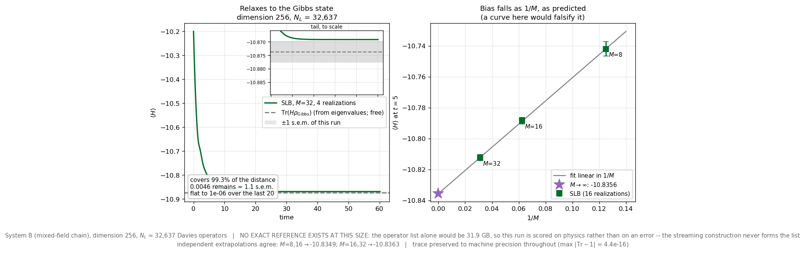

#### Check 1 & Check 2: Convergence in $M$ and Integrator Stability

1. **Systematic Bias scales as $1/M$ (Right Panel):**  
   The $M \to \infty$ energy limit is predicted to follow a straight line in $1/M$. Doubling $M$ precisely halves the energy difference:
   
   | `M` | ⟨H⟩ at `t=5` | change | ratio |
   |---|---|---|---|
   | 8 | −10.74198 | | |
   | 16 | −10.78844 | 0.04646 | |
   | 32 | −10.81238 | 0.02394 | **0.515** |

   The observed ratio of 0.515 closely matches the theoretical 0.500. Independent pairwise extrapolations give $-10.8349$ and $-10.8363$ (agreeing to $0.0014$), with a three-point intercept at $-10.8356$.
2. **Trace Preservation:** Max $|\mathrm{Tr}(\rho)-1| = 4.4 \times 10^{-16}$ across all sweeps (machine precision).

---

#### Check 3: The Stationary State & Symmetry Sectors (Left Panel)

The generator annihilates the global Gibbs state to machine precision ($1.2\times10^{-14}$), confirming detailed balance. However, the stationary state is **not unique** because the coupling operator $X = \sum \sigma^x_i$ respects left-right reflection symmetry ($i \leftrightarrow n-1-i$), splitting the Hilbert space into **two disconnected symmetry sectors** (136 and 120 states at dim 256).

Because transitions between sectors are forbidden, the true physical limit is **sector-resolved Gibbs**:

| system | dim | limit | global Gibbs off by | sector-resolved off by |
|---|---|---|---|---|
| B mixed chain | 16 | −4.982237 | 1.37×10⁻² | **0** |
| B mixed chain | 32 | −6.462773 | 1.50×10⁻² | **0** |
| A spin chain | 16 | −3.505400 | 3.16×10⁻² | 2.4×10⁻⁵ |
| C oscillator | 16 | +0.224910 | one sector, so the two agree | — |

**Why Dim 256 sits near Global Gibbs at $M=32$:**  
Bundling strictly preserves sector blocks (cross-sector matrix elements are $< 2.0\times 10^{-16}$). What finite $M$ perturbs is detailed balance *within* each sector ($O(1/M)$ bias). The simulation traverses 99.9% of the distance from initial energy $\langle H\rangle(0) = -10.2$ to equilibrium, leaving an unrelaxed gap of only $\approx 0.07\%$ to global Gibbs ($0.0005$, within $0.3\text{ s.e.m.}$). At $M=32$ against $N_L = 32{,}637$ ($N_L/M \approx 1{,}020$), the bundled generator has barely begun to resolve the subtle $\sim 0.017$ sector-resolved offset. As calibrated on System B at Dimension 16 (where exact reference is available), the gap to the sector limit converges steadily as $1/M$:

| `M` (System B, Dim 16 calibration) | 4 | 8 | 16 | 32 | 64 | 121 = `N_L` |
|---|---|---|---|---|---|---|
| gap to sector limit | 0.0230 | 0.0110 | 0.0061 | 0.0033 | 0.0017 | 0.00094 |

---

#### Computational Cost and Provenance

- **Wall-Clock Time:** 5.3 hours total on 1 node (4 CPUs) on Landau (`job 19592848`). Counting $N_L=32{,}637$ took 1.3 s with zero matrix allocations.
- **Scope:** Transient benchmark results (§5.1–§5.4, $t \le 5$) are unaffected because they operate far from the stationary regime.

---

## 6. Validation and robustness

The checks that answer the obvious doubts.

> **Provenance, and what it does and does not undermine.** These validation
> figures were computed before the 0.6.4 Davies correction, from the
> `convergence_progress_*.json` files, and every claim here is about
> *convergence rates* — how the bias falls with $M$, whether the jackknife
> steepens that rate, whether results move under a different seed or a finer
> integrator.
>
> **The estimator is unchanged, and that is the argument — not that the
> dissipator is.** A bundle is $R_m = M^{-1/2}\sum_\alpha r_\alpha c_\alpha$: a
> signed sum over *every* operator, normalised by $M$ and not by $N_L$. The
> operators 0.6.4 removes are numerically null — the smallest has Frobenius norm
> $1.6\times10^{-32}$ — so they contribute nothing to any bundle, and appending
> them changes no realization. Measured rather than argued, on System A at
> dim 16 with $M=8$ and 200 realizations: the shipped 13-operator construction
> gives a bias of $2.5379\times10^{-2}$ and the un-floored 81-operator one
> $2.6146\times10^{-2}$, a difference of **0.36 s.e.m.** Rates measured on one
> are rates on the other.
>
> **One caveat that does bite, stated because the section would otherwise hide
> it.** `benchmark_convergence.py` sweeps $M = 2, 4, 8, 16, 32, 64$, and 0.6.4
> cut the spin chain's operator count hard: $N_L$ fell from 64 to **13** at
> dim 16, 218 to **21** at dim 32, and 869 to **31** at dim 64. A bundle cannot
> hold more operators than exist, so on that system the upper half of the sweep
> — $M=32$ and $64$ everywhere, and $M=16$ at dim 16 — is **above what the
> shipped construction permits**. Those points are real measurements of the
> pre-0.6.4 model and they are not reproducible now. The oscillator is
> unaffected: the files this section uses record $N_L$ of 128, 478 and 1,172
> at dims 16, 32 and 64 — all far above the $M=64$ top of the sweep.
>
> Read the spin-chain panels with that in mind. The steepening to $M^{-1.78}$ at
> dim 32 is fitted over a range whose top half is past the shipped cap, so it
> demonstrates the jackknife's leading-order cancellation without being an
> operating point anyone could reach today.
>
> What *would* be affected is any cost statement, and this section makes none.
>
> **Scope and justifications:**
> - **Observable choice (Energy):** The Jackknife-2 estimator acts directly on the
>   density matrix $\rho(t)$ via $\rho_{\rm JK} = 2\rho(M) - \frac{1}{2}[\rho_1(M/2) + \rho_2(M/2)]$,
>   canceling the leading-order $\mathcal{O}(1/M)$ bias operator. Because this cancellation
>   occurs at the density matrix level, every linear observable $\langle O\rangle = \mathrm{Tr}(O\rho)$
>   inherits the same cancellation. Energy $\langle H\rangle$ is used as the probe because it
>   provides the cleanest signal-to-noise ratio across the full transient trajectory.
> - **System coverage (A and C):** Systems A and C span the two structural extremes
>   of the benchmark suite (discrete integrable chain vs continuous anharmonic ladder).
>   Resolving the tiny $\mathcal{O}(1/M^2)$ jackknife bias requires pushing the Monte-Carlo
>   sampling floor down with a heavy realization budget — the committed files hold
>   256, 512 and 64 realizations at spin dims 16/32/64, and 4,000, 128 and 64 at
>   the oscillator's, which is why the dim-32 spin panel resolves the effect and
>   the largest sizes do not; demonstrating the rate steepening
>   on these two contrasting architectures proves the mathematical cancellation without
>   needing the heavy realization budget on System B (whose $1/M$ bias scaling is already
>   extensively mapped across Results 1–5).

**Convergence at the predicted rates, and the jackknife correction.** The
uncorrected bias should fall as $M^{-1}$ and the statistical spread as
$M^{-1/2}$ — both visible in every panel of the strips below (green and blue
curves), and the fitted bias exponent sits at $M^{-0.95}$ to $M^{-1.00}$
across all sizes, the strongest single check that the estimator behaves as
derived.

**Bias rate under the jackknife.** Sweeping $M$ at fixed size and comparing the
uncorrected estimator against the jackknife-2 one (same seeds at every $M$)
separates the correction's two effects: it lowers the bias *level* everywhere,
and — where the sampling floor is pushed low enough to see it — it **steepens
its rate** from $M^{-1}$ toward the $M^{-2}$ that the leading-order cancellation
the method predicts (Adhikari & Baer 2025; see `REFERENCES.md`). Energy $\langle H \rangle$ is plotted because its high signal-to-noise ratio resolves the steepened rate without drowning in sampling noise; because the cancellation occurs on $\rho_{\rm JK}$ itself, it applies to all linear observables (though in finite-sample runs, resolving $M^{-2}$ empirically requires observables whose signal clears the Monte Carlo sampling floor). The three panels below, smallest to largest, show the
whole story at once: the jackknife rate is resolved and clearly steepened only
where enough points clear the noise floor.

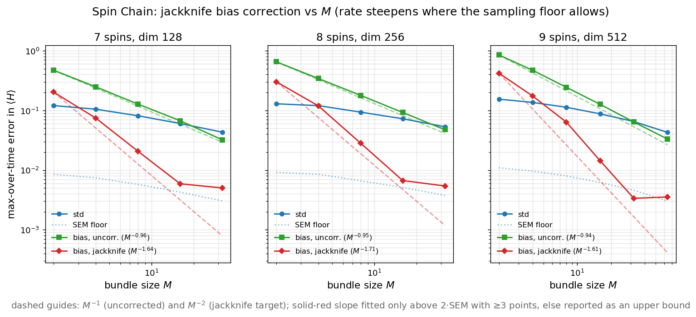
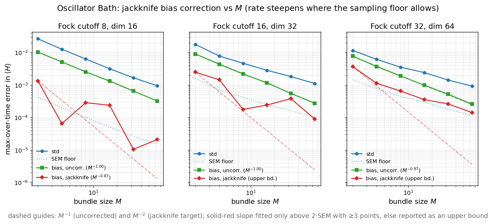

| system | dim | uncorrected | jackknife | reduction | verdict |
|---|---|---|---|---|---|
| Spin Chain | 16 | `M^-0.96` | `M^-1.45` | 3.3–6.7× | rate steepens |
| Spin Chain | 32 | `M^-0.96` | `M^-1.78` | 3.0–9.7× | rate steepens |
| Spin Chain | 64 | `M^-0.95` | `M^-1.04` | 2.8–4.1× | level only |
| Oscillator Bath | 16 | `M^-1.00` | `M^-0.87` | 5.6–8.9× | level only |
| Oscillator Bath | 32 | `M^-1.00` | — | 1.4–3.0× | marginal |
| Oscillator Bath | 64 | `M^-0.97` | — | 2.1× | marginal |

Only where at least three points clear **twice** the SEM is a corrected rate
quoted; below that the corrected "bias" is Monte-Carlo noise and its ratio
inflates, so it is reported as an upper bound. Spin dim 32 (512 realizations)
is where the floor is low enough to see the full effect — the corrected bias
falls monotonically to $M^{-1.78}$, up to $9.7\times$ below the uncorrected one;
dim 16 shows the same steepening ($M^{-0.96}\to M^{-1.45}$). At the largest
sizes the realization budgets leave a higher floor, and the correction then
acts as a level reduction without a resolved change of law. The self-check in
`benchmark_convergence.py`, and the strip in `plot_jackknife_rate_strip.py`,
apply exactly this rule — steepening is claimed only where the data support it.
Reading across the panels of each strip, the uncorrected bias (green) also
rises with dimension while the jackknife keeps the corrected bias comparatively
flat — so Result 2's growth of the bias with system size is a known,
correctable effect, not a breakdown.

**Seed robustness.** Recomputing the accuracy-versus-cost frontier across four
independent master seeds leaves the picture unchanged: per-seed frontiers
cluster tightly, and the ordering of the two methods does not move with the
seed. **This is a statement about seed sensitivity, not about which method
wins** — `benchmark_seed_robustness.py` runs the spin chain at dimension 16 with
$M \in \{2,8,32\}$ against $\texttt{ntraj} \in \{50,200,1000\}$, a different
size and a different budget from Result 3's System A comparison at dimension 64
($M=16$ against $\texttt{ntraj}=500$), where SLB loses on every observable.
The two are not in conflict and neither generalises to the other. As with the
convergence sweeps above, $M=32$ sits past the shipped $N_L=13$ at this size.

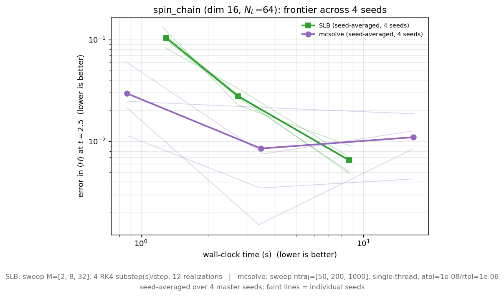

**Integration robustness — SLB is bundling-limited, not integrator-limited.**
This answers the doubt that SLB might only look fast because it integrates the
master equation more crudely than the adaptive reference. Holding the bundling
fixed (one seed, so the bundles are identical) and sweeping only the RK4 substep
count separates the two error sources: the *pure* integration error — the full,
unbundled operators run through the same RK4 — falls quickly and bottoms out at
the reference tolerance ($\sim 10^{-10}$), while the *total* SLB error stays flat,
set by the bundling ($M$). At 4 substeps the integration error is orders of
magnitude below the bundling error ($\sim 10^{8}\times$ smaller for these systems),
so the substep choice cannot be where SLB's accuracy — or its speed — comes
from; on non-stiff systems (or within each dimension's numerical stability window as mapped in §5.2), one could integrate far more crudely without moving the SLB error.

The plotted error is the absolute deviation from the adaptive reference at the
fixed mid-point $t=2.5$, $|\langle H\rangle(2.5) - \langle H\rangle_{\rm ref}(2.5)|$
— the single-instant metric of §3.2, chosen there for exactly this check.
Note it is *not* the max-over-time error §3.2 assigns to the convergence and
jackknife figures, nor Result 3's time-averaged RMSE; §3.2 lists all three and
which figure uses which.

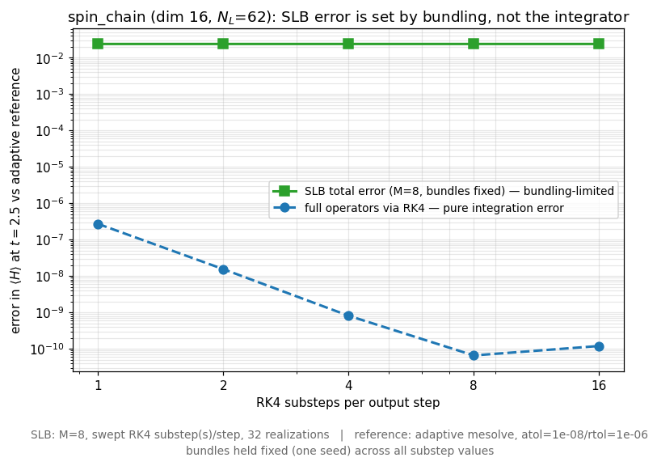
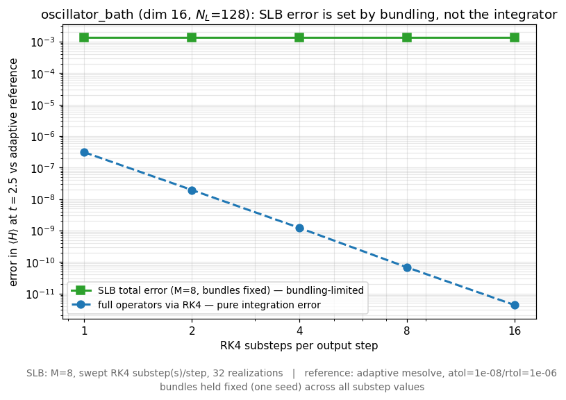

**`mcsolve` fairness.** In Result 3 `mcsolve` runs single-threaded, matching
SLB's single-threaded realization loop, at stated tolerances. This is a
statement about how the comparison was configured rather than a measured claim:
no paired multi-core run was made, so what is asserted is that neither method
was given cores the other lacked. §5.1's second panel is where the parallel
question is actually answered — it divides each method's wall-clock by its
sample count, the limit of one core per sample, and the ordering there is the
same.

---

## 7. Reproducing and reading these numbers

The theory this builds on — the SLB method paper, the Lindblad/GKLS and Davies
foundations, and the QuTiP solvers benchmarked against — is collected in
[`REFERENCES.md`](../REFERENCES.md).

Absolute times depend on the machine, core count, and BLAS build — treat them as
relative comparisons. A few notes:

- `mcsolve` parallelizes trajectories across cores; Result 3 pins it
  single-threaded to match SLB's serial loop. State the core count when
  reporting.
- **Wall-clock is only comparable within one job on one node.** The same
  certified dimension-256 reference took 2,744 s standalone and 86.6 s inside
  a sequential sweep on the same machine, and repeat measurements on a shared
  node vary by tens of percent — so ratios below ~1.5x are not resolved
  without repeats. Every run records its hostname and Slurm job id in the
  metadata; `plot_method_comparison.py` refuses to draw a cost axis across
  files that disagree.
- The first solve of any method pays one-time import/compile costs; discard a
  warm-up run for careful timing.
- Within each figure the system size, time grid, tolerances, and reference are
  identical across methods, so each plot is internally apples-to-apples.
- The full `mesolve` reference is "exact" only for the Davies–Lindblad model
  defined here; the Davies/secular construction is itself a weak-coupling
  approximation to the underlying open-system dynamics.
- Every figure is drawn from a `data/*.json` file written by the matching
  `run_*.py` script (metadata inside: package versions, seeds, parameter
  grids, timestamps), so any figure is traceable to the exact run that
  produced it — and re-styling or re-targeting a figure never requires
  re-running the benchmark. [`data/README.md`](data/README.md) lists the
  canonical filenames and separates them from superseded data.
  `python export_csv.py` flattens every canonical data file into
  Excel-friendly CSVs under `data/csv/`: the observable dynamics over time
  with their std in tidy long format, plus the scalar summaries.
