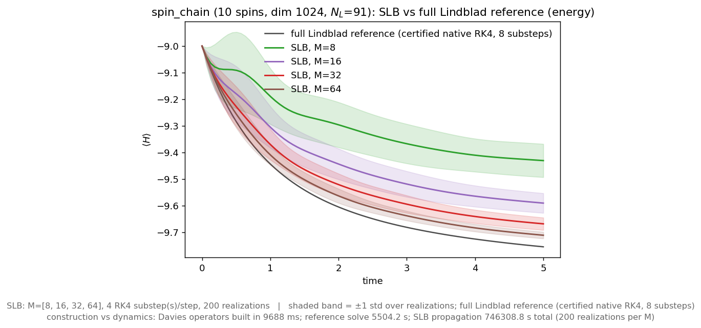
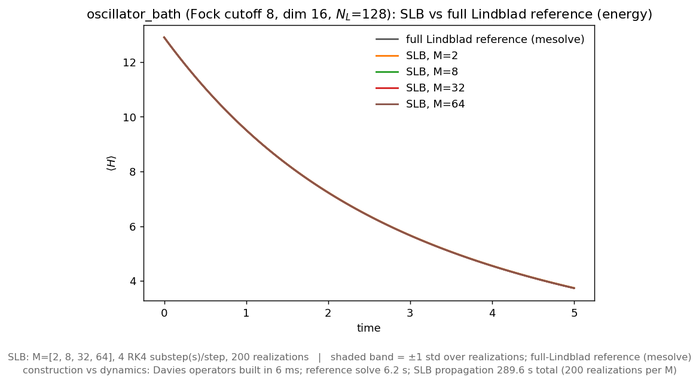
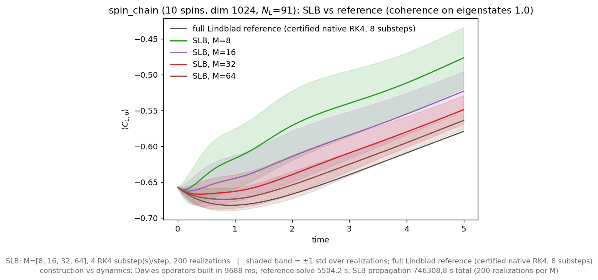
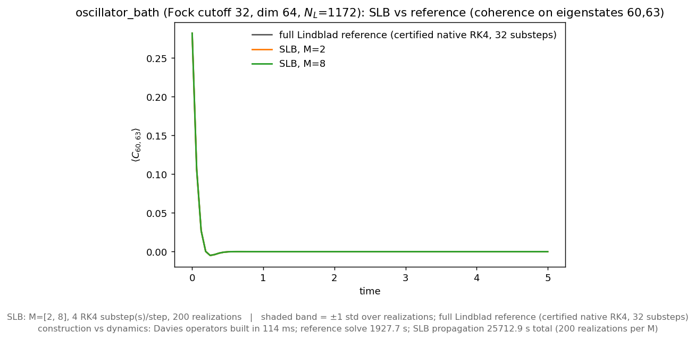
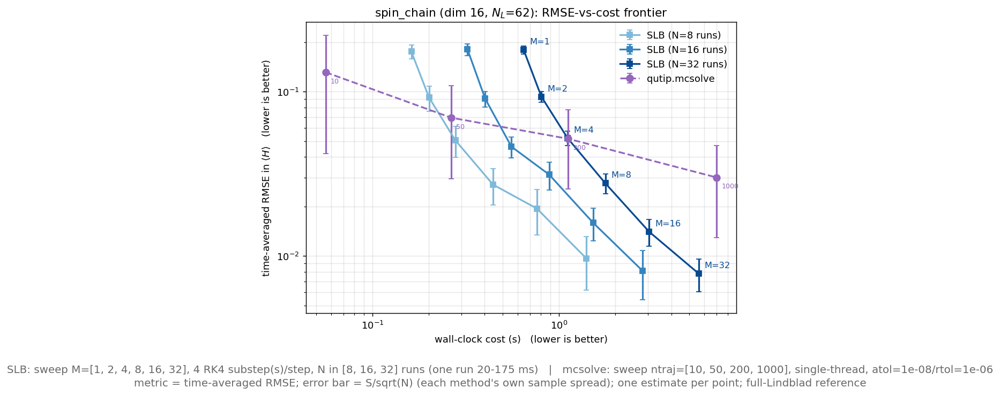
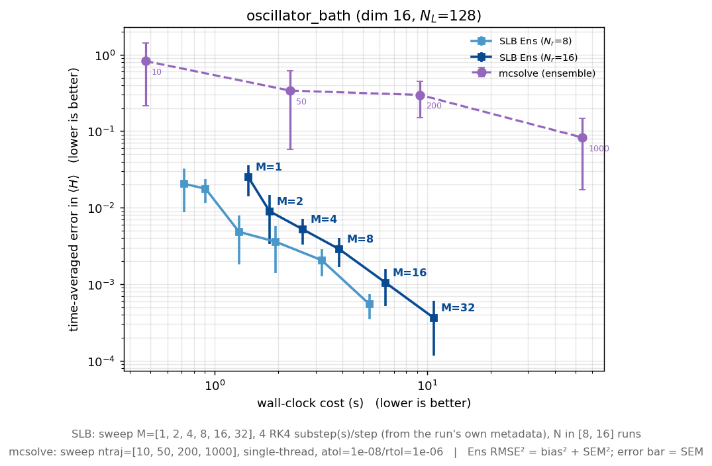
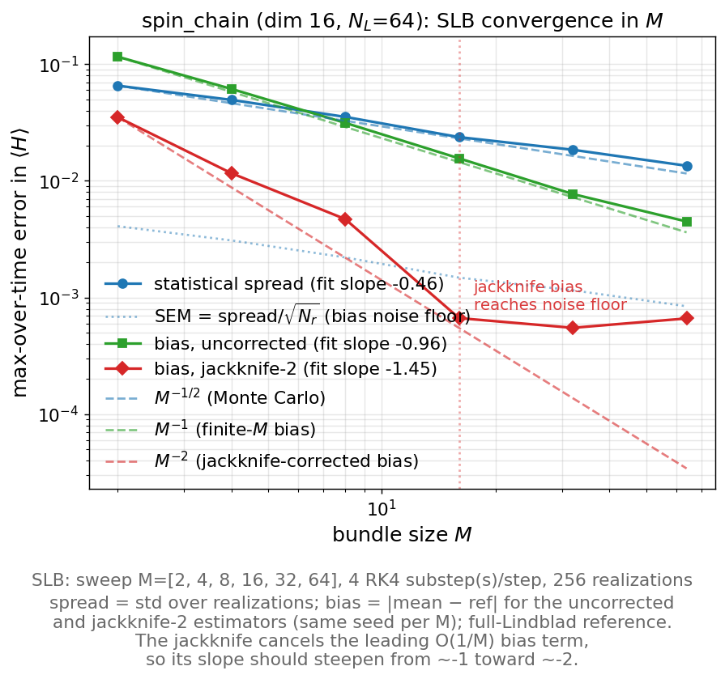
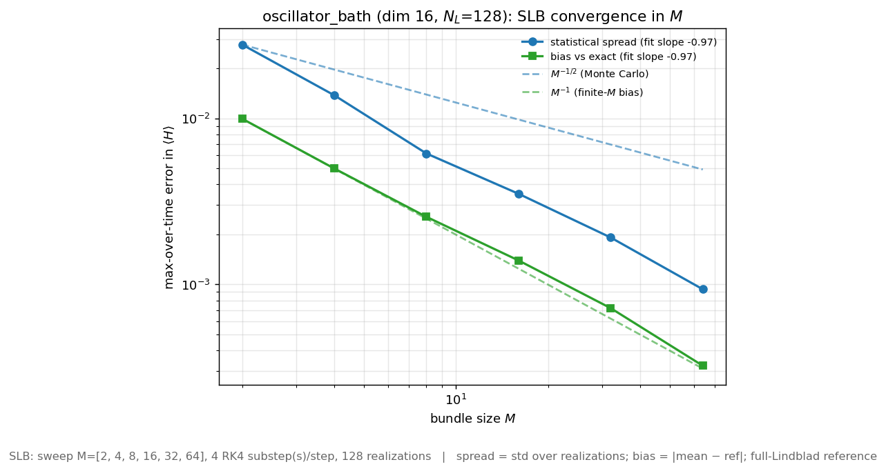
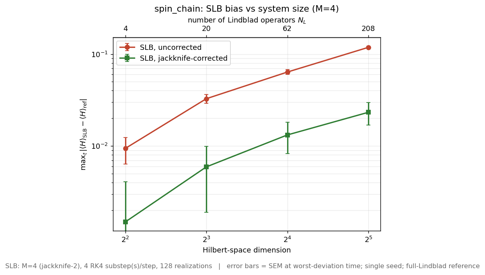
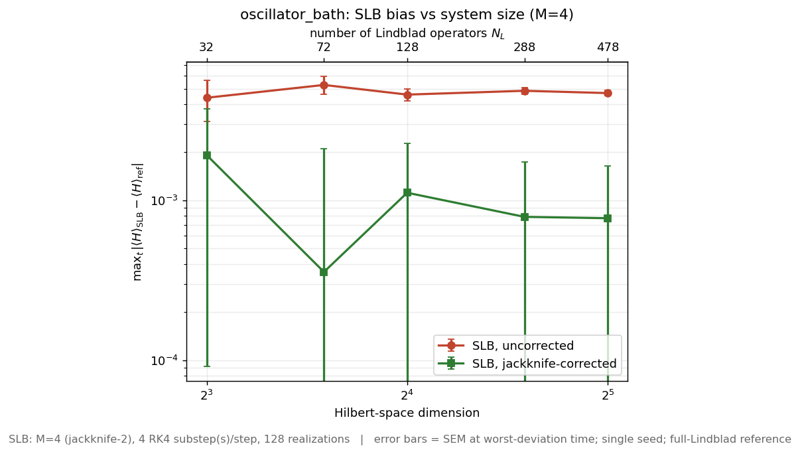

# Benchmarks

This page benchmarks `qutip-bundling` (stochastic Lindblad bundling, **SLB**)
against the two standard QuTiP solvers it competes with: the exact Lindblad
master equation `mesolve`, and the Monte-Carlo trajectory solver `mcsolve`.

Everything below is produced by self-contained scripts in this folder:

- `run_accuracy_vs_M.py` + `plot_accuracy_vs_M.py` — accuracy versus bundle size
  (Result 1). The run script saves the raw per-realization dynamics of both
  observables for every `M` into `data/accuracy_vs_M_<system>.json`, timing the
  Davies-operator construction separately from the propagation; the plot script
  derives the mean curves, the bands, and the peak-error decomposition from it.
- `run_cost_scaling.py` + `plot_cost_scaling.py` — cost scaling versus the exact
  solver (Result 2). The run script does the compute and writes
  `data/cost_scaling_<system>.json` (stamped with package versions, seeds, and
  the full bundle-size sweep); the plot script derives the figure from that
  file in seconds.
- `run_frontier.py` + `plot_frontier.py` — accuracy-versus-cost frontier against
  `mcsolve` (Result 3), same split: raw SLB run samples and per-`ntraj` stats go
  into `data/frontier_<system>.json` (with the substeps-guard verdict recorded),
  and the plot script draws the frontier from it. `run_frontier.py --preset big`
  is the heavy workstation variant (dim 64 / N_L ~ 866).
- `run_isocost_vs_dim.py` + `plot_isocost_vs_dim.py` — iso-accuracy cost versus
  dimension (Result 4), split the same way: the run script writes
  `data/isocost_vs_dim_<system>.json` with the raw run samples and the mcsolve
  $S^2$ fit; the plot script derives $M^\ast$, $\texttt{ntraj}^\ast$, and the
  speedups from it.

To regenerate every figure: `pip install qutip-bundling matplotlib`, then run each
script. The supporting checks (`benchmark_convergence.py`,
`benchmark_jackknife.py`, `benchmark_seed_robustness.py`,
`benchmark_substep_convergence.py`) produce the validation figures (§6).

---

## Contents

**Setup**
- [1. The core idea, and the two methods being compared](#1-the-core-idea-and-the-two-methods-being-compared)
- [2. The two test systems (fully specified)](#2-the-two-test-systems-fully-specified)
  - [2.1 The bath (shared by both systems)](#21-the-bath-shared-by-both-systems)
  - [2.2 Is this weak coupling? Yes — in both senses.](#22-is-this-weak-coupling-yes--in-both-senses)
  - [2.3 System A — dissipative transverse-field Ising chain](#23-system-a--dissipative-transverse-field-ising-chain)
  - [2.4 System B — anharmonic oscillator coupled to a spin](#24-system-b--anharmonic-oscillator-coupled-to-a-spin)
- [3. What we measure, and how the error is reported](#3-what-we-measure-and-how-the-error-is-reported)
  - [3.1 Error: a time-resolved band, and the single numbers from it](#31-error-a-time-resolved-band-and-the-single-numbers-from-it)
  - [3.2 How much sampling each method does](#32-how-much-sampling-each-method-does)
  - [3.3 Integrators: matched where it is possible, disclosed where it is not](#33-integrators-matched-where-it-is-possible-disclosed-where-it-is-not)
- [4. How `mcsolve`'s error works, versus SLB's](#4-how-mcsolves-error-works-versus-slbs)

**Results**
- [5. Results](#5-results)
  - [Result 1 — accuracy versus the bundle size $M$](#result-1--accuracy-versus-the-bundle-size-m)
  - [Result 2 — cost scaling versus the exact solver](#result-2--cost-scaling-versus-the-exact-solver)
  - [Result 3 — accuracy-versus-cost frontier against `mcsolve`](#result-3--accuracy-versus-cost-frontier-against-mcsolve)
  - [Result 4 — iso-accuracy cost versus dimension](#result-4--iso-accuracy-cost-versus-dimension)

**Reference**
- [6. Validation and robustness](#6-validation-and-robustness)
- [7. Reproducing and reading these numbers](#7-reproducing-and-reading-these-numbers)

---

## 1. The core idea, and the two methods being compared

A Lindblad master equation with many collapse operators is expensive. The
dissipator costs one matrix product per operator, and the number of operators
$N_L$ usually grows like $N^2$ in the Hilbert-space dimension $N$, so a full
solve scales as roughly $O(N^5)$ per step. **SLB** replaces the $N_L$ operators
with $M$ random *bundled* combinations whose dissipator equals the full one in
expectation; with $M$ held fixed as the system grows, the per-step cost drops to
$O(N^3)$.

There are two stochastic methods on the table, and the single most important
thing to understand up front is that **they randomize different things.** This
is why their costs and errors behave so differently, and why the comparison has
to be empirical.

**`mcsolve` randomizes the state.** It *unravels* the master equation into
random pure-state trajectories. One trajectory is a wavefunction
$|\psi(t)\rangle$ that drifts under the non-Hermitian effective Hamiltonian
$H_{\rm eff} = H - \tfrac{i}{2}\sum_a L_a^\dagger L_a$, interrupted by random
*quantum jumps*: at random times one of the original $N_L$ collapse operators
$L_a$ fires (chosen with probability $\propto\langle\psi|L_a^\dagger
L_a|\psi\rangle$) and the state resets to $L_a|\psi\rangle$. A single trajectory
looks nothing like the smooth answer; you recover the density matrix by
averaging over `ntraj` trajectories. Both the jump times and which operator fires are random, so no two trajectories are alike — they differ even in how many jumps occur. Raising ntraj does not change any single trajectory; it only adds more independent samples to the average, shrinking the Monte-Carlo error as $N_{\rm traj}^{-1/2}$.  **The randomness is in the state path, and
all $N_L$ operators are kept exact.**

**SLB randomizes the operators.** It keeps the full density matrix and runs an
ordinary deterministic Lindblad evolution — but with the $N_L$ collapse
operators replaced by $M$ random bundles. No jumps, no wavefunctions, just a
density-matrix ODE with fewer operators, averaged over a handful of
realizations. **The randomness is in the operators, and the full state is
kept.**

So the two attack the cost from opposite directions. `mcsolve` propagates cheap
$N$-vectors but touches all $N_L$ operators and needs many trajectories to
suppress its noise. SLB propagates the more expensive $N\times N$ density matrix
but with only $M\ll N_L$ operators and few realizations. Which wins depends on
$N$, $N_L$, $M$, and `ntraj` together — hence the empirical comparison in the
rest of this page.

A consequence worth stating now: the two methods have different **error knobs**,
and they are *not* symmetric (see §4). `mcsolve` has one knob (`ntraj`) that
controls pure statistical noise. SLB has two knobs (`M` and the number of
realizations) controlling two different error sources (a bias and a
fluctuation). Keeping that asymmetry in mind makes every results section below
easier to read.

---

## 2. The two test systems (fully specified)

Both systems are weakly coupled to the **same** thermal bath and relax toward
thermal equilibrium. In both, the collapse operators are built with
`davies_operators(H, X, gamma)`, which diagonalizes the system Hamiltonian $H$,
forms one Bohr-frequency operator $|a\rangle\langle b|$ per pair of energy
levels $(a,b)$ with $\omega_{ab}=E_b-E_a$, and weights each by the bath response
$\sqrt{\gamma(\omega_{ab})}$ at that transition frequency.

### 2.1 The bath (shared by both systems)

The bath is specified entirely by one spectral function — the rate at which the
bath exchanges energy quantum $\omega$ with the system:

$$
\gamma(\omega) = \alpha\\omega*e^{-|\omega|/\omega_c}\\big/\\big(1-e^{-\omega/k_BT}\big),
\qquad \alpha = 0.3,\; k_BT = 0.5,\; \omega_c = 8 .
$$

Reading the three factors:

- $\alpha\,\omega$ — an **ohmic** spectral density (linear in $\omega$ at low
  frequency). $\alpha=0.3$ sets the overall system–bath coupling strength.
- $e^{-|\omega|/\omega_c}$ — an exponential high-frequency cutoff at
  $\omega_c=8$. Since the systems' transition frequencies are of order $1$, the
  cutoff sits well above them and the bath is effectively broadband across the
  transitions that matter.
- $1/(1-e^{-\omega/k_BT})$ — the thermal occupation factor at temperature
  $k_BT=0.5$. It enforces **detailed balance** (the KMS condition
  $\gamma(-\omega)/\gamma(\omega)=e^{-\omega/k_BT}$), which is what guarantees
  relaxation toward the Gibbs state rather than runaway heating. At $\omega\to0$
  this factor gives the finite limit $\gamma(0)=\alpha\,k_BT$.

So in one line: **an ohmic bath with an exponential cutoff, at temperature
$k_BT=0.5$, satisfying detailed balance.**

**Building the Lindblad operators.** Both systems turn $(H_{\rm sys}, X, \gamma)$
into collapse operators by the same Davies (secular) recipe —
`davies_operators(H, X, gamma)`. First diagonalize the system Hamiltonian,

$$H_{\rm sys}\,|a\rangle = E_a\|a\rangle .$$

Then every **ordered** pair of eigenstates $(a,b)$ whose coupling element
$\langle a|X|b\rangle$ is non-zero contributes one Lindblad operator, tagged with
the Bohr frequency of that transition:

$$\omega_{ab} = E_b - E_a , \qquad
  c_{ab} = \sqrt{\gamma(\omega_{ab})}\\langle a|X|b\rangle\|a\rangle\langle b| .$$

The number of such operators is $N_L$ — one per energy-conserving channel the
coupling opens. The sign convention $\omega_{ab}=E_b-E_a$ is what makes the
dynamics relax rather than heat up: a downward transition ($E_b>E_a$, so $b$ is
the higher level) carries $\omega_{ab}>0$, where detailed balance makes
$\gamma$ largest, so energy is preferentially emitted to the bath and the state
flows toward $\rho_\infty\propto e^{-H_{\rm sys}/k_BT}$. (`davies_operators`
bakes in this convention; building the operators by hand with the opposite sign
runs the system uphill.)

The two systems feed *different* $(H_{\rm sys}, X)$ into this one recipe:

- **System A** (§2.3): $X = \sum_i \sigma^x_i$, the collective transverse
  magnetization. Diagonalizing the 16-state chain and keeping every pair with
  $\langle a|X|b\rangle\neq 0$ gives $N_L \approx 64$. (The exact count is mildly
  sensitive to how the chain's symmetry degeneracies are resolved numerically —
  62–64 depending on the linear-algebra backend — because within a degenerate
  energy level the eigenbasis is not unique.)
- **System B** (§2.4): $X = x\otimes I$, the oscillator position. The anharmonic
  ladder is non-degenerate, so the count is exact and basis-independent:
  $N_L = 128$.

In code this is a single call per system:

```python
H, X, psi0 = build_spin_chain(4)        # System A  (build_oscillator_bath(8) for B)
c_ops = davies_operators(H, X, gamma)   # the {c_ab} above, length N_L
```

### 2.2 Is this weak coupling? Yes — in both senses.

1. **By construction.** `davies_operators` builds a Davies/secular master
   equation, which is *derived* in the weak system–bath coupling (Born–Markov)
   limit. Using the Davies operators places the model in the weak-coupling
   Lindblad regime by assumption — that is the theory's domain of validity.
2. **By the numbers.** The bath coupling scale $\alpha=0.3$ is smaller than each
   system's coherent energy scales ($J=1$ for the chain, $\omega_0=1$ for the
   oscillator), so dissipation is slower than the internal coherent dynamics —
   the weak-coupling ordering. It is "moderate" weak coupling: strong enough to
   produce real relaxation over $t\in[0,5]$, not so strong that the perturbative
   description breaks.

### 2.3 System A — dissipative transverse-field Ising chain

The **system Hamiltonian** for $n$ spins is

$$
H_{\rm sys} = -J\sum_{i=1}^{n-1}\sigma^z_i\sigma^z_{i+1}\-h\sum_{i=1}^{n}\sigma^x_i,
\qquad J = 1.0,\; h = 0.6 .
$$

The first term is nearest-neighbour Ising coupling; the second is a transverse
field. The bath couples to the system through the **coupling operator**
$X = \sum_i \sigma^x_i$ (total transverse magnetization): the reservoir acts on
the chain *via* this observable, driving transitions that relax its magnetization
toward thermal equilibrium. This is a single *collective* coupling — all $n$ spins
share **one** common bath through this global operator, rather than each spin
relaxing into its own independent reservoir. The chain starts fully polarized,
$|\psi_0\rangle = |{\uparrow\uparrow\cdots\uparrow}\rangle$. Starting from this pure,
fully ordered state, the open evolution relaxes the chain to the thermal Gibbs
state $\rho_\infty \propto e^{-H_{\rm sys}/k_BT}$ at the bath temperature
$k_BT = 0.5$: the net magnetization decays, the initial coherence is lost, and
energy flows out into the bath.


System A: a transverse-field Ising chain ($J = 1.0$, $h = 0.6$), fully
polarized at $t = 0$, coupled through the global operator
$X = \sum_i \sigma^x_i$ to a single collective ohmic bath.

Because there is no separate bath Hilbert space in the Lindblad description, the
**total object being evolved** is the master equation
$\dot\rho = -i[H_{\rm sys},\rho] + \sum_a \mathcal{D}[c_a]\rho$, with the
dissipators $c_a$ generated from $(H_{\rm sys}, X, \gamma)$ as in §2.1. The
Hilbert dimension is $2^n$. The energy eigenbasis mixes all sites, so nearly
every level pair contributes a Davies operator and $N_L$ climbs steeply with
size — 4 operators at $n=2$, $\sim 64$ at $n=4$ (dim 16), $\sim 213$ at $n=5$ (dim 32),
$\sim 2200$ at $n=7$ (dim 128). This rapid operator growth is SLB's natural home.

### 2.4 System B — anharmonic oscillator coupled to a spin

The **system Hamiltonian** is

$$
H_{\rm sys} = \omega_0\\left(n+\tfrac12\right) + \chi*n^2
            + \tfrac{\Delta}{2}\\sigma_z + g\(x\otimes\sigma_x)
$$

with $\omega_0=1.0$, anharmonicity $\chi=0.1$, spin gap $\Delta=1.0$, and an
internal oscillator–spin coupling $g=0.3$. Here $n=a^\dagger a$ is the number
operator and $x=(a+a^\dagger)/\sqrt2$ the position. The four terms are: the bare
oscillator, its anharmonicity, the spin's energy splitting, and a coherent
oscillator–spin coupling.


System B: an anharmonic oscillator whose energy gaps widen up the ladder,
coupled to a two-level spin by an internal coherent coupling $g$. A single
ohmic bath couples to the oscillator position $X = x\otimes I$ only, so the
spin relaxes solely indirectly through $g$. The oscillator starts in its top
Fock level.

The bath couples to the system through the **coupling operator** $X = x\otimes I$
(the oscillator position): a phonon/photon-like reservoir acts *via* this observable,
damping the oscillator's motion and draining its energy toward thermal equilibrium.
It is a single shared bath — $X = x\otimes I$ acts only on the oscillator, so the
oscillator and spin couple to **one** common reservoir (the spin has no separate
bath of its own). Because $X$ touches only the oscillator, the bath never damps the
spin directly; dissipation reaches the spin only indirectly, through the internal
coherent coupling $g\(x\otimes\sigma_x)$. The system starts in the oscillator's
top Fock state with the spin down. As above, the total evolved object is the Lindblad master
equation with dissipators built from $(H_{\rm sys}, X, \gamma)$ as in §2.1 ($N_L = 128$ at dim 16). Note the two
distinct "couplings": $g=0.3$ is an **internal coherent** coupling inside
$H_{\rm sys}$, whereas $\alpha=0.3$ is the **system–bath** coupling carried by
$\gamma$ through $X$ — they are different physics that happen to share a value.
The size is set by the Fock truncation. This system is close to the
molecular/vibronic problems the method was developed for.

---

## 3. What we measure, and how the error is reported

### 3.1 Error: a time-resolved band, and the single numbers from it

The quantity of interest is how well the bundled $\langle H(t)\rangle$ (and, in
Result 1, a coherence) tracks the exact reference. The accuracy and coherence
figures show this **resolved over the whole trajectory**: for each $M$, the SLB
mean curve is drawn with a shaded **$\pm1$ standard-deviation band** (the spread
over the stochastic realizations) and, beneath it, a **residual panel**
$\langle H\rangle_{\rm SLB}-\langle H\rangle_{\rm ref}$. Nothing is collapsed to a
single instant — the error is visible at every time.

This keeps the **two error components** separate:

- the **bias** is how far the residual curve sits from zero — the systematic
  offset of the bundled mean from the exact answer;
- the **statistical fluctuation** is the width of the shaded band — how much a
  single bundled run scatters around that mean.

The distinction matters because one combined number hides which dominates, and
at small $M$ or small systems the fluctuation can be *larger* than the bias.

When the error must instead live on an axis — the **error-vs-X figures** — it is
collapsed to one scalar per point, and the right scalar depends on the figure's
job:

- **Characterizing one method's own scaling** — convergence vs $M$ and the
  jackknife vs dimension (both §6) — uses the **max-over-time** error, the
  worst deviation over the trajectory. For "how fast does this method's error
  shrink," the conservative worst case is the robust diagnostic and needs no
  chosen time.
- **Comparing two methods head-to-head** — the SLB-vs-`mcsolve` frontier
  (Result 3) — uses the **time-averaged RMSE**: at each time it combines the
  systematic bias $|\langle H\rangle_{\rm SLB}-\langle H\rangle_{\rm ref}|$
  with the statistical error $S/\sqrt{N}$ as $\sqrt{\text{bias}^2+\text{SEM}^2}$,
  then averages over the trajectory. This is the fair choice for a head-to-head:
  it counts *both* error components — a bias-only or single-time number would
  ignore `mcsolve`'s large trajectory variance — and time-averaging avoids both a
  lucky single instant and the upward bias of a max-over-time number. The substep
  integrator check (§6) still reports a single **mid-relaxation time
  $t=2.5$**, where one representative instant suffices.

**Why time-averaged RMSE, plainly.** A stochastic estimate carries two errors —
a systematic **bias** (its mean sits off the true answer) and a statistical
**scatter** (a single run fluctuates about that mean). Any single number that
hides one of them can be gamed: a method can look accurate by trading bias for
variance or the reverse. The RMSE $\sqrt{\text{bias}^2+\text{SEM}^2}$ refuses that
trade — it counts both at once — and the time-average reports the *typical* total
error across the whole relaxation instead of one cherry-picked instant. That is
why it is the metric wherever two methods are compared head-to-head (Results 3
and 4); the per-$M$ and per-dimension self-scaling checks (§6), which only ask
"how fast does *this* method's error shrink", use the simpler max-over-time or
single-time numbers noted above.

(The dynamics run to $t=5$ in natural units — $J=1$ for the chain, $\omega_0=1$
for the oscillator — over 40 output points; $t=2.5$ is the mid-relaxation
sample, where the energy has substantially decayed but not yet saturated.)

### 3.2 How much sampling each method does

The two methods' "sample counts" are not the same kind of thing, so here they
are explicitly.

**SLB has two levels of sampling:**

- *Within one solve:* $M$ random bundled operators. Each solve is already a
  Monte-Carlo average over $M$ random draws (that is the unbiased-estimator
  property).
- *Across solves:* the reported mean and its std come from averaging
  `n_realizations` independent bundled solves, each with a fresh random draw.
  This is the closer analogue of `ntraj`.

So a single reported SLB point is built from `n_realizations` full
density-matrix solves of $M$ operators each — a total of $M\times$
`n_realizations` random draws. The values used here:

| figure | `M` | `n_realizations` | error bars |
|---|---|---|---|
| accuracy (Result 1) | system-dependent | 32 | $\pm1$ std band |
| cost scaling (Result 2) | 8 (iso-accuracy sweeps `M`) | 1 (cost) / 16 (RMSE) | — |
| frontier (Result 3) | 1, 2, 4, 8, 16, 32 | 8 / 16 / 32 | $S/\sqrt{N}$ |
| iso-cost vs dim (Result 4) | swept to target ($\le 128$) | 4 / 8 / 16 | mcsolve via $S/\sqrt{\texttt{ntraj}}$ fit |

**`mcsolve` has one level of sampling:** a single reported point is `ntraj`
independent trajectories (swept over `[10, 50, 200, 1000]` in the frontier
(Result 3), and sampled at `[100, 200, 400]` to fit the cost projection in
Result 4), run single-threaded so its wall-clock
time is the full sequential cost of all trajectories — matching SLB's
single-threaded realization loop. Its frontier error bar is its own trajectory
spread $S/\sqrt{\texttt{ntraj}}$ — the same quantity SLB's bar measures over its
runs, so the two methods are treated identically, one estimate per point (no
extra repeats of one method but not the other).

### 3.3 Integrators: matched where it is possible, disclosed where it is not

The full `mesolve` reference and `mcsolve` both use QuTiP's **adaptive**
integrator at stated tolerances (`atol=1e-8`, `rtol=1e-6`): they choose their
own step sizes to hit an error target, so there is no single step size to quote.
SLB's native backend uses **fixed-step RK4** with a small number of substeps per
output step (4 here; the result is already converged by 2).

This is a deliberate, disclosed asymmetry, not a hidden advantage:

- All methods share the **same output time grid** and the **same exact
  reference**, so they are compared at identical points.
- You *can* match the full `mesolve` reference to SLB by running the full
  (unbundled) operators through the same fixed-step RK4. Doing so isolates the
  integration error, which falls far below the bundling error — orders of
  magnitude below for these systems (the substep-convergence check in
  **§6** makes this explicit) — so it does not contaminate the comparison.
- You *cannot* match `mcsolve` this way: its accuracy knob is `ntraj`, not a step
  size, so a shared accurate reference is the only sensible common ground. SLB is
  therefore not winning by integrating more loosely — if anything `mcsolve`
  integrates each trajectory more tightly; SLB wins by needing far fewer
  operators and samples.

---

## 4. How `mcsolve`'s error works, versus SLB's

This is the asymmetry promised in §1, made precise.

**`mcsolve`: essentially no bias; error is pure fluctuation.** Because the
observable is linear in $\rho$ and the unraveling is exact in expectation
($\mathbb{E}[|\psi\rangle\langle\psi|]=\rho$), the trajectory average is an
**unbiased** estimator of the true expectation for *any* `ntraj`. Increasing
`ntraj` does not move the mean — it only shrinks the statistical scatter, as

$$
\text{StdErr} = \frac{\sigma_{\rm traj}}{\sqrt{\text{ntraj}}} .
$$

The fluctuation depends on **`ntraj`** (the explicit knob, $1/\sqrt{\text{ntraj}}$)
and on **$\sigma_{\rm traj}$**, the intrinsic per-trajectory spread — large for
strongly dissipative systems, many jump channels, long times, and observables
sensitive to *which* jumps occurred (coherences especially). The only
non-statistical error floor is ODE integration error, set by the tolerances —
not by `ntraj`. **To reduce `mcsolve` error: raise `ntraj`** (and the floor is
governed by the tolerances).

**SLB: a bias *and* a fluctuation — two knobs.** The randomness sits in the
dissipator, and $\rho$ is a *nonlinear* function of the generator, so even
though the bundled dissipator is unbiased, pushing its noise through the
nonlinear evolution leaves a **finite-$M$ bias** of order $1/M$ in the state.
On top of that sits a run-to-run **fluctuation** that averages down over
realizations. So:

- **Bias** $\sim M^{-1}$ — reduced by raising `M` (or removed to leading order by
  the built-in jackknife correction). This is what grows with system size at
  fixed `M` (more operators compressed into the same bundles — see Result 2).
- **Fluctuation** — reduced by raising `n_realizations` (and also falls with
  `M`).

The practical upshot: `mcsolve` users turn one knob (`ntraj`) against noise; SLB
users turn `M` against bias and `n_realizations` against fluctuation. The
frontier (Result 3) sweeps the bias knob `M` for SLB against the noise knob
`ntraj` for `mcsolve`.

---

## 5. Results

> Read in order, the four results build one argument: SLB is **accurate**
> (Result 1), **cheap and better-scaling than the exact solver** (Result 2),
> **cheaper than `mcsolve` at matched accuracy** (Result 3), and that advantage
> **widens with system size** (Result 4). Readers who only care about speed can
> jump to Result 2. The supporting checks behind every claim are in §6.

### Result 1 — accuracy versus the bundle size $M$




These plot $\langle H(t)\rangle$ against the exact reference (black) as the
system relaxes, with a $\pm1$-std band over realizations. As `M` grows the
bundled mean tightens onto the reference and the band narrows — the
approximation is a dial, not a fixed compromise. The two systems differ in how
fast they converge in `M`: the oscillator already sits essentially on the
reference at `M=2`, while the chain shows a visible bias and spread at `M=2`
that shrink as `M` grows. Convergence speed is set by the spread of the
individual operator contributions, not by dimension alone, so it is worth
checking on your own system.

**Beyond energy: a coherence.** Energy is nearly diagonal in the energy
eigenbasis, so matching $\langle H\rangle$ says little about off-diagonal
structure. SLB also tracks the most-populated energy-eigenstate coherence
$|a\rangle\langle b|+\text{h.c.}$ with the same convergence in `M` — the bundled
mean converges onto the exact off-diagonal dynamics as `M` grows, confirming SLB
reproduces the full density matrix, not merely its diagonal.




**The anatomy of the error at its worst moment.** The time traces above show
*that* the estimate converges; this figure shows *how*. For each observable,
$t^\ast$ is the instant where the smallest-$M$ estimate's RMSE$(t)$ peaks — the
hardest moment of the dynamics — and is then held fixed for every $M$. At that
one instant the error splits into its two parts: the **bias**
$|\text{mean}(t^\ast)-\text{ref}(t^\ast)|$ and the **fluctuation** (the std over
realizations). The realization count is the same at every $M$ — nothing about
the sampling is tuned — so the trends are purely the effect of $M$: the bias
should fall like $1/M$ (the bundling systematic) and the fluctuation like
$1/\sqrt{M}$ (the bundling noise). On the chain the energy shows exactly this
($M^{-1.2}$ and $M^{-0.5}$ fitted). One honest caveat: once the true bias drops
below the statistical floor of the run-mean (SEM $=$ fluctuation$/\sqrt{32}$),
the *measured* bias flattens into that noise — visible for the coherence at
large $M$, where the fitted bias slope is shallower for exactly this reason.


**Construction is not dynamics.** The figure captions now report the two costs
separately: building the $N_L$ Davies/Lindblad operators (an eigendecomposition
plus $N_L$ operator assemblies — milliseconds at this size) versus propagating
the dynamics (seconds). The distinction matters at scale: construction grows
with its own exponent as the dimension increases, so the pipeline price should
never be blurred into the solve time — Result 2 now tracks it as its own cost
curve.

### Result 2 — cost scaling versus the exact solver


The figure has two panels sharing the dimension axis. **Top:** wall-clock time
for one solve versus Hilbert-space dimension $N$. **Bottom:** the accuracy of the
SLB solve at each size, so the speed claim is qualified by the error it holds.
The dashed vertical line marks where one full `mesolve` exceeds the time budget —
past it the exact solver is impractical.

**Four cost curves (top).** The exact full-dissipator `mesolve` evolves the
density matrix with all $N_L$ collapse operators, an operation count that grows
like $O(N^5)$ (the legend reports the fitted large-$N$ slope). SLB at a *fixed*
bundle size ($M=8$) only ever propagates $M$ operators, so one solve is cheap;
the SLB and construction curves need no exact reference, so they extend well
past the wall, far enough for the fitted slope to reach the true scaling regime
(small sizes are overhead-dominated and read misleadingly flat). Two costs that
must not be blurred are shown separately: the dotted curve is the one-time
**Davies construction** of the $N_L$ operators (an eigendecomposition plus $N_L$
operator assemblies) — cheap in absolute terms here, but scaling with its own
exponent. Inside each SLB realization there is also a bundle-assembly step
(combining all $N_L$ operators into $M$ bundles, cost $\sim M N_L N^2$, i.e.
$\sim N^4$ once $N_L \sim N^2$): an implementation term, not part of the
method's $O(N^3)$ propagation, and the natural target for a vectorized or
sparse bundle build if the top-end slope needs flattening. The iso-accuracy
curve is the honest one — read on.

**Fixed $M$ is cheap, but its accuracy decays with size (bottom panel).** At a
fixed bundle count the RMSE against the exact solve *grows* with $N$: $N_L$ grows
with the system, so a fixed number of bundles resolves the dissipator less
finely. The bottom panel shows this directly — the fixed-$M$ RMSE climbs and
crosses the target line (error bars: delete-one jackknife over the 16 runs) —
so a pure fixed-$M$ speed plot compares at a *moving*
accuracy, which invites the obvious objection: fast is meaningless if the error
blows up with $N$.

**Iso-accuracy — the cost to hold a *fixed* accuracy (third curve).** To answer
"fast *at what accuracy*", the iso-accuracy curve chooses, at each $N$, the
smallest bundle size $M^\ast$ — the first on a geometric grid $M = 1, 2, 4,
\ldots$ whose 16-run time-averaged RMSE reaches a fixed target (here
$\text{RMSE}=0.02$, measured against the exact solve) — and plots the cost of *that*
solve. The bottom panel's second curve shows the RMSE that $M^\ast$ *actually*
achieves — it hugs the target from below in discrete steps, because $M$ is
searched on a grid — and the $M^\ast$ labels sit on that curve, at the accuracy
each $M^\ast$ delivers. **The two panels line up vertically:** the $M^\ast$
annotated in the bottom panel at each dimension is exactly the bundle size whose
wall-clock cost sits directly above it on the iso-accuracy curve — so a vertical
read at any $N$ gives, for that system, both the accuracy floor and the price of
holding it. (The run script records the whole sweep, so the target defining
$M^\ast$ is applied at analysis time — it can be changed and the figure redrawn
without re-running the benchmark.) The required
$M^\ast$ grows with $N$ (annotated in the bottom panel —
roughly $M^\ast\propto N$ on the chain), so this curve is steeper than fixed-$M$:
holding accuracy costs about one extra power of $N$. But it still sits far below
the exact solver, so SLB's advantage survives the honest accounting. It is
computable only up to the reference wall, since tuning $M^\ast$ needs the exact
answer. (On the oscillator the target is met with $M^\ast=1$ at every size — a
single bundle already suffices — so there the fixed-$M$ and iso-accuracy costs
coincide.)

**What this figure does and doesn't show.** It shows SLB's speedup over the
*exact* solver — the comparison the method is built to win. It leaves `mcsolve`
out on purpose: a trajectory method's cost scales differently, so a
cost-versus-size plot is the wrong way to judge it. The fair SLB-versus-`mcsolve`
question is *accuracy per unit cost* — to match SLB's accuracy, `mcsolve` needs
many trajectories — and that comparison is **Result 3**.

**A practical note.** On the stiffer oscillator at large sizes, SLB's RK4
integrator needs a few substeps per step to stay stable — one substep diverges.
These runs use a small fixed substep count (given in the caption) inside the
stable range. If the integration ever blows up to a non-finite state, the solver
raises `SolverInstabilityError` instead of silently returning a corrupted result.

### Result 3 — accuracy-versus-cost frontier against `mcsolve`




Each curve sweeps its own knob (`M` for SLB, `ntraj` for `mcsolve`); the axes
are wall-clock time and the **time-averaged RMSE** in $\langle H(t)\rangle$
(§3.1, both lower-is-better), so the method toward the **lower-left wins at
matched accuracy**. Error bars are each method's own sample spread $S/\sqrt{N}$ —
SLB over its independent runs, `mcsolve` over its trajectories. The three SLB
curves are increasing run counts ($N=8, 16, 32$); more runs lower the
statistical floor, but SLB is **bias-limited** here, so $N=16$ already sits
essentially on the frontier. Both methods run at disclosed integration
resolution (§3.3) and share the same grid and reference.

**What one error bar means — and why serial timing is fair.** Each plotted
point is a *single* estimate: for SLB the average of its $N$ runs, for
`mcsolve` the average of its `ntraj` trajectories. The error bar is that one
estimate's own statistical uncertainty — $S/\sqrt{N}$ from its own sample
spread — not the spread over many repeated experiments; a repeat of the whole
estimate would land within about one bar of the point shown, and the
seed-robustness check (§6) verifies exactly that. The cost axis is serial
wall-clock, with `mcsolve` pinned single-threaded. This is not a handicap for
either side: both methods parallelize trivially in the *same* variable — SLB
across its independent runs, `mcsolve` across its trajectories — so $k$ cores
divide both costs by $\sim\!k$ and shift both curves left by the same
log-distance. The frontier's relative positions, and every conclusion drawn
from them, are invariant; serial timing is simply the normalization that makes
the axis machine-independent.

On the spin chain the two are competitive at the loosest, cheapest end, and
**SLB pulls ahead as the accuracy tightens**: its RMSE keeps falling with `M`,
while `mcsolve`'s is floored by trajectory variance — visible as its wide error
bars, which the RMSE counts and SLB's low variance avoids. By the tight end SLB
reaches a given accuracy at a fraction of `mcsolve`'s cost. On the oscillator the
gap is large from the start: SLB reaches RMSE around $10^{-3}$–$10^{-4}$ in a few
seconds, while `mcsolve` after a thousand trajectories is still near $10^{-1}$ —
two to three orders of magnitude less accurate at higher cost. That stiff,
operator-heavy regime is what SLB is built for.

### Result 4 — iso-accuracy cost versus dimension


Results 2 and 3 leave one question open. Result 2 scales cost with dimension but
only against the *exact* solver; Result 3 races SLB against `mcsolve` but at a
*fixed* size. This figure runs the SLB-versus-`mcsolve` comparison **as a
function of dimension**: at each $N$ it asks each method for the cheapest setting
that reaches a fixed target accuracy ($\text{RMSE}=0.02$ against the exact solve)
and plots that cost. The bottom panel is the payoff — the speedup
(`mcsolve` cost / SLB cost) versus $N$: if it rises, SLB's advantage *widens* with
system size.

**It widens, on both systems.** On the spin chain `mcsolve` needs steadily more
trajectories to hold the target ($\sim\!300$ at dim 4, $\sim\!1400$ at dim 32),
while SLB needs only a modest bump in `M` ($M^\ast$: $1\to8\to16\to32$); the
speedup grows from a few-fold to $\sim\!25\times$ across the range. On the
oscillator the effect is dramatic: `mcsolve` needs thousands of trajectories at
dim 8 and tens of thousands by dim 16, crossing into "impractical"
($\gtrsim\!20{,}000$) at dim 32, while SLB hits the target with a *single* bundle
($M^\ast=1$) at every size — a speedup climbing into the thousands. That stiff,
operator-heavy regime is exactly where a trajectory method's per-trajectory
variance explodes and bundling does not.

**SLB is shown at three averaging levels** ($N=4, 8, 16$ runs), each re-optimizing
`M` for the target: for each level, $M^\ast$ is the smallest bundle size on the
grid $1, 2, 4, \ldots, 128$ whose $N$-run time-averaged RMSE first reaches $0.02$. A less obvious point falls out: *fewer* runs are often
*cheaper*, because with fewer runs you compensate with a larger `M`, and a few
well-converged high-`M` runs beat many low-`M` ones for a fixed target. The
speedup panel plots one line per level so nothing is hidden; the cheapest level
sets the strongest (topmost) speedup.

**Two modelling choices, stated plainly.** (1) The `mcsolve` cost is a
*projection*, not a brute-force run to the threshold: because its trajectory
average is unbiased, its error is exactly $S/\sqrt{\texttt{ntraj}}$, so we sample
a few small `ntraj`, estimate $S$, and solve $\texttt{ntraj}^\ast=(S/\text{target})^2$.
This is more reliable than a single noisy threshold crossing and needs no
huge-`ntraj` runs — but it does assume `mcsolve` is unbiased (true here, with
exact per-trajectory integration). (2) SLB is tuned on `M` at a fixed set of run
counts, not fully co-optimized over $(M, N)$; the three levels bracket the
operating point. As with Result 2's iso-accuracy curve, the whole figure is
computable only up to the exact-reference wall, since tuning either knob to a
target needs the exact answer. (The run script saves the raw run samples and
the $S^2$ fit, so both the target and the averaging levels are applied at
analysis time — the figure can be redrawn for a different target without
re-running the benchmark.)

---

## 6. Validation and robustness

The checks that answer the obvious doubts.

**Convergence at the predicted rates.** The bias should fall as $M^{-1}$ and the
statistical spread as $M^{-1/2}$.




Fitting recovers the predicted $M^{-1}$ bias on both systems ($M^{-0.99}$ chain,
$M^{-0.97}$ oscillator); the spread follows $M^{-1/2}$ on the chain ($M^{-0.52}$)
and faster on the oscillator. Matching the predicted *bias* exponent — the thing
that sets SLB's accuracy — is the strongest single check that the estimator
behaves as derived.

**Bias versus size, with jackknife (this is the Result 2 size trend,
quantified).** At fixed `M` the finite-$M$ bias grows with dimension; the
built-in jackknife correction suppresses it.




The uncorrected bias rises steeply with dimension while the corrected bias stays
comparatively flat — so the Result 2 growth is a known, correctable effect, not
a breakdown. On the oscillator the corrected residual sits at the noise floor
(consistent with zero).

**Seed robustness.** Recomputing the frontier across independent master seeds
leaves the conclusion unchanged: per-seed frontiers cluster tightly and SLB
stays below `mcsolve` for every seed.


**Integration robustness — SLB is bundling-limited, not integrator-limited.**
This answers the doubt that SLB might only look fast because it integrates the
master equation more crudely than the adaptive reference. Holding the bundling
fixed (one seed, so the bundles are identical) and sweeping only the RK4 substep
count separates the two error sources: the *pure* integration error — the full,
unbundled operators run through the same RK4 — falls quickly and bottoms out at
the reference tolerance ($\sim 10^{-10}$), while the *total* SLB error stays flat,
set by the bundling ($M$). At 4 substeps the integration error is orders of
magnitude below the bundling error ($\sim 10^{8}\times$ smaller for these systems),
so the substep choice cannot be where SLB's accuracy — or its speed — comes
from; one could integrate far more crudely without moving the SLB error.

The plotted error is the absolute deviation from the adaptive reference at the
fixed mid-point $t=2.5$, $|\langle H\rangle(2.5) - \langle H\rangle_{\rm ref}(2.5)|$
— the same single-time-point metric as the scaling and frontier figures (§3.1).


**`mcsolve` fairness.** In Result 3 `mcsolve` runs single-threaded (matching
SLB's single-threaded loop) at stated tolerances; removing its multi-core
advantage does not change the conclusion.

---

## 7. Reproducing and reading these numbers

Absolute times depend on the machine, core count, and BLAS build — treat them as
relative comparisons. A few notes:

- `mcsolve` parallelizes trajectories across cores; Result 3 pins it
  single-threaded to match SLB. State the core count when reporting.
- The first solve of any method pays one-time import/compile costs; discard a
  warm-up run for careful timing.
- Within each figure the system size, time grid, tolerances, and reference are
  identical across methods, so each plot is internally apples-to-apples.
- The full `mesolve` reference is "exact" only for the Davies–Lindblad model
  defined here; the Davies/secular construction is itself a weak-coupling
  approximation to the underlying open-system dynamics.
- Every figure is drawn from a `data/*.json` file written by the matching
  `run_*.py` script (metadata inside: package versions, seeds, parameter
  grids, timestamps), so any figure is traceable to the exact run that
  produced it — and re-styling or re-targeting a figure never requires
  re-running the benchmark. `python export_csv.py` flattens every data file
  into Excel-friendly CSVs under `data/csv/`: the observable dynamics over
  time with their std in tidy long format, plus the scalar summaries.
