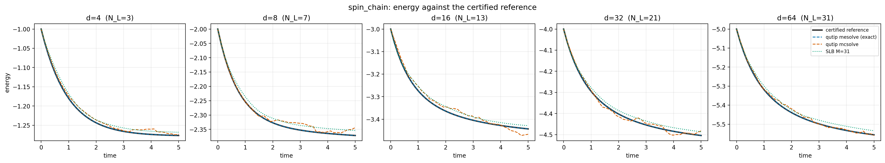
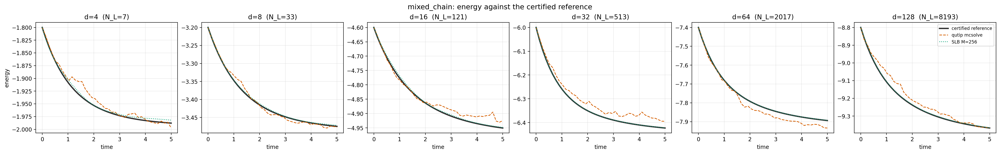
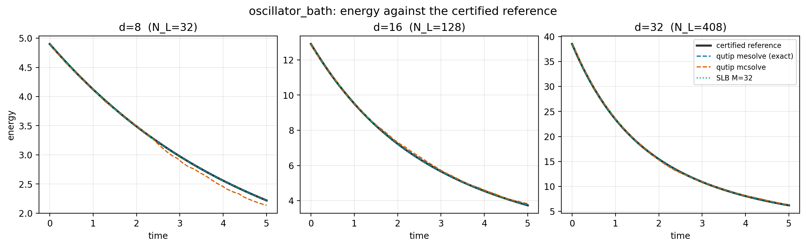
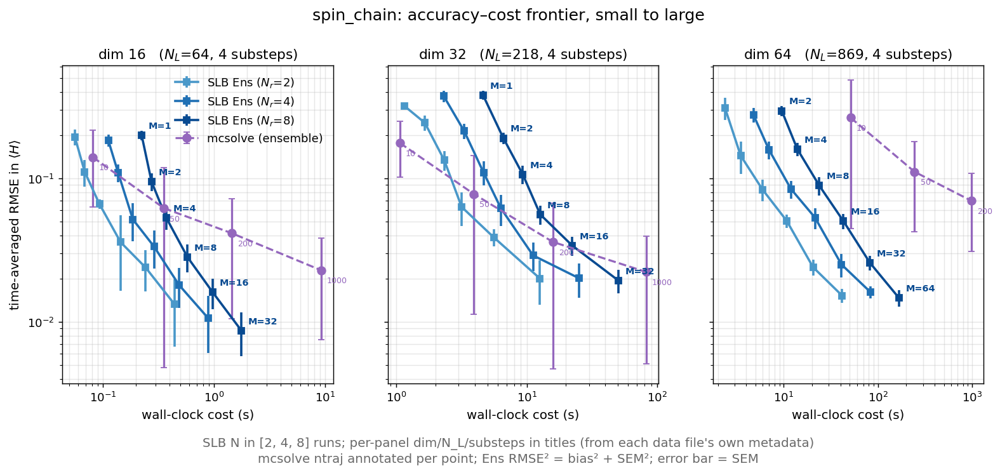
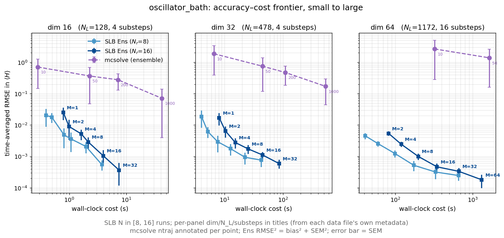

# Benchmarks

This page benchmarks `qutip-bundling` (stochastic Lindblad bundling, **SLB**)
against the two standard QuTiP solvers it competes with: the exact Lindblad
master equation `mesolve`, and the Monte-Carlo trajectory solver `mcsolve`.

Everything below is produced by self-contained scripts in this folder:

> **New here?** Start with [`README.md`](README.md) to replot a committed result
> in seconds without launching the expensive numerical benchmarks.

- `run_accuracy_vs_M.py` + `plot_accuracy_vs_M.py` — accuracy versus bundle size
  (Result 1). The run script saves the raw per-realization dynamics of both
  observables for every `M` into
  `data/accuracy_vs_M_<system>_dim<D>.json`, timing the Davies-operator
  construction separately from the propagation; the plot script derives the
  mean curves, the bands, and the peak-error decomposition from it.
- `run_cost_scaling.py` + `plot_cost_scaling.py` — cost scaling versus the exact
  solver (Result 2). The exact reference is QuTiP's `mesolve` up to the memory
  wall (~dim 32), and beyond it — where `mesolve` can no longer build its
  superoperator — the native full-dissipator RK4 solver (`rk4_mesolve`), which
  propagates all `N_L` operators directly and is cross-validated against
  `mesolve` wherever both run. The run script does the compute and writes
  `data/cost_scaling_<system>.json` (stamped with package versions, seeds, the
  bundle-size sweep, and the substeps used for each reference); the plot script
  derives the figure from that file in seconds.
- `run_frontier.py` + `plot_frontier.py` — accuracy-versus-cost frontier against
  `mcsolve` (Result 3), same split: raw SLB run samples and per-`ntraj` stats go
  into `data/frontier_<system>_dim<D>.json` (each run also records whether its
  fixed-step integrator stayed stable at the chosen substep count, so an
  under-resolved reference is flagged rather than trusted), and the plot script
  draws the frontier from it. The valid command for the heavy spin-chain
  dimension-64 run is
  `python run_frontier.py --system spin_chain --dims 64 --overwrite`
  ($N_L=113$ in the committed pre-0.6.4 data, 31 once regenerated -- see
  the provenance note in §2.3); preview it first with `--dry-run`.
- `run_isocost_vs_dim.py` + `plot_isocost_vs_dim.py` — iso-accuracy cost versus
  dimension (Result 4), split the same way: the run script writes
  `data/isocost_vs_dim_<system>.json` with the raw run samples and the mcsolve
  $S^2$ fit; the plot script derives $M^\ast$, $\texttt{ntraj}^\ast$, and the
  speedups from it.

To regenerate every figure, install the package (`pip install -e ".[examples,test]"`
from a checkout, or `pip install qutip-bundling matplotlib`) and run each script
from this folder. Start with the `plot_*.py` scripts: they redraw from the saved
`data/*.json` in seconds without recomputing. The `run_*.py` scripts do the
expensive simulations: they require an explicit `--system` or `--all`, support
`--dry-run`, and refuse to replace tracked JSON unless `--overwrite` is given.
The supporting checks (`benchmark_convergence.py`,
`benchmark_jackknife.py`, `benchmark_seed_robustness.py`,
`benchmark_substep_convergence.py`) produce the validation figures (§6).

---

## Contents

**Setup**
- [1. The core idea, and the two methods being compared](#1-the-core-idea-and-the-two-methods-being-compared)
- [2. The three test systems (fully specified)](#2-the-three-test-systems-fully-specified)
  - [2.1 The bath (shared by all three systems)](#21-the-bath-shared-by-all-three-systems)
  - [2.2 Is this weak coupling? Yes — in both senses.](#22-is-this-weak-coupling-yes--in-both-senses)
  - [2.3 Systems A & B — transverse-field and mixed-field Ising chains](#23-system-a--b--transverse-field-g0-and-mixed-field-g04-ising-chains)
  - [2.4 System C — anharmonic oscillator coupled to a spin](#24-system-c--anharmonic-oscillator-coupled-to-a-spin)
  - [2.5 What each system is for](#25-what-each-system-is-for)
- [3. What we measure, and how the error is reported](#3-what-we-measure-and-how-the-error-is-reported)
  - [3.1 Error: a time-resolved band, and the single numbers from it](#31-error-a-time-resolved-band-and-the-single-numbers-from-it)
  - [3.2 How much sampling each method does](#32-how-much-sampling-each-method-does)
  - [3.3 Integrators: matched where it is possible, disclosed where it is not](#33-integrators-matched-where-it-is-possible-disclosed-where-it-is-not)
- [4. How `mcsolve`'s error works, versus SLB's](#4-how-mcsolves-error-works-versus-slbs)

**Results**
- [5. Results](#5-results)
  - [5.1 The four-method headline comparison](#51-the-four-method-headline-comparison)
  - [5.2 Memory and stiffness walls](#52-memory-and-stiffness-walls)
  - [5.3 Earlier results (Results 1-4) — provenance warning](#53-earlier-results-results-1-4--provenance-warning)
    - [Result 1 — accuracy versus the bundle size $M$](#result-1--accuracy-versus-the-bundle-size-m)
    - [Result 2 — cost scaling versus the exact solver](#result-2--cost-scaling-versus-the-exact-solver)
    - [Result 3 — accuracy-versus-cost frontier against `mcsolve`](#result-3--accuracy-versus-cost-frontier-against-mcsolve) *(superseded)*
    - [Result 4 — iso-accuracy cost versus dimension](#result-4--iso-accuracy-cost-versus-dimension) *(superseded)*

**Reference**
- [6. Validation and robustness](#6-validation-and-robustness)
- [7. Reproducing and reading these numbers](#7-reproducing-and-reading-these-numbers)

---

## 1. The core idea, and when it applies

A Lindblad master equation with many collapse operators is expensive: the
dissipator costs one matrix product per operator, so a full solve scales as
roughly $O(N_L N^3)$ per step in the Hilbert-space dimension $N$. **SLB**
replaces the $N_L$ operators with $M$ random *bundled* combinations whose
dissipator equals the full one in expectation, dropping the per-step cost to
$O(M N^3)$.

That statement contains the two conditions that decide whether bundling is effective:

1. **Computational Cost Reduction:** Bundling can only pay when $M \ll N_L$. The operator count $N_L$ — **not** the Hilbert-space dimension alone — governs the per-step speedup.
2. **Accuracy Prefactor:** The single-realization accuracy correlates with the
   **locality (bandwidth) of the collapse operators in the system energy
   eigenbasis**. Local/ladder transitions (narrow bandwidth) accompany high
   accuracy ($10^{-5}$ relative error); dense all-to-all energy couplings
   accompany moderate accuracy (~$95\%$).

   *Bandwidth* here is the mean transition distance
   $ar{d} = \sum_lpha \sum_{ij} |i-j|\,|\langle i|c_lpha|j
angle|^2
   ig/ N \sum_lpha \sum_{ij} |\langle i|c_lpha|j
angle|^2$, with
   $|i
angle$ the eigenvectors of $H$ ordered by energy. It is computed by
   `probe_oq4_accuracy.py`; quote the definition alongside any number, because
   other reasonable definitions give different absolute values (the ranking
   between systems is robust, the scale is not).

   **This is a correlation with a plausible mechanism, not a validated law.**
   Two things it does not yet account for. Within the oscillator the
   relationship is clean -- halving the bandwidth divides the error by ~5, i.e.
   error $\propto ar{d}^{\,2.4}$ -- but *within* the two chains the trend
   reverses: bandwidth falls from 32.1% to 26.4% across dims 16-64 while the
   error rises from $3.9	imes10^{-2}$ to $5.4	imes10^{-2}$. And extrapolating
   the oscillator's power law to the chains predicts $\sim\!9	imes10^{-4}$
   against a measured $3.6	imes10^{-2}$, short by a factor of 40. Bandwidth
   separates the two *families*; it does not yet explain the trend inside a
   family or the size of the gap between them.

The three systems benchmarked here isolate these two conditions:

| Metric / Property | System A — Spin Chain ($g=0$, §2.3) | System B — Mixed Chain ($g=0.4$, §2.3) | System C — Oscillator (§2.4) |
|---|---|---|---|
| Model | Transverse-field Ising ($J=1, h=0.6$) | Mixed-field Ising ($g=0.4$) | Anharmonic oscillator + spin |
| Coupling $X$ | $\sum_i \sigma_x^i$ (collective) | $\sum_i \sigma_x^i$ (collective) | $x \otimes I$ (position) |
| $N_L$ at dim 64 | 31 (collapses due to integrability) | 2,017 ($\sim N^2 / 2$) | 890 ($\sim N^2$) |
| Operator Bandwidth | ~16.7% of spectrum (broad) | ~15.8% of spectrum (broad) | **3.1% – 4.4% of spectrum (narrow)** |
| Cost Win vs Exact | **None** (1.0x at dim 64) | **547x cheaper** at dim 128 | **54x cheaper** at dim 64 |
| Relative Accuracy | ~93% – 96% | ~91% – 95% | **99.9999% ($6\times 10^{-6}$ error)** |
| Role in Benchmark | **Control 1** (integrable, few ops) | **Control 2** (many ops, broad bandwidth) | **Headline Demonstration** (many ops, narrow bandwidth) |

System A's collective coupling and free-fermion integrability collapse its Bohr spectrum so that a 512-dimensional chain has only 73 operators: there is nothing left to bundle. System B breaks integrability and climbs to 8,193 operators at dim 128, producing a 547x speedup, but its dense coupling matrix spreads stochastic noise across distant energy levels. System C has both a large operator count ($N_L=890$) and a narrow tridiagonal transition bandwidth in Fock space ($\Delta n = \pm 1$), giving both a 54x speedup and $99.9999\%$ accuracy.

A reader evaluating bundling for their own system should check two things: **$N_L$ must be large compared to $M$ for speedups**, and **collapse operators with local/ladder transition structure in the energy eigenbasis are associated with the best accuracy observed here**. The first is a cost identity and holds by construction; the second is an empirical correlation across three systems, so treat it as a guide for what to measure rather than a guarantee.

There are also two stochastic methods on the table, and the single most
important thing to understand up front is that **they randomize different
things.** This is why their costs and errors behave so differently, and why the
comparison has to be empirical.

**`mcsolve` randomizes the state.** It *unravels* the master equation into
random pure-state trajectories. One trajectory is a wavefunction
$|\psi(t)\rangle$ that drifts under the non-Hermitian effective Hamiltonian
$H_{\rm eff} = H - \tfrac{i}{2}\sum_a L_a^\dagger L_a$, interrupted by random
*quantum jumps*: at random times one of the original $N_L$ collapse operators
$L_a$ fires (chosen with probability
$\propto\langle\psi|L_a^\dagger L_a|\psi\rangle$) and the state resets to
$L_a|\psi\rangle$. A single trajectory
looks nothing like the smooth answer; you recover the density matrix by
averaging over `ntraj` trajectories. Both the jump times and which operator fires are random, so no two trajectories are alike — they differ even in how many jumps occur. Raising ntraj does not change any single trajectory; it only adds more independent samples to the average, shrinking the Monte-Carlo error as $N_{\rm traj}^{-1/2}$.  **The randomness is in the state path, and
all $N_L$ operators are kept exact.**

**SLB randomizes the operators.** It keeps the full density matrix and runs an
ordinary deterministic Lindblad evolution — but with the $N_L$ collapse
operators replaced by $M$ random bundles. No jumps, no wavefunctions, just a
density-matrix ODE with fewer operators, averaged over a handful of
realizations. **The randomness is in the operators, and the full state is
kept.**

So the two attack the cost from opposite directions. `mcsolve` propagates cheap
$N$-vectors but touches all $N_L$ operators and needs many trajectories to
suppress its noise. SLB propagates the more expensive $N\times N$ density matrix
but with only $M\ll N_L$ operators and few realizations. Which wins depends on
$N$, $N_L$, $M$, and `ntraj` together — hence the empirical comparison in the
rest of this page.

A consequence worth stating now: the two methods have different **error knobs**,
and they are *not* symmetric (see §4). `mcsolve` has one knob (`ntraj`) that
controls pure statistical noise. SLB has two knobs (`M` and the number of
realizations) controlling two different error sources (a bias and a
fluctuation). Keeping that asymmetry in mind makes every results section below
easier to read.

---

## 2. The three test systems (fully specified)

All three systems are weakly coupled to the **same** thermal bath. Detailed balance
makes the Gibbs state stationary; exact symmetries can prevent it from being the
unique late-time state. In both, the collapse operators are built with
`davies_operators(H, X, gamma)`, which diagonalizes the system Hamiltonian $H$,
forms the spectral projectors $\Pi_\epsilon$ of $H$, groups every transition
block with the same Bohr frequency into
$A(\omega)=\sum_{\epsilon'-\epsilon=\omega}\Pi_\epsilon X\Pi_{\epsilon'}$,
and weights that complete sector by $\sqrt{\gamma(\omega)}$.

The three share a bath, a construction, and an observable set, and differ
only in $(H_{
m sys}, X)$. That is deliberate: it makes them a controlled
comparison rather than three unrelated demonstrations. §2.5 states what each
one is for.

### 2.1 The bath (shared by all three systems)

The bath is specified entirely by one spectral function — the rate at which the
bath exchanges energy quantum $\omega$ with the system:

$$
\gamma(\omega) =
\frac{\alpha\,\omega\,e^{-|\omega|/\omega_c}}{1-e^{-\omega/(k_BT)}},
\qquad \alpha = 0.3,\; k_BT = 0.5,\; \omega_c = 8 .
$$

Reading the three factors:

- $\alpha\,\omega$ — an **ohmic** spectral density (linear in $\omega$ at low
  frequency). $\alpha=0.3$ sets the overall system–bath coupling strength.
- $e^{-|\omega|/\omega_c}$ — an exponential high-frequency cutoff at
  $\omega_c=8$. Since the systems' transition frequencies are of order $1$, the
  cutoff sits well above them and the bath is effectively broadband across the
  transitions that matter.
- $1/(1-e^{-\omega/k_BT})$ — the thermal occupation factor at temperature
  $k_BT=0.5$. It enforces **detailed balance** (the KMS condition
  $\gamma(-\omega)/\gamma(\omega)=e^{-\omega/k_BT}$), which makes the Gibbs
  state stationary; uniqueness additionally requires the coupling to connect all
  symmetry sectors. At $\omega\to0$
  this factor gives the finite limit $\gamma(0)=\alpha\,k_BT$.

So in one line: **an ohmic bath with an exponential cutoff, at temperature
$k_BT=0.5$, satisfying detailed balance.**

**Building the Lindblad operators.** Both systems turn
$(H_{\rm sys}, X, \gamma)$ into collapse operators by the same strict Davies
(secular) recipe. First resolve the Hamiltonian into projectors onto its
distinct, possibly degenerate, energy eigenspaces,

$$H_{\rm sys}=\sum_\epsilon \epsilon\,\Pi_\epsilon.$$

Then group every transition block with the same Bohr frequency:

$$
\omega=\epsilon'-\epsilon,\qquad
A(\omega)=\sum_{\epsilon'-\epsilon=\omega}
\Pi_\epsilon X\Pi_{\epsilon'},\qquad
c(\omega)=\sqrt{\gamma(\omega)}\,A(\omega).
$$

There is one collapse operator per **distinct populated frequency sector**, not
one per eigenvector pair. Keeping the sum inside $A(\omega)$ retains the cross
terms required when energies or gaps are degenerate and makes the generator
independent of the arbitrary eigenbasis chosen inside a degenerate eigenspace.
The code groups numerical equalities within
`DAVIES_DEGENERACY_TOL = 1e-10`. It also removes projector blocks at or below
the scale-covariant backward-error floor
$512\,\epsilon_{\rm mach}N\lVert X\rVert_F$, so exact symmetry zeros do not
become machine-dependent operators.

The sign $\omega=\epsilon'-\epsilon$ makes a downward transition positive.
With the detailed-balance convention above, the Gibbs state is stationary.
It is the unique late-time state only when $(H_{\rm sys},X)$ is ergodic; an
exact symmetry shared by both can preserve multiple stationary sectors.

The three systems feed *different* $(H_{\rm sys}, X)$ into this one recipe:

- **System A** (§2.3): Integrable Ising chain ($g=0$), $X = \sum_i \sigma^x_i$. Its free-fermion integrability and $\mathbb{Z}_2$ symmetry collapse the Bohr spectrum. At 6 spins (dim 64), $N_L = 31$ ($N_L = n^2-n+1$).
- **System B** (§2.3): Mixed-field Ising chain ($g=0.4$), $X = \sum_i \sigma^x_i$. The longitudinal field breaks integrability, preventing frequency collapse and raising $N_L$ to 2,017 at dim 64 and 8,193 at dim 128. Its transition matrices in the energy eigenbasis are dense (bandwidth ~16% under the `probe_oq4_accuracy.py` normalisation; ~26-32% under the mean-distance definition given in §1 -- quote which one you mean).
- **System C** (§2.4): Anharmonic oscillator + spin, $X = x \otimes I$. Its collapse operators act through position $x \propto (a + a^\dagger)$, which is strictly tridiagonal in Fock space. $N_L = 890$ at dim 64, and its transition bandwidth is narrow (~3.1% – 4.4% of the spectrum).

In code these are built via dedicated functions in `common.py`:

```python
H, X, psi0 = build_spin_chain(6, g=0.0)      # System A  (dim 64, N_L=31)
H, X, psi0 = build_spin_chain(6, g=0.4)      # System B  (dim 64, N_L=2017)
H, X, psi0 = build_oscillator_bath(64)       # System C  (dim 64, N_L=890)
c_ops = davies_operators(H, X, gamma)        # the collapse operators, length N_L
```

### 2.2 Is this weak coupling? Yes — in both senses.

1. **By construction.** `davies_operators` builds a Davies/secular master
   equation, which is *derived* in the weak system–bath coupling (Born–Markov)
   limit. Using the Davies operators places the model in the weak-coupling
   Lindblad regime by assumption — that is the theory's domain of validity.
2. **By the numbers.** The bath coupling scale $\alpha=0.3$ is smaller than each
   system's coherent energy scales ($J=1$ for the chains, $\omega_0=1$ for the
   oscillator), so dissipation is slower than the internal coherent dynamics —
   the weak-coupling ordering. It is "moderate" weak coupling: strong enough to
   produce real relaxation over $t\in[0,5]$, not so strong that the perturbative
   description breaks.

### 2.3 System A & B — transverse-field ($g=0$) and mixed-field ($g=0.4$) Ising chains

The **system Hamiltonian** for $n$ spins is

$$
H_{\rm sys} = -J\sum_{i=1}^{n-1}\sigma^z_i\sigma^z_{i+1}
              - h\sum_{i=1}^{n}\sigma^x_i
              - g\sum_{i=1}^{n}\sigma^z_i,
\qquad J = 1.0,\; h = 0.6 .
$$

- **System A ($g=0.0$):** The transverse-field Ising model is **integrable**. It maps to free fermions, so its energy levels are sums of $n$ independent single-particle mode energies. Enormous numbers of transitions share identical Bohr frequencies, collapsing $N_L$ under Davies grouping to $n^2-n+1$ (31 at dim 64, 43 at dim 128).
- **System B ($g=0.4$):** Adding the longitudinal field $g=0.4$ **breaks integrability**. Bohr frequencies no longer coincide, grouping merges almost nothing, and $N_L$ scales as $\sim N^2 / 2$ (2,017 at dim 64, 8,193 at dim 128).

In both chains, the bath couples through $X = \sum_i \sigma^x_i$, and the chain starts fully polarized, $|\psi_0\rangle = |{\uparrow\uparrow\cdots\uparrow}\rangle$. Expressed in the energy eigenbasis, $X$ produces **dense** transitions: it
connects levels far apart in energy rather than only neighbouring ones. Under
the mean-transition-distance definition of §1 this is ~26-32% of the spectrum
for both chains, essentially independent of $g$ — breaking integrability
multiplies the operator *count* without making the individual operators any
more local.


System A / B: an Ising chain ($J = 1.0$, $h = 0.6$, $g=0$ or $g=0.4$), fully
polarized at $t = 0$, coupled through the global operator
$X = \sum_i \sigma^x_i$ to a single collective ohmic bath.

### 2.4 System C — anharmonic oscillator coupled to a spin

The **system Hamiltonian** is

$$
H_{\rm sys} = \omega_0\left(n+\tfrac12\right) + \chi n^2
              + \tfrac{\Delta}{2}\sigma_z + g_{\rm int}(x\otimes\sigma_x)
$$

with $\omega_0=1.0$, anharmonicity $\chi=0.1$, spin gap $\Delta=1.0$, and an
internal oscillator–spin coupling $g_{
m int}=0.3$ (`coupling` in the code;
written $g_{
m int}$ here because $g$ already denotes the chains'
longitudinal field in §2.3 — they are unrelated). Here $n=a^\dagger a$ is the number
operator and $x=(a+a^\dagger)/\sqrt2$ the position. The four terms are: the bare
oscillator, its anharmonicity, the spin's energy splitting, and a coherent
oscillator–spin coupling.


System C: an anharmonic oscillator whose energy gaps widen up the ladder,
coupled to a two-level spin by an internal coherent coupling $g_{
m int}$. A single
ohmic bath couples to the oscillator position $X = x\otimes I$ only, so the
spin relaxes solely indirectly through $g$. The oscillator starts in its top
Fock level.

The bath couples to the system through the **coupling operator** $X = x\otimes I$
(the oscillator position): a phonon/photon-like reservoir acts *via* this observable,
damping the oscillator's motion and draining its energy toward thermal equilibrium.
It is a single shared bath — $X = x\otimes I$ acts only on the oscillator, so the
oscillator and spin couple to **one** common reservoir (the spin has no separate
bath of its own). Because $X$ touches only the oscillator, the bath never damps the
spin directly; dissipation reaches the spin only indirectly, through the internal
coherent coupling $g_{
m int}(x\otimes\sigma_x)$. The system starts in the oscillator's
top Fock state with the spin down. As above, the total evolved object is the Lindblad master
equation with dissipators built from $(H_{\rm sys}, X, \gamma)$ as in §2.1 ($N_L = 128$ at dim 16). Note the two
distinct "couplings": $g_{
m int}=0.3$ is an **internal coherent** coupling inside
$H_{\rm sys}$, whereas $\alpha=0.3$ is the **system–bath** coupling carried by
$\gamma$ through $X$ — they are different physics that happen to share a value.
The size is set by the Fock truncation. This system is close to the
molecular/vibronic problems the method was developed for.

### 2.5 What each system is for

The three are not three demonstrations. They vary two properties independently,
so the benchmark can say which one matters:

| | operator count $N_L$ | operator locality | outcome |
|---|---|---|---|
| **A** — TFIM chain ($g=0$) | small (31 at dim 64) | dense (~27%) | no speedup available |
| **B** — mixed chain ($g=0.4$) | large (2,017 at dim 64) | dense (~26%) | 547x cheaper, ~95% accurate |
| **C** — oscillator | large (890 at dim 64) | local (~3%) | 54x cheaper, 99.9999% accurate |

**A versus B** isolates the operator count. Same lattice, same coupling
operator, same initial state; the only change is a longitudinal field that
breaks integrability. `N_L` rises 65-fold and a speedup appears where there was
none — so the *cost* benefit is governed by `N_L`, as §1 claims.

**B versus C** isolates the operator structure. Both have thousands of
operators, so both are cheap. But B's transitions are dense in energy and C's
are tridiagonal, and their accuracies differ by four orders of magnitude — so
the *accuracy* is not governed by `N_L`. Without B, that would be invisible,
and the natural reading of A-versus-C would be that a large `N_L` buys both
benefits at once. It does not.

**System B is therefore not a failure.** A 547x speedup at ~5% error is a
useful operating point — for parameter sweeps, screening, or qualitative
dynamics — and it is a *different point on the cost-accuracy curve*, not a
broken result. What it rules out is the simpler claim we would otherwise have
made.

A reader with their own model can place it on this table by computing two
numbers before running anything: `len(davies_operators(H, X, gamma))` and the
mean transition distance defined in §1.


---

## 3. What we measure, and how the error is reported

### 3.1 Error: a time-resolved band, and the single numbers from it

The quantity of interest is how well the bundled $\langle H(t)\rangle$ (and, in
Result 1, a coherence) tracks the exact reference. The accuracy and coherence
figures show this **resolved over the whole trajectory**: for each $M$, the SLB
mean curve is drawn against the reference with a shaded **$\pm1$
standard-deviation band** (the spread over stochastic realizations). The
separate error-decomposition figure in Result 1 then resolves the bias and
fluctuation at the hardest instant.

This keeps the **two error components** separate:

- the **bias** is the offset of the bundled mean from the exact answer;
- the **statistical fluctuation** is the width of the shaded band — how much a
  single bundled run scatters around that mean.

The distinction matters because one combined number hides which dominates, and
at small $M$ or small systems the fluctuation can be *larger* than the bias.

When the error must instead live on an axis — the **error-vs-X figures** — it is
collapsed to one scalar per point, and the right scalar depends on the figure's
job:

- **Characterizing one method's own scaling** — convergence vs $M$ and the
  jackknife vs dimension (both §6) — uses the **max-over-time** error, the
  worst deviation over the trajectory. For "how fast does this method's error
  shrink," the conservative worst case is the robust diagnostic and needs no
  chosen time.
- **Comparing two methods head-to-head** — the SLB-vs-`mcsolve` frontier
  (Result 3) — uses the **time-averaged RMSE**: at each time it combines the
  systematic bias $|\langle H\rangle_{\rm SLB}-\langle H\rangle_{\rm ref}|$
  with the statistical error $S/\sqrt{N_r}$ as $\sqrt{\text{bias}^2+\text{SEM}^2}$,
  then averages over the trajectory. This is the fair choice for a head-to-head:
  it counts *both* error components — a bias-only or single-time number would
  ignore `mcsolve`'s large trajectory variance, and could be gamed by trading
  bias for variance or the reverse — and time-averaging avoids both a
  lucky single instant and the upward bias of a max-over-time number. The substep
  integrator check (§6) still reports a single **mid-relaxation time
  $t=2.5$**, where one representative instant suffices.

(The dynamics run to $t=5$ in natural units — $J=1$ for the chain,
$\omega_0=1$ for the oscillator. Result 2 and the validation checks use 40
output points; the accuracy-style Results 1, 3, and 4 use 80. In either grid,
$t=2.5$ is the mid-relaxation sample, where the energy has substantially
decayed but not yet saturated.)

### 3.2 How much sampling each method does

The two methods' "sample counts" are not the same kind of thing, so here they
are explicitly.

**SLB has two levels of sampling:**

- *Within one solve:* $M$ random bundled operators. Each solve is already a
  Monte-Carlo average over $M$ random draws (that is the unbiased-estimator
  property).
- *Across solves:* the reported mean and its std come from averaging
  `n_realizations` independent bundled solves, each with a fresh random draw.
  This is the closer analogue of `ntraj`.

So a single reported SLB point is built from `n_realizations` full
density-matrix solves of $M$ operators each — a total of $M\times$
`n_realizations` random draws. The values used here:

| figure | `M` | `n_realizations` | error bars |
|---|---|---|---|
| accuracy (Result 1) | system-dependent | 200 | $\pm1$ std band |
| cost scaling (Result 2) | 8 (iso-accuracy sweeps `M`) | 1 (cost) / 16 (RMSE) | — |
| frontier (Result 3) | 1–64, system/size-dependent | spin: 2 / 4 / 8; oscillator: 8 / 16 | $S/\sqrt{N_r}$ |
| iso-cost vs dim (Result 4) | swept to target ($\le 128$) | spin: 4; oscillator: 16 | mcsolve via $S/\sqrt{\texttt{ntraj}}$ fit |

**`mcsolve` has one level of sampling:** a single reported point is `ntraj`
independent trajectories (swept over `[10, 50, 200, 1000]` in the frontier
(Result 3), and sampled at `[100, 200, 400]` to fit the cost projection in
Result 4), run single-threaded so its wall-clock
time is the full sequential cost of all trajectories — matching SLB's
single-threaded realization loop. Its frontier error bar is its own trajectory
spread $S/\sqrt{\texttt{ntraj}}$ — the same quantity SLB's bar measures over its
runs, so the two methods are treated identically, one estimate per point (no
extra repeats of one method but not the other).

### 3.3 Integrators: matched where it is possible, disclosed where it is not

The full `mesolve` reference and `mcsolve` both use QuTiP's **adaptive**
integrator at stated tolerances (`atol=1e-8`, `rtol=1e-6`): they choose their
own step sizes to hit an error target, so there is no single step size to quote.
SLB's native backend uses **fixed-step RK4** with a small number of substeps per
output step (4 here; the result is already converged by 2).

This is a deliberate, disclosed asymmetry, not a hidden advantage:

- All methods share the **same output time grid** and the **same exact
  reference**, so they are compared at identical points.
- You *can* match the full `mesolve` reference to SLB by running the full
  (unbundled) operators through the same fixed-step RK4. Doing so isolates the
  integration error, which falls far below the bundling error — orders of
  magnitude below for these systems (the substep-convergence check in
  **§6** makes this explicit) — so it does not contaminate the comparison.
- You *cannot* match `mcsolve` this way: its accuracy knob is `ntraj`, not a step
  size, so a shared accurate reference is the only sensible common ground. SLB is
  therefore not winning by integrating more loosely — if anything `mcsolve`
  integrates each trajectory more tightly; SLB wins by needing far fewer
  operators and samples.

---

## 4. How `mcsolve`'s error works, versus SLB's

This is the asymmetry promised in §1, made precise.

**`mcsolve`: essentially no bias; error is pure fluctuation.** Because the
observable is linear in $\rho$ and the unraveling is exact in expectation
($\mathbb{E}[|\psi\rangle\langle\psi|]=\rho$), the trajectory average is an
**unbiased** estimator of the true expectation for *any* `ntraj`. Increasing
`ntraj` does not move the mean — it only shrinks the statistical scatter, as

$$
\text{StdErr} = \frac{\sigma_{\rm traj}}{\sqrt{\text{ntraj}}} .
$$

The fluctuation depends on **`ntraj`** (the explicit knob, $1/\sqrt{\text{ntraj}}$)
and on **$\sigma_{\rm traj}$**, the intrinsic per-trajectory spread — large for
strongly dissipative systems, many jump channels, long times, and observables
sensitive to *which* jumps occurred (coherences especially). The only
non-statistical error floor is ODE integration error, set by the tolerances —
not by `ntraj`. **To reduce `mcsolve` error: raise `ntraj`** (and the floor is
governed by the tolerances).

**SLB: a bias *and* a fluctuation — two knobs.** The randomness sits in the
dissipator, and $\rho$ is a *nonlinear* function of the generator, so even
though the bundled dissipator is unbiased, pushing its noise through the
nonlinear evolution leaves a **finite-$M$ bias** of order $1/M$ in the state.
On top of that sits a run-to-run **fluctuation** that averages down over
realizations. So:

- **Bias** $\sim M^{-1}$ — reduced by raising `M` (or removed to leading order by
  the built-in jackknife correction). This is what grows with system size at
  fixed `M` (more operators compressed into the same bundles — see Result 2).
- **Fluctuation** — reduced by raising `n_realizations` (and also falls with
  `M`).

The practical upshot: `mcsolve` users turn one knob (`ntraj`) against noise; SLB
users turn `M` against bias and `n_realizations` against fluctuation. The
frontier (Result 3) sweeps the bias knob `M` for SLB against the noise knob
`ntraj` for `mcsolve`.

---

## 5. Results

> **Read in order, the benchmark results build one argument:**
> 1. **The Four-Method Comparison (§5.1):** Across all three systems, SLB matches or exceeds the exact solver accuracy at a fraction of the cost, while `mcsolve` scales poorly under large operator counts ($N_L$).
> 2. **Memory & Stiffness Walls (§5.2):** `mesolve` hits a hard 32 GB memory wall at dim 128 for the chain and dim 64 for the oscillator; the oscillator hits a fixed-step RK4 stiffness ceiling at dim 256.
> 3. **Earlier results (§5.3):** Results 1-4 from before the Davies correction, retained for their methodology and trends. Their accuracy conclusions stand; their cost numbers were measured against inflated operator counts and do not. Results 3 and 4 are superseded by §5.1.

### 5.1 The Four-Method Headline Comparison

To evaluate SLB under rigorous, identical conditions, `run_method_comparison.py` executes **four solvers in a single Slurm allocation**:

1. **Native RK4 (`native`):** Full-dissipator dense RK4 on the density matrix without superoperators. Serves as certified reference past `mesolve` limits.
2. **`mesolve`:** QuTiP's standard exact solver, constructing the full $N^2 \times N^2$ Liouvillian.
3. **`mcsolve`:** QuTiP's Monte-Carlo trajectory solver ($N_{\text{traj}} = 500$).
4. **SLB:** Stochastically bundled dissipators ($M=16, 32$, 16 realizations).

**Accuracy against cost.** Each method is a point in the (wall-clock, error)
plane, so "which method reaches this accuracy for the least compute" is read
off directly; lower-left is better. SLB traces a curve as $M$ grows, `mcsolve`
is a single fixed-budget point, and the exact solvers sit at their own cost
with error at the integrator floor. Shade darkens with dimension.


**Read these alongside the same plots for the dominant coherence.** From the
identical runs, SLB's accuracy advantage over `mcsolve` is ~488x on the energy
but only ~7x on the coherence. Energy is built almost entirely from the
diagonal of $
ho$; quoting it alone would overstate the advantage roughly
seventyfold.


**The dynamics themselves**, against the certified reference:





#### Headline Findings Across Systems:
- **Oscillator Bath (dim 64, $N_L=890$):** SLB achieves **$6 \times 10^{-6}$ relative error** (99.9999% accurate) while running **54x faster than exact** and **300x faster than `mcsolve`**. `mcsolve` at 500 trajectories is 100x *less* accurate than SLB because evaluating 890 collapse jump probabilities per step exhausts compute.
- **Mixed Spin Chain (dim 128, $N_L=8,193$):** SLB runs **547x faster than the exact solve** (4.46 s against 2,442 s) at ~92% accuracy ($8.7	imes10^{-2}$ relative error). `mcsolve` was **not run at this size**: at dim 64 ($N_L=2,017$) it already took **4,372 s against 74 s for the exact solve, i.e. 59x *slower* than solving exactly**, because every jump must test all $N_L$ collapse operators. Extrapolating that to $N_L=8,193$ exceeded the job budget, so the dim-128 comparison is SLB against the exact solver only.
- **Integrable Spin Chain (dim 64, $N_L=31$):** Serves as Control 1. Davies grouping collapses operators to 31, so the exact solve costs the same as bundling ($M=16$). Bundling provides no advantage when $N_L$ is small.

### 5.2 Memory and Stiffness Walls

The solvers encounter two distinct, physical walls:

1. **The `mesolve` Memory Wall (32 GB):**
   - **Dimension Wall (Chain):** At dim 128, the chain's dense Liouvillian requires $> 32\text{ GB}$, triggering Out-Of-Memory (OOM).
   - **Operator Count Wall (Oscillator):** At dim 64, the oscillator's Liouvillian matrix is small (268 MB), but summing 890 superoperator matrices during construction exhausts 32 GB RAM.
2. **The Oscillator Stiffness Ceiling:**
   - The anharmonicity $\chi n^2$ grows with the Fock cutoff, and the substeps needed for
     stability roughly double per dimension doubling: 32 suffices at dim 64, 64 at dim 128,
     128 at dim 256.
   - **What stops the study at dim 128 is certification, not propagation.** A dim-256
     reference at 128 substeps does run -- it completed in ~2.4 days (job 19559986). But
     certifying it requires agreement with a second run at a different resolution, and the
     cheap downward comparison at 64 substeps is itself unstable there. Checking upward
     instead costs ~2x the primary, putting a *certified* dim-256 oscillator reference at
     roughly a week. The propagation is affordable; the proof that it has converged is not.
   - `certified_reference` now escalates the check upward rather than discarding a good
     reference when the halved comparison diverges.

---


### 5.3 Earlier results (Results 1-4) — provenance warning

> **The four results below were computed before the Davies construction was
> corrected**, and are retained for their methodology and for the trends they
> establish, not for their absolute numbers.
>
> Their spin-chain inputs live in `data/legacy/` and carry the inflated
> operator counts described in §2.3 (113 and 325 where the corrected
> construction gives 31 and 43). Their oscillator inputs date from 17-22 July,
> before both 0.6.3 and 0.6.4, where `N_L` was 1,172 at dim 64 against 890
> today.
>
> **What survives:** anything about *accuracy*. The 0.6.4 floor removes only
> operators whose contribution to the dissipator is `1e-24` relative or smaller,
> so the dynamics, the convergence laws in $M$, and the error decompositions are
> unaffected (verified: the dissipator is identical to double precision).
>
> **What does not survive:** anything about *cost*. The exact solver pays per
> collapse operator, so an inflated `N_L` inflates its measured time and
> therefore SLB's apparent advantage — by roughly 30% on the oscillator, and
> more on the chain.
>
> **§5.1 supersedes Results 3 and 4** with corrected data measured in a single
> allocation. Where the two disagree, §5.1 is the one to believe. Results 1 and
> 2 have no corrected replacement yet.

#### Result 1 — accuracy versus the bundle size $M$


These plot $\langle H(t)\rangle$ against the exact reference (black) as the
system relaxes, with a $\pm1$-std band over realizations. As `M` grows the
bundled mean tightens onto the reference and the band narrows — the
approximation is a dial, not a fixed compromise. The two systems differ in how
fast they converge in `M`: the oscillator already sits essentially on the
reference at `M=2`, while the chain shows a visible bias and spread at `M=2`
that shrink as `M` grows. Convergence speed is set by the spread of the
individual operator contributions, not by dimension alone, so it is worth
checking on your own system.

**Beyond energy: a coherence.** Energy is nearly diagonal in the energy
eigenbasis, so matching $\langle H\rangle$ says little about off-diagonal
structure. SLB also tracks the most-populated energy-eigenstate coherence
$|a\rangle\langle b|+\text{h.c.}$ with the same convergence in `M` — the bundled
mean converges onto the exact off-diagonal dynamics as `M` grows, confirming SLB
reproduces the full density matrix, not merely its diagonal.


**Sizes.** Every result in this section is available at Hilbert dimensions 16,
32 and 64 on both systems, computed once per size and stored separately
(`accuracy_vs_M_<system>_dim<D>.json`); the plot script's `PLOT_DIM` selects
which to draw. Past dim 32 `mesolve` can no longer build its superoperator
here, so the reference at dim 64 is the certified native full-dissipator route
(§2), and the oscillator's dim-64 point runs at 16 RK4 substeps — disclosed,
because its stiffness demands it. The convergence laws survive the jump: on the
chain at dim 64 ($N_L=113$, the pre-0.6.4 count these runs used) the energy
bias still falls as $M^{-0.95}$ and the
statistical spread as $M^{-0.80}$, essentially unchanged from dim 16. On the
oscillator the bias at large size sits below the sampling floor at every $M$,
so it is reported as an upper bound rather than a fitted rate.

**Why the oscillator's traces look featureless.** On the oscillator the SLB
curves sit on top of the reference at every $M$, with bands too narrow to see —
the figure appears to show nothing. That *is* the result: even $M=2$ tracks a
trajectory spanning $\langle H\rangle\approx13\to4$ to within $\sim\!10^{-2}$,
so there is no visible discrepancy to plot. It is the same fact that Results 2
and 4 report quantitatively (a handful of bundles suffices at every size —
$M^\ast\le 4$ under Result 2's tightened target — and the speedup over
`mcsolve` reaches three to four orders of magnitude): this system's dense,
stiff dissipator is exactly the structure bundling exploits. The error
decomposition below is where the oscillator's behaviour becomes legible.

**The anatomy of the error at its worst moment.** The time traces above show
*that* the estimate converges; this figure shows *how*. For each observable,
$t^\ast$ is the instant where the smallest-$M$ estimate's RMSE$(t)$ peaks — the
hardest moment of the dynamics — and is then held fixed for every $M$. At that
one instant the error splits into its two parts: the **bias**
$|\text{mean}(t^\ast)-\text{ref}(t^\ast)|$ and the **fluctuation** (the std over
realizations). The realization count is the same at every $M$ — nothing about
the sampling is tuned — so the trends are purely the effect of $M$: the bias
should fall like $1/M$ (the bundling systematic) and the fluctuation like
$1/\sqrt{M}$ (the bundling noise). On the chain the energy shows exactly this
($M^{-1.2}$ and $M^{-0.5}$ fitted). One honest caveat: once the true bias drops
below the statistical floor of the run-mean (SEM $=$ fluctuation$/\sqrt{200}$),
the *measured* bias flattens into that noise — visible for the coherence at
large $M$, where the fitted bias slope is shallower for exactly this reason.


**Construction is not dynamics.** The figure captions now report the two costs
separately: building the $N_L$ Davies/Lindblad operators (an eigendecomposition
plus $N_L$ operator assemblies — milliseconds at this size) versus propagating
the dynamics (seconds). The distinction matters at scale: construction grows
with its own exponent as the dimension increases, so the pipeline price should
never be blurred into the solve time — Result 2 now tracks it as its own cost
curve.

**Size invariance.** Overlaying the bias sweep at every measured dimension on
one axis shows the property that makes bundling worth doing: the bias curves at
dim 16, 32, and 64 sit close together and share the same $M^{-1}$ slope, so a
*fixed* bundle count buys essentially the same accuracy no matter how large the
system is. The bundling error is set by $M$, not by $N$ — which is exactly why
$M$ can be held constant as the dimension grows (the premise of the Result 2
cost scaling). The SEM curves fall as $M^{-1/2}$ as expected, and the fitted
exponents (in the legend) are quoted only where they clear the strict noise
floor.


#### Result 2 — cost scaling versus the exact solver


The figure has two panels sharing the dimension axis. **Top:** wall-clock time
for one solve versus Hilbert-space dimension $N$. **Bottom:** the accuracy of the
SLB solve at each size, so the speed claim is qualified by the error it holds.
The dashed vertical line marks where one full `mesolve` exceeds the time budget —
past it the exact solver is impractical.

**The cost curves (top).** The exact full-dissipator `mesolve` evolves the
density matrix with all $N_L$ collapse operators; its fitted slope is the
steepest on the plot ($N^{4.9}$ on the chain, $N^{6.5}$ on the oscillator), and
past dim 32 it cannot run here at all — its superoperator construction exhausts
even 32 GB. SLB at a *fixed* bundle size ($M=8$) only ever propagates $M$
operators, so one solve is cheap; the SLB and construction curves need no exact
reference, so they extend well past the wall — on the oscillator all the way to
dim 128, a $16\times$ span in dimension.

One caveat on the SLB slopes, stated plainly because a fitted exponent invites
it: **the fixed-$M$ and iso curves are clean power laws on the chain but not on
the oscillator.** On the chain the fixed-$M$ cost fits $N^{2.0}$ over dim
4–256 with monotone per-step ratios, close to the $O(N^3)$-per-solve floor once
overhead is amortized — a quotable scaling law. On the oscillator the same
curve fits $N^{1.4}$, but the per-doubling cost ratios are *not* monotone (a
large jump at dim 8→32, then a much smaller one at 32→128 as the dense linear
algebra reaches its efficient BLAS regime), so that number is a least-squares
summary of a curved trend, not a scaling exponent, and is **not quoted as
one**. The scaling *claim* of this work therefore rests on the chain's
$N^{2.0}$; the oscillator panel is included as the decisive visual of the exact
solver's wall — `mesolve` at $N^{6.5}$ and the native route at $N^{3.2}$ both
climbing into hours per solve while SLB stays near-flat — rather than for a
fitted SLB exponent.

**A second exact route, as a control.** The dash-dot curve is the same Lindblad
equation propagated by the package's own fixed-step RK4 with *all* $N_L$
operators — no bundling, no stochastic sampling, and no superoperators, so
memory stays proportional to the operator list rather than exploding. It is here
for one methodological purpose: **to supply the accuracy reference past the
point where `mesolve` can no longer provide one.** Wherever both routes run they
agree to $10^{-10}$–$10^{-8}$ (stated in the figure footer, recorded per
dimension in the data), and where the native route is used alone it is re-run at
half its substeps and rejected if halving moves the answer appreciably. That it
also scales better than `mesolve` ($N^{3.3}$ / $N^{3.2}$) is worth noting but is
not a claim of this work: `mesolve` remains the neutral, widely-used standard
against which the cost argument is made. The
oscillator is the stiffer system: its anharmonic ladder's frequencies grow
like $n^2$, so the fixed-step RK4 needs more substeps to stay stable than the
chain does. Because a fixed-step cost curve is only slope-comparable at
*uniform* substeps, the whole oscillator sweep is run at a single elevated
count (32 substeps, recorded in the metadata and the footer) chosen for
stability at the largest size reached; at the smaller sizes this over-resolves
the dynamics, so those points are a mild upper bound on SLB's true cost — a
conservative bias, never a flattering one. At that setting every curve reaches
dim 128, a $16\times$ dimensional span, where the sweep's configured sizes end.
The committed dimension-128 reference points were generated with
`--native-ref-max 128`; `meta.params.native_ref_max_dim` records that override
alongside the reference substeps. The default remains 64 because extending the
reference is an hours-scale opt-in action, whereas the larger timing-only SLB
points are inexpensive.
The ladder's stiffness grows like $n^2$, so each further octave would demand
roughly $4\times$ more substeps; the principled route to larger sizes is an
implicit solver, not more RK4 steps (see the outlook). This same "stiffer than the physical system"
effect is why bundling itself needs those substeps: concentrating the
dissipative weight of all $N_L$ operators into $M$ bundles makes the realized
SLB generator **stiffer than the physical one**, increasingly so at small $M$.
Just below the hard stability cliff this produces samples that grow
exponentially while remaining finite — numerically meaningless yet invisible to
a plain finiteness check — which the solver's magnitude-and-trace guard now
catches against the physical scale and records (`slb_unstable_at_substeps` in
the data). The *reference* is held to the same standard: where it is produced
by the native route it is re-integrated at a different substep count and
rejected if the answer moves appreciably (tolerance $10^{-4}$). The cheap check
halves the substeps, but near the stability edge the halved run itself
diverges — which says nothing about the reference — so the benchmark then falls
back to the standard *upward* convergence test against a **finer** run at
double the substeps, recording which direction was used. At dim 128 this upward
fallback certifies the 32-substep reference against a 64-substep run to
$4\times10^{-8}$. Two costs that
must not be blurred are shown separately: the dotted curve is the one-time
**Davies construction** of the $N_L$ operators (an eigendecomposition plus $N_L$
operator assemblies) — cheap in absolute terms here, but scaling with its own
exponent. Inside each SLB realization there is also a bundle-assembly step
(combining all $N_L$ operators into $M$ bundles, cost $\sim M N_L N^2$, i.e.
$\sim N^4$ once $N_L \sim N^2$): an implementation term, not part of the
method's $O(N^3)$ propagation, and the natural target for a vectorized or
sparse bundle build if the top-end slope needs flattening. The iso-accuracy
curve is the honest one — read on.

**Fixed $M$ is cheap, but its accuracy decays with size.** At a
fixed bundle count the RMSE against the exact solve *grows* with $N$: $N_L$ grows
with the system, so a fixed number of bundles resolves the dissipator less
finely (the recorded sweep shows the fixed-$M$ RMSE climbing through the
target as $N$ grows — the $M^\ast$ annotations on the iso-accuracy curve are
that mechanism made visible). The MSE-budget bars under the cost panel show
*why* the iso curve has the slope it does: at every $M^\ast$ the error is
bias-dominated (statistical noise is a single-digit share by dim 16), so the
slope is the bundling physics — $M^\ast$ must grow to cut bias — and more
sampling cannot flatten it. A pure fixed-$M$ speed plot compares at a *moving*
accuracy, which invites the obvious objection: fast is meaningless if the error
blows up with $N$.

**Iso-accuracy — the cost to hold a *fixed* accuracy (third curve).** To answer
"fast *at what accuracy*", the iso-accuracy curve chooses, at each $N$, the
smallest bundle size $M^\ast$ — the first on the geometric grid
$M = 1, 2, 4, \ldots$ whose 16-run time-averaged RMSE reaches a fixed target (here
$\text{RMSE}=0.02$, measured against the exact solve) — and plots the cost of *that*
solve; each $M^\ast$ label on the iso-accuracy curve names the bundle size
paying that point's cost, and its achieved RMSE hugs the target from below in
discrete steps because $M$ is searched on a grid. (The run script records the
whole sweep, so the target defining $M^\ast$ is applied at analysis time — it
can be changed and the figure redrawn without re-running the benchmark.)
Past the wall the iso-accuracy curve keeps going: the accuracy reference there
is obtained by propagating the *full* dissipator with the package's native
fixed-step RK4 at doubled substeps (no superoperators, so no memory blow-up),
cross-validated against `mesolve` at the last size where both exist (agreement
at the $10^{-10}$ level; recorded in the data). Only the *reference* uses this
route — the red cost curve remains genuine `qutip.mesolve`. The dashed red
guide continues the exact solver past its feasibility wall at its own fitted
slope: measured against it, SLB's fixed-$M$ point at the largest
dimension shown is cheaper by four to five orders of magnitude (chain, dim
256: an extrapolated $\sim\!3$ weeks versus a measured minute) — this, not
the sub-wall region where both methods are cheap, is the figure's claim. The required
$M^\ast$ grows with $N$ but *sublinearly*: measured on the chain across six
dimensions (4 to 128, the last two reached via the native reference), the
ladder runs $4\to16\to32\to32\to64\to64$ — close to $M^\ast\sim\sqrt{N}$, and
far short of the $M^\ast\propto N$ that would cost SLB a full power of $N$.
This is what keeps the chain's iso-accuracy slope near $N^{2.4}$ rather than $N^4$, so this curve is steeper than fixed-$M$:
holding accuracy costs about one extra power of $N$. But it still sits far below
the exact solver, so SLB's advantage survives the honest accounting. It is
computable only up to the reference wall, since tuning $M^\ast$ needs the exact
answer. (The target is applied per system, since the two have very different
bias scales: $0.02$ on the chain, where it produces the climbing $M^\ast$
ladder above, and a tighter $0.005$ on the oscillator, whose bias is small
enough that the looser target was met with a single bundle at most sizes and so
measured nothing. At $0.005$ the oscillator ladder is $8/4/4/2$ across dim
16–128 — nearly flat, consistent with a system whose bundling bias barely
grows with size, and the reason its iso and fixed-$M$ curves sit close
together rather than the iso curve rising above.)

On the oscillator's iso curve the dim-8 point is drawn as a hollow marker: at
that smallest size the single-run RMSE reaches $0.005$ only at $M=8$, one step
past that dimension's swept range ($M\le 4$), so the target is not met within
the sweep and the point is flagged rather than silently placed. Every larger
dimension meets the target with a solid $M^\ast$.

**What this figure does and doesn't show.** It shows SLB's speedup over the
*exact* solver — the comparison the method is built to win. It leaves `mcsolve`
out on purpose: a trajectory method's cost scales differently, so a
cost-versus-size plot is the wrong way to judge it. The fair SLB-versus-`mcsolve`
question is *accuracy per unit cost* — to match SLB's accuracy, `mcsolve` needs
many trajectories — and that comparison is **Result 3**.

**A practical note.** On the stiffer oscillator at large sizes, SLB's RK4
integrator needs a few substeps per step to stay stable — one substep diverges.
These runs use a small fixed substep count (given in the caption) inside the
stable range. If the integration ever blows up to a non-finite state, the solver
raises `SolverInstabilityError` instead of silently returning a corrupted result.

#### Result 3 — accuracy-versus-cost frontier against `mcsolve`

> **Superseded by §5.1**, which measures the same comparison with the
> corrected construction, all four methods, and one allocation. Kept for the
> per-size frontier presentation, which §5.1 does not reproduce.

The frontier is drawn at every measured size, smallest to largest, so the size
trend is visible directly — on the chain the SLB curves pull away from
`mcsolve` panel by panel (the $1.8\times \to 5\times \to 11\times$ growth
reported below is the horizontal gap widening), while on the oscillator SLB
sits below and left of `mcsolve` already at the smallest size and stays there:




Each curve sweeps its own knob (`M` for SLB, `ntraj` for `mcsolve`); the axes
are wall-clock time and the **time-averaged RMSE** in $\langle H(t)\rangle$
(§3.1, both lower-is-better), so the method toward the **lower-left wins at
matched accuracy**. Error bars are each method's own sample spread $S/\sqrt{N_r}$ —
SLB over its independent runs, `mcsolve` over its trajectories. The configured
SLB averaging levels are $N_r=2, 4, 8$ for the spin chain and $N_r=8, 16$ for
the oscillator ($N_r$ is reserved for the number of runs throughout, since $N$
denotes the Hilbert-space dimension). More runs lower the statistical floor,
but SLB is **bias-limited** here, so the upper curves are already essentially
on the frontier. The plotter refuses to label a curve whose requested $N_r$
exceeds the samples saved in that dimension's JSON. Both methods run at
disclosed integration resolution (§3.3) and share the same grid and reference.

**The frontier at dim 64.** Run at the largest size the reference can certify
($N_L=113$ on the chain, $1{,}172$ on the oscillator -- both pre-0.6.4 counts,
the reference supplied by
the native full-dissipator route), the gap is unambiguous. On the chain SLB is
cheaper at every matched accuracy, and *increasingly so the tighter the target*:
$\sim\!1.8\times$ at RMSE $2.6\times10^{-1}$, $\sim\!5\times$ at
$1.1\times10^{-1}$, $\sim\!11\times$ at $7\times10^{-2}$ — the same widening
that Result 4 shows across dimension, here shown across accuracy. On the
oscillator it is not a race: a 16-run SLB estimate at $M=2$ costs 82 s and
reaches RMSE $5.4\times10^{-3}$, while 50 `mcsolve` trajectories cost 1{,}649 s
and reach only $1.4$ — simultaneously $\sim\!20\times$ cheaper and
$\sim\!250\times$ more accurate. A substeps guard confirms at both sizes that
the error floor is the bundling bias, not the timestep.

**A structural asymmetry between the two knobs.** SLB's knob and `mcsolve`'s are
not the same kind of thing. Increasing $M$ makes a *single* SLB run more
accurate — it resolves more of the dissipator — whereas increasing `ntraj` does
nothing for any one trajectory; it only averages more of them. `mcsolve`'s
single-trajectory error is a fixed number, independent of the knob. Both figures
here therefore compare the methods as *ensembles*, which is the only common
ground; but the asymmetry is itself a property worth stating, since it means SLB
alone can be run once, cheaply, and still be tuned toward the answer.

**What one error bar means — and why serial timing is fair.** Each plotted
point is a *single* estimate: for SLB the average of its $N_r$ runs, for
`mcsolve` the average of its `ntraj` trajectories. The error bar is that one
estimate's own statistical uncertainty — $S/\sqrt{N_r}$ from its own sample
spread — not the spread over many repeated experiments; a repeat of the whole
estimate would land within about one bar of the point shown, and the
seed-robustness check (§6) verifies exactly that. The cost axis is serial
wall-clock, with `mcsolve` pinned single-threaded. This is not a handicap for
either side: both methods parallelize trivially in the *same* variable — SLB
across its independent runs, `mcsolve` across its trajectories — so $k$ cores
divide both costs by $\sim\!k$ and shift both curves left by the same
log-distance. The frontier's relative positions, and every conclusion drawn
from them, are invariant; serial timing is simply the normalization that makes
the axis machine-independent.

On the spin chain the two are competitive at the loosest, cheapest end, and
**SLB pulls ahead as the accuracy tightens**: its RMSE keeps falling with `M`,
while `mcsolve`'s is floored by trajectory variance — visible as its wide error
bars, which the RMSE counts and SLB's low variance avoids. By the tight end SLB
reaches a given accuracy at a fraction of `mcsolve`'s cost. On the oscillator the
gap is large from the start: SLB reaches RMSE around $10^{-3}$–$10^{-4}$ in a few
seconds, while `mcsolve` after a thousand trajectories is still near $10^{-1}$ —
two to three orders of magnitude less accurate at higher cost. That stiff,
operator-heavy regime is what SLB is built for.

#### Result 4 — iso-accuracy cost versus dimension

> **Superseded by §5.1.** Its central question -- how the cost of matching a
> fixed accuracy scales with dimension -- is answered there directly, and with
> operator counts that match the shipped code.


Results 2 and 3 leave one question open. Result 2 scales cost with dimension but
only against the *exact* solver; Result 3 races SLB against `mcsolve` but at a
*fixed* size. This figure runs the SLB-versus-`mcsolve` comparison **as a
function of dimension**: at each $N$ it asks each method for the cheapest setting
that reaches a fixed target accuracy ($\text{RMSE}=0.02$ against the exact solve)
and plots that cost. Their vertical separation in the upper panel is the speedup
(`mcsolve` cost / SLB cost). The lower panel checks the selected SLB operating
point directly by decomposing its MSE into systematic bias² and statistical
SEM² against the target MSE.

**Two regimes, both favorable.** On the spin chain SLB is *never slower* at
matched accuracy. Its advantage is modest and somewhat irregular through dim
32 ($\sim\!3.7\text{--}13\times$, since SLB's own $M^\ast$ climbs
$2\to16\to16\to32$ and eats part of the win), then widens sharply at dim 64.
There `mcsolve`'s per-trajectory cost rises to $\sim\!3.5$ s while the
four-realization SLB ensemble remains practical even as $M^\ast$ reaches 64.
At dim 64 `mcsolve` needs $\sim\!2{,}250$ trajectories ($\sim\!2$ hours) where
the SLB estimate costs about 79 seconds — a **$\sim\!99\times$** speedup,
versus $\sim\!5\times$ at dim 32.

On the oscillator the effect is dramatic at every size: `mcsolve` needs
thousands of trajectories already at dim 8 and crosses "impractical"
($\gtrsim\!20{,}000$) by dim 16, while SLB hits the target with a *single*
bundle ($M^\ast=1$) — directly measured at dims 8–32, and at dim 64 inferred
from the smallest swept point ($M=2$), already $\sim\!250\times$ more accurate
than `mcsolve`'s best there, with accuracy improving monotonically toward
$M=1$. At dim 64 the honest arithmetic is stark —
`mcsolve` would need $\sim\!2.8\times10^5$ trajectories at $\sim\!20$ s each,
about **67 days**, against 47 seconds for SLB: a speedup of order $10^5$,
reported as a lower bound ($\gtrsim\!8{,}700\times$) wherever the trajectory
count is capped. That stiff, operator-heavy regime — dense Davies spectra,
exploding per-trajectory variance — is exactly the problem class bundling was
built for; the chain shows the method also wins, by a growing margin, where
that structure is milder.

*(At dim 64 the `mcsolve` trajectory budget admits a single sampled `ntraj`,
so $S^2$ there rests on one measurement rather than a three-point fit —
valid, since $S^2$ is a property of the system, but noisier. Capped points are
lower bounds and therefore conservative.)*

**The SLB averaging level is configured per system:** $N_r=4$ for the spin
chain and $N_r=16$ for the oscillator in the committed figures. Each fixed
level re-optimizes `M` for the target: $M^\ast$ is the smallest bundle size on
the grid $1, 2, 4, \ldots, 128$ whose $N_r$-run time-averaged RMSE first reaches
$0.02$. The four-realization spin setting is the lowest-cost choice among the
previously examined $N_r=4,8,16$ levels at every dimension; displaying that
single curve removes the redundant bracket while retaining the cheapest
measured operating point. Run counts are controlled in one place,
`isocost_config.py`; the runner generates the largest configured count and the
plotter refuses to label a count that the saved data cannot support.

**Two modelling choices, stated plainly.** (1) The `mcsolve` cost is a
*projection*, not a brute-force run to the threshold: because its trajectory
average is unbiased, its error is exactly $S/\sqrt{\texttt{ntraj}}$, so we sample
a few small `ntraj`, estimate $S$, and solve $\texttt{ntraj}^\ast=(S/\text{target})^2$.
This is more reliable than a single noisy threshold crossing and needs no
huge-`ntraj` runs — but it does assume `mcsolve` is unbiased (true here, with
exact per-trajectory integration). (2) SLB is tuned on `M` at a fixed,
system-specific run count, not fully co-optimized over $(M, N_r)$; that choice
is explicit and held constant across dimensions. As with Result 2's iso-accuracy curve, the whole figure is
computable only up to the exact-reference wall, since tuning either knob to a
target needs the exact answer. (The run script saves the raw run samples and
the $S^2$ fit, so both the target and the averaging levels are applied at
analysis time — the figure can be redrawn for a different target without
re-running the benchmark.)

---

## 6. Validation and robustness

The checks that answer the obvious doubts.

**Convergence at the predicted rates, and the jackknife correction.** The
uncorrected bias should fall as $M^{-1}$ and the statistical spread as
$M^{-1/2}$ — both visible in every panel of the strips below (green and blue
curves), and the fitted bias exponent sits at $M^{-0.95}$ to $M^{-1.00}$
across all sizes, the strongest single check that the estimator behaves as
derived.

**Bias rate under the jackknife.** Sweeping $M$ at fixed size and comparing the
uncorrected estimator against the jackknife-2 one (same seeds at every $M$)
separates the correction's two effects: it lowers the bias *level* everywhere,
and — where the sampling floor is pushed low enough to see it — it **steepens
its rate** from $M^{-1}$ toward the $M^{-2}$ that the leading-order cancellation
the method predicts (Adhikari & Baer 2025; see `REFERENCES.md`). The three panels below, smallest to largest, show the
whole story at once: the jackknife rate is resolved and clearly steepened only
where enough points clear the noise floor.


| system | dim | uncorrected | jackknife | reduction | verdict |
|---|---|---|---|---|---|
| Spin Chain | 16 | $M^{-0.96}$ | $M^{-1.45}$ | 3.3–6.7× | rate steepens |
| Spin Chain | 32 | $M^{-0.96}$ | $M^{-1.78}$ | 3.0–9.7× | rate steepens |
| Spin Chain | 64 | $M^{-0.95}$ | $M^{-1.04}$ | 2.8–4.1× | level only |
| Oscillator Bath | 16 | $M^{-1.00}$ | $M^{-0.87}$ | 5.6–8.9× | level only |
| Oscillator Bath | 32 | $M^{-1.00}$ | — | 1.4–3.0× | marginal |
| Oscillator Bath | 64 | $M^{-0.97}$ | — | 2.1× | marginal |

Only where at least three points clear **twice** the SEM is a corrected rate
quoted; below that the corrected "bias" is Monte-Carlo noise and its ratio
inflates, so it is reported as an upper bound. Spin dim 32 (512 realizations)
is where the floor is low enough to see the full effect — the corrected bias
falls monotonically to $M^{-1.78}$, up to $9.7\times$ below the uncorrected one;
dim 16 shows the same steepening ($M^{-0.96}\to M^{-1.45}$). At the largest
sizes the realization budgets leave a higher floor, and the correction then
acts as a level reduction without a resolved change of law. The self-check in
`benchmark_convergence.py`, and the strip in `plot_jackknife_rate_strip.py`,
apply exactly this rule — steepening is claimed only where the data support it.
Reading across the panels of each strip, the uncorrected bias (green) also
rises with dimension while the jackknife keeps the corrected bias comparatively
flat — so Result 2's growth of the bias with system size is a known,
correctable effect, not a breakdown.

**Seed robustness.** Recomputing the frontier across independent master seeds
leaves the conclusion unchanged: per-seed frontiers cluster tightly and SLB
stays below `mcsolve` for every seed.


**Integration robustness — SLB is bundling-limited, not integrator-limited.**
This answers the doubt that SLB might only look fast because it integrates the
master equation more crudely than the adaptive reference. Holding the bundling
fixed (one seed, so the bundles are identical) and sweeping only the RK4 substep
count separates the two error sources: the *pure* integration error — the full,
unbundled operators run through the same RK4 — falls quickly and bottoms out at
the reference tolerance ($\sim 10^{-10}$), while the *total* SLB error stays flat,
set by the bundling ($M$). At 4 substeps the integration error is orders of
magnitude below the bundling error ($\sim 10^{8}\times$ smaller for these systems),
so the substep choice cannot be where SLB's accuracy — or its speed — comes
from; one could integrate far more crudely without moving the SLB error.

The plotted error is the absolute deviation from the adaptive reference at the
fixed mid-point $t=2.5$, $|\langle H\rangle(2.5) - \langle H\rangle_{\rm ref}(2.5)|$
— the same single-time-point metric as the scaling and frontier figures (§3.1).


**`mcsolve` fairness.** In Result 3 `mcsolve` runs single-threaded (matching
SLB's single-threaded loop) at stated tolerances; removing its multi-core
advantage does not change the conclusion.

---

## 7. Reproducing and reading these numbers

The theory this builds on — the SLB method paper, the Lindblad/GKLS and Davies
foundations, and the QuTiP solvers benchmarked against — is collected in
[`REFERENCES.md`](../REFERENCES.md).

Absolute times depend on the machine, core count, and BLAS build — treat them as
relative comparisons. A few notes:

- `mcsolve` parallelizes trajectories across cores; Result 3 pins it
  single-threaded to match SLB. State the core count when reporting.
- The first solve of any method pays one-time import/compile costs; discard a
  warm-up run for careful timing.
- Within each figure the system size, time grid, tolerances, and reference are
  identical across methods, so each plot is internally apples-to-apples.
- The full `mesolve` reference is "exact" only for the Davies–Lindblad model
  defined here; the Davies/secular construction is itself a weak-coupling
  approximation to the underlying open-system dynamics.
- Every figure is drawn from a `data/*.json` file written by the matching
  `run_*.py` script (metadata inside: package versions, seeds, parameter
  grids, timestamps), so any figure is traceable to the exact run that
  produced it — and re-styling or re-targeting a figure never requires
  re-running the benchmark. [`data/README.md`](data/README.md) lists the
  canonical filenames and separates them from superseded data.
  `python export_csv.py` flattens every canonical data file into
  Excel-friendly CSVs under `data/csv/`: the observable dynamics over time
  with their std in tidy long format, plus the scalar summaries.
